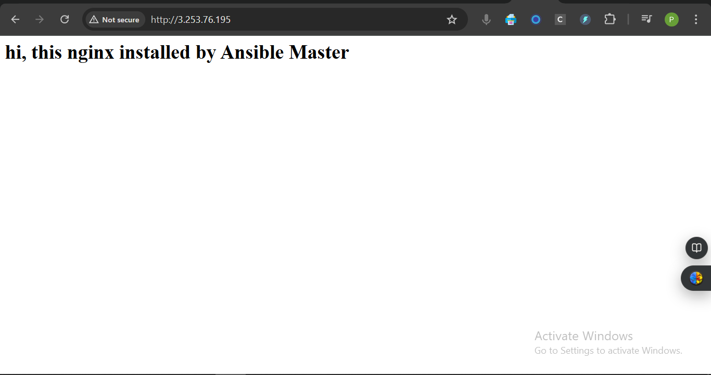
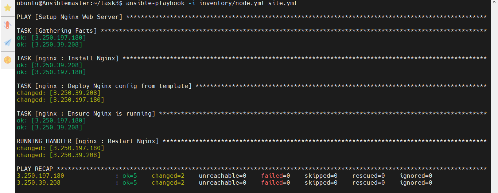
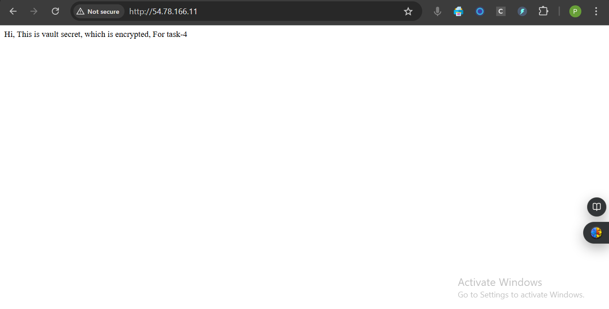
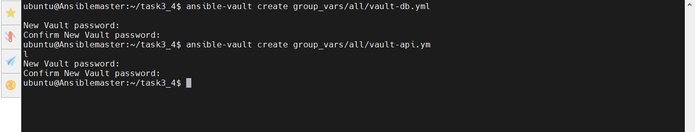

# Week 9: Ansible Automation Challenge Solution

## **Task 1: Install Ansible and Configure a Dynamic Inventory**

### Step 1: Install Ansible
### On Ubuntu/Debian:

```bash
sudo apt update
sudo apt install -y software-properties-common
sudo add-apt-repository --yes --update ppa:ansible/ansible
sudo apt install -y ansible
```

### On RHEL/CentOS:

```bash
sudo yum install epel-release -y
sudo yum install ansible -y
```

### On Amazon Linux 2:

```bash
sudo amazon-linux-extras enable ansible2
sudo yum install ansible -y
```

**Verify installation:**

```bash
ansible --version
```

### Step 2: Configure a Dynamic Inventory
We can use AWS EC2 dynamic inventory (official plugin) or write a simple script.

#### Option 1: Using AWS EC2 Dynamic Inventory Plugin (Recommended for AWS users)

1. **Install AWS CLI and Boto3** (needed for plugin):

```bash
pip install boto3 botocore
sudo apt install unzip
curl "https://awscli.amazonaws.com/awscli-exe-linux-x86_64.zip" -o "awscliv2.zip"
unzip awscliv2.zip
sudo ./aws/install

aws configure  # Provide your AWS credentials
```

2. **Create inventory config file**:

Create `aws_ec2.yaml` in the Ansible project directory:

```yaml
plugin: aws_ec2
regions:
  - us-east-1  # Change to your AWS region
filters:
  instance-state-name: running
hostnames:
  - private-ip-address
keyed_groups:
  - key: tags.Name
    prefix: tag
```

3. **Run a test**:

```bash
ansible all -i aws_ec2.yaml -m ping -u ubuntu --private-key ~/ansible-key.pem
ansible-inventory -i aws_ec2.yaml --list
```


#### Option 2: Using a Simple Python Dynamic Inventory Script

1. Create a file `dynamic_inventory.py`:

```python
#!/usr/bin/env python3
import json

inventory = {
    "all": {
        "hosts": ["18.201.32.74","18.200.248.226"],
        "vars": {
            "ansible_user": "ubuntu",
            "ansible_ssh_private_key_file": "~/ansible-key.pem",
            "ansible_python_interpreter": "/usr/bin/python3"
        }
    }
}

print(json.dumps(inventory))
```

```bash
chmod +x dynamic_inventory.py #Make it executable
ansible all -i dynamic_inventory.py -m ping #test
```

**Screenshots**

 

 

 

 

 


### Why Dynamic Inventory?

Dynamic inventories allow Ansible to:

* Automatically detect newly created/terminated servers.
* Avoid manual editing of static inventory files.
* Integrate easily with cloud platforms (AWS, Azure, GCP).

---
### Challenges & Solutions

| Challenge                     | Mitigation Strategy                                 |
| ----------------------------- | --------------------------------------------------- |
| Credentials management        | Use AWS IAM roles or environment variables          |
| Frequent host changes         | Use tags and filters in the inventory plugin        |
| Debugging connectivity issues | Use `ansible -vvv` and `aws ec2 describe-instances` |


---

## **Task 2: Develop a Robust Playbook to Install and Configure Nginx** 
---
### Directory Structure:
```
ansible-nginx/
├── nginx_setup.yml
├── templates/
│   └── nginx.conf.j2
├── inventory/
│   └── aws_ec2.yaml
├── ansible.cfg
```

---

### `nginx_setup.yml` – Robust Playbook with Async & Error Handling

```yaml
---
- name: Robust Nginx Installation and Configuration
  hosts: all
  become: true
  vars:
    nginx_ports:
      - 80
      - 443
    server_name: "{{ inventory_hostname }}"
    default_root: /var/www/html

  tasks:

    - name: Install Nginx asynchronously
      apt:
        name: nginx
        state: present
        update_cache: yes
      async: 300
      poll: 0
      register: nginx_async

    - name: Wait for Nginx installation to finish
      async_status:
        jid: "{{ nginx_async.ansible_job_id }}"
      register: install_result
      until: install_result.finished
      retries: 5
      delay: 10

    - name: Fail if Nginx install failed
      fail:
        msg: "Nginx installation failed"
      when: install_result.rc is defined and install_result.rc != 0

    - name: Create Nginx custom config from template
      template:
        src: nginx.conf.j2
        dest: /etc/nginx/nginx.conf
      notify: Restart Nginx

    - name: Ensure Nginx is running and enabled
      service:
        name: nginx
        state: started
        enabled: yes

  handlers:
    - name: Restart Nginx
      service:
        name: nginx
        state: restarted
```

---

### 📄 `templates/nginx.conf.j2` – Advanced Jinja2 Template

```jinja
user www-data;
worker_processes auto;
pid /run/nginx.pid;

events {
    worker_connections 1024;
}

http {
    include       mime.types;
    default_type  application/octet-stream;
    sendfile        on;
    keepalive_timeout 65;

    server {
        listen 80 default_server;
        server_name _;

        location / {
            return 200 '<h1>hi, this nginx installed by Ansible Master</h1>';
            add_header Content-Type text/html;
        }
    }
}
```
**Screenshots**

 

 

 

 



> **Note**

#### Playbook: `nginx_setup.yml`
- Installs Nginx asynchronously to handle long-running operations.
- Uses a templated `nginx.conf.j2` with:
  - `worker_processes` variable.
  - Loop over multiple server blocks.
  - Conditional templating support (if needed).
- Restarts Nginx on template change.
- Verifies Nginx service is started and enabled.

#### Jinja2 Template Highlights:
- Loops through `server_list` to generate multiple `server` blocks dynamically.
- Improves DRY (Don’t Repeat Yourself) principle.
- Easier to maintain and extend in production.

#### Async & Error Handling:
- Uses `async` and `poll: 0` to start installation in the background.
- Uses `async_status` to check completion with retries and timeout.
- Uses `failed_when` for custom error handling when command fails.

### Interview Question Answers:

#### Q: How do Jinja2 templates with loops and conditionals improve production configuration management?
**A:** They allow dynamic, reusable configuration generation. Instead of hardcoding each server block, we can loop over variables to auto-generate configs. It's more scalable, readable, and reduces human error.

#### Q: What are the challenges of managing long-running tasks with async in Ansible, and how do you handle errors?
**A:** Async tasks don't block the playbook but require tracking. Challenges include:
- Ensuring job IDs are stored and monitored.
- Retrying until the task finishes or fails.
- Custom handling when the task fails (`failed_when`).
We manage them using `async_status`, `until`, `retries`, and `delay`.

## **Task 3**, which is about **organizing Ansible playbooks using roles and advanced variables**


### ✅ 1. Directory Structure (Using `ansible-galaxy init`)

Run:

```bash
ansible-galaxy init nginx
```

Project folder structure:

```
task3/
├── site.yml                # 🔹 Main playbook that includes roles
├── inventory/
│   └── node.yml        # 🔹 Dynamic inventory (or static)
├── group_vars/
│   └── all.yml             # 🔹 Optional variables per group
├── roles/
│   └── nginx/              # 🔹 Your nginx role (created using ansible-galaxy)
│       ├── tasks/main.yml
│       ├── handlers/main.yml
│       ├── templates/nginx.conf.j2 
│       ├── defaults/main.yml
│       ├── vars/main.yml
│       └── files/           # static files (if any)

```

### ✅ 2.  Roles Content of (`nginx`)

 `tasks/main.yml`

```yaml
- name: Install Nginx
  apt:
    name: nginx
    state: present
  become: true

- name: Deploy Nginx config from template
  template:
    src: nginx.conf.j2
    dest: /etc/nginx/nginx.conf
  notify: Restart Nginx

- name: Ensure Nginx is running
  service:
    name: nginx
    state: started
    enabled: true
```

### `handlers/main.yml`

```yaml
- name: Restart Nginx
  service:
    name: nginx
    state: restarted
```

### `templates/nginx.conf.j2`

```jinja
user www-data;
worker_processes auto;
pid /run/nginx.pid;

events {
    worker_connections 1024;
}

http {
    include       mime.types;
    default_type  application/octet-stream;

    server {
        listen 80 default_server;
        server_name _;

        location / {
            return 200 '{{ welcome_message | default("hi") }}';
            add_header Content-Type text/html;
        }
    }
}
```

## ✅ 3. Advanced Variables

### `defaults/main.yml`

```yaml
welcome_message: "This Nginx Server created by Ansible Master, for Task-3"
```

### `vars/main.yml`

```yaml
nginx_port: 80
```

We can later override `welcome_message` or `nginx_port` in:

* Inventory vars
* `group_vars/` or `host_vars/`
* Playbook `vars:` section
* Extra vars (`-e`)

---

## ✅ 4. Playbook (`site.yml`)

```yaml
- name: Configure Web Server
  hosts: all
  become: true
  roles:
    - nginx
```

---

## ✅ 5. Running the Playbook
```bash
chmod +x  inventory/node.yml
ansible-playbook -i inventory/node.yml site.yml
```

**Screenshots**

 

 

 

 


---

###  Interview Questions

####  Q: How do roles improve scalability and collaboration?

**Answer:**
Roles separate logic into reusable components (like `nginx`, `db`, etc.), enabling:

* Clear modularity (easy to maintain/test)
* Reusability across environments
* Collaboration across teams (e.g., one team owns the DB role)
* Cleaner codebase with predictable structure

---

#### Q: What strategies do you use for variable precedence and hierarchy?

**Answer:**
I follow this hierarchy (from low to high precedence):

1. `defaults/main.yml` in roles
2. `vars/main.yml` in roles
3. `group_vars` / `host_vars`
4. Playbook-level `vars:`
5. Extra vars via CLI (`-e`)

**Strategy:**

* Use `defaults/` for safe fallbacks
* Use `group_vars/` for environment-specific values
* Use `-e` only for overrides or CI/CD

---


## **Task 4: Secure Production Data with Advanced Ansible Vault Techniques**

**Steps to Integrate Vault Secret**

### a. Create Vault file

```bash
ansible-vault create roles/nginx/vars/welcome.yml
#then in yml file put below value
welcome_message: "Welcome to Production!"
```

### b. Update `tasks/main.yml`
```yaml
- name: Load welcome message from Vault
  include_vars: welcome.yml

- name: Template nginx config with welcome message
  template:
    src: nginx.conf.j2
    dest: /etc/nginx/nginx.conf
    owner: root
    group: root
    mode: '0644'
  notify: Restart Nginx
```

### c.Now the Template (unchanged, because it already supports Vault!)

```nginx
location / {
    return 200 '{{ welcome_message | default("hi") }}';
    add_header Content-Type text/html;
}
```

### d. Run with Vault Password

```bash
ansible-playbook site.yml --ask-vault-pass
ansible-playbook site.yml --vault-password-file ~/.vault_pass.txt
```

**Screenshots**

 

 

 

 

 

 

 

**Another Example**

### Step 1: **Create Encrypted Secret Files**

We can store sensitive data in encrypted files. For example:

```bash
ansible-vault create vault-db.yml
```

Add something like:

```yaml
db_user: mydbuser
db_password: Sup3rS3cretPass
```

Then create another for an API secret:

```bash
ansible-vault create vault-api.yml
```

Contents:

```yaml
api_key: sk-test-1234567890
```

---
 

### Step 2: **Organize Files in Group Vars or Role Vars**

Create a directory structure like:

```bash
group_vars/
  all/
    vault-db.yml
    vault-api.yml
```

Or inside a role:

```bash
roles/
  nginx/                #db, backend ...
    vars/
      main.yml          # Regular vars
      vault-db.yml      # Encrypted
      vault-api.yml     # Encrypted
```

---

### Step 3: **Modify Playbook to Include Encrypted Vars**

Now `site.yml` or `nginx_setup.yml` might look like this:

```yaml
- name: Secure Nginx setup
  hosts: all
  vars_files:
    - group_vars/all/vault-db.yml
    - group_vars/all/vault-api.yml

  roles:
    - nginx
```

Or just reference the files with `vars_files` wherever appropriate.

---

###  Step 4: **Run the Playbook With Decryption**

Option 1: Provide password interactively

```bash
ansible-playbook -i inventory/node.py site.yml --ask-vault-pass
```


> **Note**
**🔁 Variable Precedence (High to Low)**
Extra vars (-e)
Task-level include_vars or set_fact
Role vars (roles/nginx/vars/main.yml)
Inventory vars
Role defaults (roles/nginx/defaults/main.yml) ← lowest precedence

**Vault Strategy:**
* Created multiple encrypted variable files (`vault-db.yml`, `vault-api.yml`) to separate concerns.
* Kept secrets outside the playbook logic using `vars_files`.
* Used `--vault-password-file` for automation environments (e.g., CI/CD).
* Role-based or group-based secret loading.

**Secret Management Principles:**
* Avoid hardcoding secrets in playbooks or templates.
* Use separate vault files per environment or role (e.g., `vault-staging.yml`, `vault-prod.yml`).
* Never commit vault passwords or decrypted secrets to Git.
* Use `ansible-vault rekey` to rotate encryption.

---

### Interview Questions and Answers
#### *How does Ansible Vault secure sensitive data in production?*

**Answer:**
Ansible Vault encrypts files using AES-256, making them unreadable without the vault password. It ensures that sensitive data like passwords, keys, and tokens are not exposed in plain text during version control or execution.

---

#### *What advanced techniques can you use for managing secrets at scale?*

**Answer:**

* Splitting secrets into multiple vault files by role, team, or environment.
* Using `vault_ids` to support multiple vaults with different passwords.
* Integrating with secret management tools like HashiCorp Vault via lookup plugins.
* Automating vault password injection via CI/CD secure variables.

---

##  **Task 5: Advanced Orchestration for Multi-Tier Deployments**
**Flow of data**
User ──> Nginx (frontend) ──> Flask App (backend) ──> MySQL DB (database)


### ✅ **Directory Structure**

```
task5/
├── inventory/
│   └── hosts.ini
├── site.yml
├── roles/
│   ├── nginx/
│   ├── app/
│   └── db/
```

---

### ✅ **`site.yml` Composite Playbook**

```yaml
- name: Configure DB
  hosts: database
  roles:
    - db

- name: Configure App
  hosts: backend
  roles:
    - app

- name: Configure Frontend
  hosts: frontend
  roles:
    - nginx
```
### ✅ **`inventory/hosts.ini` Example**

```yaml
[servres]
database ansible_host=3.255.183.45
backend ansible_host=34.245.40.86
frontend ansible_host=54.171.131.114

[servres:vars]
ansible_user=ubuntu
ansible_ssh_private_key_file=~/ansible-key.pem
ansible_python_interpreter:/usr/bin/python3
```

### ✅ Roles File

**`roles/db/tasks/main.yml`**

```yaml
- name: Install Python3 pip
  apt:
    name: python3-pip
    state: present
  become: true

- name: Install PyMySQL system package
  apt:
    name: python3-pymysql
    state: present
  become: true

- name: Install MySQL Server
  apt:
    name: mysql-server
    state: present
    update_cache: yes
  become: true

- name: Start and enable MySQL
  service:
    name: mysql
    state: started
    enabled: true
  become: true

- name: Create ansible admin user (once manually or in setup play)
  mysql_user:
    name: ansibleadmin
    password: secretpass
    priv: 'sampledb.*:ALL'
     # priv: '*.*:ALL,GRANT'
    host: '%' #connect from any host below one from spcified only
      #    host: localhost
    state: present
    login_user: root
    login_unix_socket: /var/run/mysqld/mysqld.sock
  become: true

- name: Create DB and user
  mysql_db:
    name: sampledb
    state: present
    login_user: ansibleadmin
    login_password: secretpass
    login_host: localhost
  become: true

- name: Write init.sql
  copy:
    dest: /tmp/init.sql
    content: |
      CREATE TABLE IF NOT EXISTS messages (
          id INT AUTO_INCREMENT PRIMARY KEY,
          text VARCHAR(255) NOT NULL
      );
      INSERT INTO messages (text) VALUES ('Hello from MySQL database!');
  become: true

- name: Import initial schema (message)  into sampledb
  mysql_db:
    name: sampledb
    state: import
    target: /tmp/init.sql
    login_user: ansibleadmin
    login_password: secretpass
    login_host: localhost
  become: true
```

**`roles/nginx/tasks/main.yml`**
```yml
- name: Install Nginx
  apt:
    name: nginx
    state: present
    update_cache: yes
  become: true

- name: Copy Nginx config
  copy:
    dest: /etc/nginx/sites-available/default
    content: |
      server {
          listen 80;
          location / {
              proxy_pass http://{{ hostvars['backend'].ansible_host }}:5000;
              proxy_set_header Host $host;
              proxy_set_header X-Real-IP $remote_addr;
          }
      }
  notify: Restart Nginx
  become: true

- name: Ensure Nginx is started
  service:
    name: nginx
    state: started
    enabled: true
  become: true
```

**`roles/nginx/handlers/main.yml`**
```yml
- name: Restart Nginx
  service:
    name: nginx
    state: restarted
  become: true
```

**`roles/app/tasks/main.yml`**
```yml
- name: Install Python and MySQL client
  apt:
    name:
      - python3
      - python3-pip
      - default-libmysqlclient-dev
      - python3-dev
      - python3-venv
    state: present
    update_cache: yes
  become: true

- name: Create requirements.txt
  copy:
    dest: /home/ubuntu/requirements.txt
    content: |
      flask
      flask-mysqldb

- name: Create a virtual environment (using python3 -m venv)
  command: python3 -m venv /home/ubuntu/venv
  args:
    creates: /home/ubuntu/venv
  become: false

- name: Install Python packages in venv using pip
  command: /home/ubuntu/venv/bin/pip install flask flask-mysqldb
  become: false


- name: Copy Flask app
  copy:
    dest: /home/ubuntu/app.py
    content: |
      from flask import Flask
      from flask_mysqldb import MySQL

      app = Flask(__name__)

      app.config['MYSQL_HOST'] = '{{ hostvars["database"].ansible_host }}'

      app.config['MYSQL_USER'] = 'ansibleadmin'
      app.config['MYSQL_PASSWORD'] = 'secretpass'
      app.config['MYSQL_DB'] = 'sampledb'

      mysql = MySQL(app)

      @app.route("/")
      def hello():
          cur = mysql.connection.cursor()
          cur.execute("SELECT text FROM messages LIMIT 1;")
          message = cur.fetchone()
          cur.close()
          return message[0] if message else "No message found"
      if __name__ == "__main__":
          app.run(host="0.0.0.0", port=5000)

- name: Start Flask app
  shell: |
    source /home/ubuntu/venv/bin/activate
    FLASK_APP=/home/ubuntu/app.py nohup flask run --host=0.0.0.0 --port=5000 &
  args:
    executable: /bin/bash
  async: 30
  poll: 0
```

### Run the playbook
```bash
ansible-playbook -i inventory/hosts.ini site.yml
# After that check the ip of on browser of nginx server
# make sure the db port 3306 and app 5000 port is opened in ec2
```
---


**Screenshots**
 

 

 

  

 

 

 

### **Interview Answers**

**Q1: How do you orchestrate multi-tier deployments with Ansible?**

> By organizing each tier (frontend, backend, DB) as a role and controlling execution order using `when`, `serial`, and group filters (`group_names`). This ensures each component is deployed in sequence, maintaining service dependencies.

**Q2: What are the challenges and solutions for async task execution in a multi-tier environment?**

> * **Challenges**: Handling long-running tasks, failure detection, synchronization delays.
> * **Solutions**: Use `async`, `poll: 0`, and `async_status` to run in background and wait for completion. Combine with retries and conditional checks (`until`) for robustness.

---

## Bonus Task-6 **Multi-Environment Setup with Terraform & Ansible**
**Step-by-Step Implementation**

### 1. **Terraform Setup**

### Directory Structure

```bash
├── ansible-key.pub    # Public SSH key for EC2 access
├── infra
│   ├── bucket.tf
│   ├── dynamodb.tf
│   ├── ec2.tf
│   ├── output.tf
│   └── variable.tf
├── main.tf           # Defines environment-based modules
├── providers.tf      # AWS provider configuration
├── terraform.tf      # Backend configuration for state management
```

**`main.tf`**

```hcl
# dev-infra
module "dev-infra" {
    source = "./infra"
    env = "dev"
    instance_count = 1
    instance_type = "t2.micro"
    ami = "ami-0df368112825f8d8f"
    volume_size = 8
}

# stg-infra
module "stg-infra" {
    source = "./infra"
    env = "stg"
    instance_count = 1
    instance_type = "t2.micro"
    ami = "ami-0df368112825f8d8f"
    volume_size = 8
}

# prd-infra
module "prd-infra" {
    source = "./infra"
    env = "prd"
    instance_count = 1
    instance_type = "t2.micro"
    ami = "ami-0df368112825f8d8f"
    volume_size = 9
}

output "dev_infra_ec2_public_ips" {
  value = module.dev-infra.ec2_public_ips
}


output "stg_infra_ec2_public_ips" {
  value = module.stg-infra.ec2_public_ips
}


output "prd_infra_ec2_public_ips" {
  value = module.prd-infra.ec2_public_ips
}
```

**`ec2.tf`**
```hcl
resource "aws_key_pair" "key" {
  key_name   = "${var.env}-terra-automate-key"
  public_key = file("ansible-key.pub")
}

resource "aws_default_vpc" "default" {
}

resource "aws_security_group" "sg" {
  name        = "${var.env}-sg"
  description = "Allow user to connect via SG"
  vpc_id      = aws_default_vpc.default.id
  ingress {
    description = "port 22 allow"
    from_port   = 22
    to_port     = 22
    protocol    = "tcp"
    cidr_blocks = ["0.0.0.0/0"]
  }

  egress {
    description = " allow all outgoing traffic "
    from_port   = 0
    to_port     = 0
    protocol    = "-1"
    cidr_blocks = ["0.0.0.0/0"]
  }

  ingress {
    description = "port 80 allow"
    from_port   = 80
    to_port     = 80
    protocol    = "tcp"
    cidr_blocks = ["0.0.0.0/0"]
  }

  ingress {
    description = "port 443 allow"
    from_port   = 443
    to_port     = 443
    protocol    = "tcp"
    cidr_blocks = ["0.0.0.0/0"]
  }

  tags = {
    Name = "${var.env}-sg"
    Environment = var.env
  }
}

resource "aws_instance" "my_instance" {
  count = var.instance_count
  ami             = var.ami
  instance_type   = var.instance_type
  key_name        = aws_key_pair.key.key_name
  security_groups = [aws_security_group.sg.name]
  tags = {
    Name = "${var.env}-instance"
    Environment = var.env
  }

  root_block_device {
    volume_size = var.volume_size
    volume_type = "gp3"
  }
}

```

### we can also use seperate files like  `dev.tfvars`

```hcl
region      = "us-east-1"
ami         = "ami-0c02fb55956c7d316"
instance_type = "t2.micro"
environment = "dev"
```

>other remaing files of terraform are inside the corresponding all_tasks folder

**Apply it using:**
```bash
#install terraform
sudo apt-get update
sudo apt-get install -y gnupg software-properties-common
curl -fsSL https://apt.releases.hashicorp.com/gpg | sudo gpg --dearmor -o /usr/share/keyrings/hashicorp-archive-keyring.gpg
echo "deb [signed-by=/usr/share/keyrings/hashicorp-archive-keyring.gpg] https://apt.releases.hashicorp.com $(lsb_release -cs) main" | sudo tee /etc/apt/sources.list.d/hashicorp.list
sudo apt-get update && sudo apt-get install terraform
terraform --version

#make the infrastrucure 1 dev, 1 prd and 1 stg instance
terraform init 
terraform apply

```

### 2. **Ansible Setup **
**Directory Structure of ansible**
```
ansible
├── inventories
│   ├── dev
│   ├── prod
│   └── stg
├── playbooks
│   ├── install_nginx.yml
│   └── nginx-role
│       ├── README.md
│       ├── defaults
│       │   └── main.yml
│       ├── files
│       │   └── index.html
│       ├── handlers
│       │   └── main.yml
│       ├── meta
│       │   └── main.yml
│       ├── tasks
│       │   └── main.yml
│       ├── templates
│       ├── tests
│       │   ├── inventory
│       │   └── test.yml
│       └── vars
│           └── main.yml
├── update_inventories.sh
```

**update inventory based on terraform output using script**
```ini
mkdir playbooks
cd playbooks/
ansible-galaxy role init nginx-role
vi ../update_inventories.sh
cd ..
chmod +x update_inventories.sh
./update_inventories.sh```

```

**role/tasks/main.yml**
```yml
#SPDX-License-Identifier: MIT-0
---
# tasks file for nginx-role
  - name: Install Nginx
    apt:
      update_cache: yes
      name: nginx
      state: latest

  - name: Enable Nginx
    service:
      name: nginx
      enabled: yes

  - name: Deploy webpage
    copy:
      src: index.html
      dest: /var/www/html
```
>other remaing files of ansible are inside the corresponding all_tasks folder

### Run:

```bash
ansible-playbook -i inventories/dev  playbooks/install_nginx.yml
ansible-playbook -i inventories/stg  playbooks/install_nginx.yml
ansible-playbook -i inventories/prd  playbooks/install_nginx.yml
```

**Screenshots**
 

 

 

 

 

 

 

>this error solved by adding 'update_cache: yes' in task while using apt module in playbook

 

 

 

 
 

 

 

 

 


---

> **Note**

### Terraform Variable Files

* `dev.tfvars`, `staging.tfvars`, `prod.tfvars` allow separate resource provisioning per environment.
* Output like `web_ip` can be parsed and used in Ansible inventory.

### Ansible Inventory

* Static inventories can be created from `terraform output`, or use [Terraform dynamic inventory plugin](https://docs.ansible.com/ansible/latest/plugins/inventory/terraform.html).

### Integration of Terraform and Ansible

* `terraform output -json > inventory.json`
* Use a dynamic inventory script or parse it into `ini` format.

---

### Interview Question Hints

#### 1. **How do you integrate Terraform outputs into Ansible inventories in production?**

> Use `terraform output -json` to get structured output and parse it into inventory format using scripts or dynamic inventory plugins.

#### 2. **Challenges of Multi-Environment Configuration?**

* **Challenge:** Config drift, credential isolation, environment-specific bugs.
* **Solution:**

  * Use separate state files and variable files.
  * Isolate secrets via Vault or SSM.
  * Automate validation with pipelines.

---

