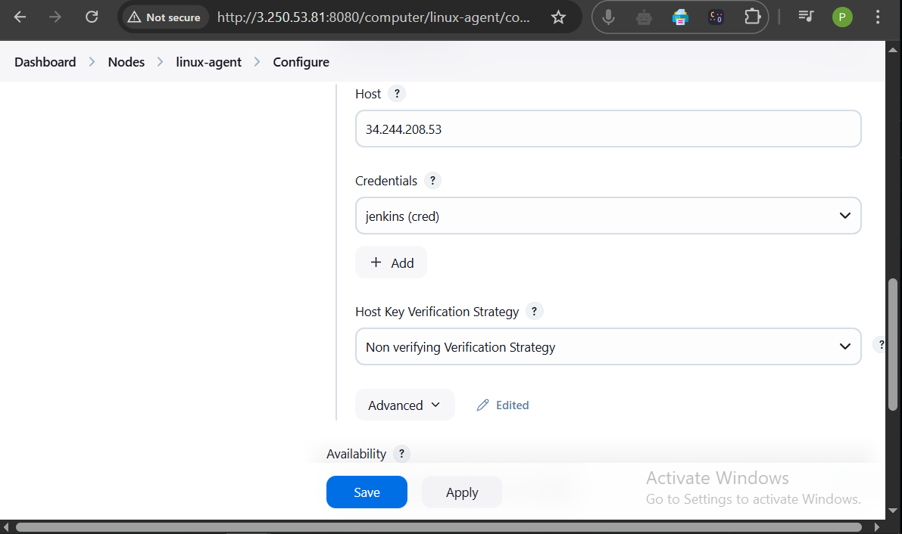
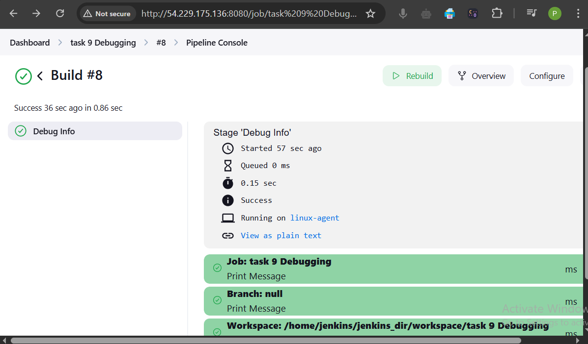

# Week 6: Jenkins (CI/CD) Basics and Advanced tasks solution

---
##  Task 1: Create a Jenkins Pipeline Job for CI/CD

### Scenario:
Create an end-to-end CI/CD pipeline for a sample application.

**1. Create Pipeline Job:**

- Go to Jenkins Dashboard
- Click **New Item**
- Name: `Sample-CI-CD-Pipeline`
- Choose **Pipeline**, click OK

**2. Jenkinsfile Code:**
```groovy
pipeline{
    
    agent {label 'dev'};
    
    stages{
        stage("Code Clone"){
            steps{
               git url: "https://github.com/Pramod1818/two-tier-flask-app.git", branch: "master"
            }
        }

        stage("Build"){
            steps{
                sh "docker build -t sample-web-app . "
            }
            
        }
        stage("Test"){
            steps{
                echo "Tests will give by developer"
            }
            
        }

        stage("Deploy"){
            steps{
                sh "docker compose up -d"
            }
        }
    }
}
```

**3. Run and Verify:**
- Click **Build Now**
- Check **Console Output** for logs
- Run `docker ps` to confirm the container is running

**4. Issues & Fixes:**
- **Docker permission error**: Resolved by adding Jenkins user to Docker group
- Used `sh` blocks for shell commands to avoid syntax errors

Screenshots:
 
 
 
 
 
 
 


### 🌟 Interview Questions:

**Q:** How do declarative pipelines streamline the CI/CD process compared to scripted pipelines?\
**A:** They offer a simpler syntax, better error handling, easier visualization, and encourage best practices through structured syntax.

**Q:** What are the benefits of breaking the pipeline into distinct stages?\
**A:** It improves clarity, debugging, and allows better resource allocation and stage-specific notifications or failure handling.

---

## Task 2: Build a Multi-Branch Pipeline for a Microservices Application

###  Scenario:
Create a multi-branch pipeline that builds, tests, and deploys services concurrently.

**1. Create Multi-Branch Pipeline Job:**
- Jenkins Dashboard → New Item → Enter name
- Select **Microservics Pipeline**
- Configure **Git repo URL**, add credentials if needed
- Jenkins auto-scans branches

**2. Jenkinsfile for Each Service:**
#### Microservice-app 'main branch'

```groovy
pipeline {
    agent { label 'dev' }

    stages {
        stage('Checkout') {
            steps {
                checkout scm
            }
        }

        stage('Deploy Full Stack (Main)') {
            when {
                branch 'main'
            }
            steps {
                echo "Deploying Full Stack (main branch)..."
                sh 'docker compose down || true' // Stop previous compose, ignore errors if none
                sh 'docker compose up -d --build'
                echo "Full Stack is running."
            }
        }
    }
}
```

#### Microservice-app 'backend branch'
```groovy
pipeline {
    agent { label 'dev' }

    stages {
        stage('Checkout') {
            steps {
                checkout scm
            }
        }

        stage('Build Backend') {
            steps {
                echo "Building Backend (backend branch)..."
                sh 'cd backend && docker build -t microservice-backend:$BRANCH_NAME .'
            }
        }

        stage('Test Backend') {
            steps {
                echo "Testing Backend (backend branch)..."
                sh 'cd backend && echo "Running backend tests..."'
                sh 'cd backend && sleep 5' // Simulate backend tests
                echo "Backend tests completed."
            }
        }

    }
}
```

#### Microservice-app 'frontend branch'
```groovy
pipeline {
    agent { label 'dev' }

    stages {
        stage('Checkout') {
            steps {
                checkout scm
            }
        }

        stage('Build Frontend') {
            steps {
                echo "Building Frontend (frontend branch)..."
                sh 'cd frontend && docker build -t microservice-frontend:$BRANCH_NAME .'
            }
        }

        stage('Test Frontend') {
            steps {
                echo "Testing Frontend (frontend branch)..."
                sh 'cd frontend && echo "Running frontend tests..."'
                sh 'cd frontend && sleep 3' // Simulate frontend tests
                echo "Frontend tests completed."
            }
        }

    }
}
```

**3. Simulate Merge Scenario:**
- Create a feature branch
- Make a PR
- Jenkins scans and runs the pipeline

### Note:
- Each service can have its own Jenkinsfile in its repo
- Multi-branch pipelines allow automation for every branch without manual reconfiguration

Screenshots:
 
 
 
 
 
 
 


### 🌟 Interview Questions:

**Q:** How does a multi-branch pipeline improve CI for microservices?\
**A:** It allows isolated and concurrent builds/tests per branch, reducing risk and increasing speed.

**Q:** What are the challenges when merging feature branches?\
**A:** Merge conflicts, test failures, or deployment clashes may occur.

---

##  Task 3: Configure and Scale Jenkins Agents/Nodes
### Scenario:
Set up Jenkins with multiple build agents (e.g., Linux and Windows) to distribute the CI/CD load and run jobs in parallel across them.

**1. Setup Linux Agent:**
- Create EC2 and install Java
- Add `jenkins` user and SSH setup
- Steps: Set Up Linux Agent (via SSH)
```sh
        sudo apt update
        sudo apt install fontconfig openjdk-17-jre
        java -version
        sudo adduser jenkins
        sudo usermod -aG sudo jenkins

        sudo su - jenkins
        mkdir -p ~/.ssh
        chmod 700 ~/.ssh
        touch ~/.ssh/authorized_keys
        chmod 600 ~/.ssh/authorized_keys #and paste public key master
```

- Jenkins → Manage Jenkins → Nodes → New Node
- Launch via SSH with labels like `linux`
```
    Name: linux-agent
    Select Permanent Agent.
    Set:    Remote root directory: /home/jenkins
    Labels: linux-agent
    Launch method: Launch agent via SSH
    Add SSH credentials for the agent user
    Click Save → Jenkins will connect and launch the agent.
```

**2. Setup Windows Agent:**
- Install Java and Git on windows system
- Download the agent.jar and run:
```
java -jar agent.jar -jnlpUrl http://<jenkins-url>/computer/windows-agent/slave-agent.jnlp
```

**3. Label Agents and Use in Jenkinsfile:**
```groovy
pipeline {
  agent none
  stages {
    stage('Build on Linux') {
      agent { label 'linux-agent' }
      steps {
        echo "Running on Linux agent"
      }
    }
    stage('Test on Windows') {
      agent { label 'windows-agent' }
      steps {
        echo "Running on Windows agent"
      }
    }
  }
}
```

**4. Parallel Execution:**
```groovy
pipeline {
  agent none
  stages {
    stage('Parallel Execution') {
      parallel {
        stage('Linux Stage') {
          agent { label 'linux-agent' }
          steps {
            echo 'Running on Linux agent'
          }
        }
        stage('Windows Stage') {
          agent { label 'windows-agent' }
          steps {
            echo 'Running on Windows agent'
          }
        }
      }
    }
  }
}
```
Screenshots:
 
 
 
 
 
 
 


### 🌟 Interview Questions:
**Q:** Benefits and challenges of distributed agents?\
**A:** Improves speed and platform coverage; setup complexity and resource usage can be challenges.

**Q:** How to ensure correct job-to-agent assignment?\
**A:** Use labels and `agent { label 'xyz' }` in Jenkinsfile.

---

##  Task 4: Implement and Test RBAC in a Multi-Team Environment
### Scenario:
Set up Role-Based Access Control (RBAC) for Jenkins using different roles like Admin, Developer, and Tester.

**1. Install Role Strategy Plugin**
**2. Enable Role-Based Strategy:**
- Manage Jenkins → Configure Global Security
- Under Authorization → Select Role-Based Strategy

**3. Define Roles:**
- Manage and Assign Roles → Manage Roles
- Create roles: `admin`, `developer`, `tester`

**4. Create Test Users:**
- Create `admin`, `dev1`, and `tester1`

**5. Assign Users to Roles:**
- Assign accordingly under **Assign Roles**

**6. Verify Access:**
- Log in as each user to test permissions

Screenshots:
 
 
 
 
 


### 🌟 Interview Questions:
**Q:** Why is RBAC essential?\
**A:** Prevents unauthorized actions, secures CI/CD, and isolates responsibilities.

**Q:** Example of RBAC failure risk?\
**A:** A tester with deploy access could push buggy code to production.

---

##  Task 5: Develop and Integrate a Jenkins Shared Library

### Scenario:
Avoid duplication by creating a common notification function and reusing it in multiple pipelines using Jenkins Shared Libraries.


**1. Create Shared Library Repository** 
```
jenkins-shared-library/vars/notify.groovy
```

**2. notify.groovy:**
```groovy
def call(String message = "Pipeline finished") {
    echo "🔔 Notification: ${message}"
}
```

**3. Configure in Jenkins:**
- Manage Jenkins → Configure System → Global Trusted Pipeline Libraries
- Add a library `simple-lib` with Git repo URL

```
    Name: simple-lib
    Default version: main (or your branch name)
    Retrieval method: Modern SCM
    SCM: Git
    Project Repository: https://github.com/your-user/jenkins-shared-library.git
```

**4. Use in Jenkinsfile:**
```groovy
@Library('simple-lib') _
pipeline {
    agent any
    stages {
        stage('Build') {
            steps {
                echo 'Building the app...'
            }
        }
        stage('Notify') {
            steps {
                notify("✅ Build Stage Completed")
            }
        }
    }
}
```
Screenshots:
 


### 🌟 Interview Questions:

**Q:** How do shared libraries help?\
**A:** Promote code reuse, reduce duplication, and ensure consistency across pipelines.

**Q:** Example function ideal for shared libraries?\
**A:** Notification, deployment, or test report generation functions.

---


## Task 6: Integrate Vulnerability Scanning with Trivy

### Scenario:
Ensure that Docker images built in your Jenkins pipeline are free from known vulnerabilities using Trivy.

**1. Add Vulnerability Scan Stage in Jenkinsfile:**
```groovy
pipeline {
    agent {label 'linux-agent'};
    stages {
        stage('code cloning'){
            steps{
                echo 'starting cloning '
                git url:'https://github.com/Pramod1818/demo-flask-app.git', branch:'main' ;
            }
        }
        stage('Build') {
            steps {
                echo "Starting Build..."
                sh 'docker build -t pk1818/simple-flask-app:latest .'
            }
        }
        
        stage('run') {
            steps {
                echo 'Starting Running...'
                sh 'docker run -d  -p 3001:5000 pk1818/simple-flask-app:latest'
            }
        }
        
        stage('Vulnerability Scan') {
            steps {
                sh 'trivy image pk1818/simple-flask-app:latest'
            }
        }
    }    
}
```

**2. Configure Fail Criteria:**
- To fail the build if vulnerabilities of high severity are found:
```sh
trivy image --exit-code 1 --severity CRITICAL your-username/sample-app:v1.0
```


- **Summary of Scan Output:** Found 50 high and 63 medium vulnerabilities.
- **Remediation:** Upgraded the base image  and patched the packages.
- **Importance:** Automated security scans ensure that no vulnerable components are deployed in production.

Screenshost:
 

 

### 🌟 Interview Questions:
**Q:** Why is integrating vulnerability scanning into a CI/CD pipeline important?
**A:** It prevents deploying vulnerable software by catching issues early in the development cycle.

**Q:** How does Trivy help improve the security of your Docker images?
**A:** It scans for known vulnerabilities in OS packages and application dependencies inside containers.
---


## Task 7: Dynamic Pipeline Parameterization

### Scenario:
Make the Jenkins pipeline flexible by accepting runtime parameters like target environment or version.

**1. Modify Jenkinsfile to Accept Parameters:**
```groovy
pipeline {
    agent any
    parameters {
        string(name: 'TARGET_ENV', defaultValue: 'building', description: 'Deployment target environment')
        string(name: 'APP_VERSION', defaultValue: '1.0.0', description: 'Application version to deploy')
    }
    stages {
        stage('Build') {
            steps {
                echo "Building version ${params.APP_VERSION} for ${params.TARGET_ENV} environment..."
            }
        }
    }
}
```

**2. Run the Pipeline with Different Parameter Values:**
- `TARGET_ENV=development`
- `APP_VERSION=1.0.1`


- **How It Works:** Jenkins allows parameters to make pipelines reusable and dynamic.
- **Benefits:** Avoids hardcoding values, allows the same pipeline for multiple deployments.

screenshots:
 
 
 

### 🌟 Interview Questions:

**Q:** How does pipeline parameterization improve CI/CD flexibility?
**A:** Enables reusability for different environments and versions without changing the code.

**Q:** When are dynamic parameters critical?
**A:** During deployment to multiple environments (dev, staging, prod) from the same pipeline.

---


## Task 8: Integrate Email Notifications for Build Events

### Scenario:
Notify team members automatically when Jenkins builds complete or fail.

**1. Configure SMTP in Jenkins:**
- Go to **Manage Jenkins → Configure System**
- Scroll to Extended E-mail Notification
- Fill SMTP details:
  - SMTP server: smtp.gmail.com
  - Port: 465
  - Use SSL: Checked
  - Credentials: Gmail App Password

**2. Update Jenkinsfile to Include Email Notifications:**
```groovy
pipeline {
    agent any

    stages {
        stage('Build') {
            steps {
                echo 'Building app...'
            }
        }

        stage('Notify') {
            steps {
                emailext (
                    subject: "Build Notification: ${env.JOB_NAME} - Build #${env.BUILD_NUMBER}",
                    body: """
                        Hello Team,

                        The build for ${env.JOB_NAME} (Build #${env.BUILD_NUMBER}) has completed.

                        Status: SUCCESS
                        Check details: ${env.BUILD_URL}

                        Regards,
                        Jenkins
                    """,
                    to: 'developer@example.com'
                )
            }
        }
    }
}
```

**3. Test Notifications:**
Trigger the pipeline and verify receipt of emails.

- **SMTP Setup:** Gmail SMTP used with app-specific password.
- **Challenges:** Required enabling "less secure apps" or app password.
- **Value:** Keeps team updated without manual checking.


Screenshots:
 
 
 
 
 
 


### 🌟 Interview Questions:

**Q:** What are the advantages of automated email notifications in CI/CD?
**A:** Immediate visibility into pipeline status helps in faster response and debugging.

**Q:** How would you troubleshoot email issues?
**A:** Check SMTP logs, firewall settings, plugin installation, and test with `mailx` or `sendmail` command.

---

## Task 9: Troubleshooting, Monitoring & Advanced Debugging

### Scenario:
Simulate a pipeline failure, demonstrate how to troubleshoot it, add logging/monitoring tools, and show debugging techniques to maintain Jenkins reliability.

**1. Simulate a Pipeline Failure:**
- Introduce an invalid command in Jenkinsfile:
```groovy
        stage('Build') {
            steps {
                echo "Starting Build..."
                sh 'invalidcommand' // This will fail
            }
        }
```

**2. Troubleshooting:**
✅ A. Check Console Output
- Go to the failed pipeline in Jenkins → Console Output
- Jenkins will show an error like:
   sh: 1: invalidcommand: not found

✅ B. Identify Root Cause
Confirm that the command is incorrect or missing from the agent.
Replace or correct it to fix the pipeline.

**3. Use Jenkins Logs for Deeper Troubleshooting:**
- If running Jenkins in Docker:
   docker logs <jenkins-container-name>
- View Jenkins Logs (Web UI):
   Manage Jenkins → System Log

**4. Jenkins Monitoring Options:**
- **Install Monitoring Plugins:**
  - Monitoring Plugin
  - Prometheus Metrics Plugin
  - Audit Trail – track user actions
  - Log Parser Plugin – parse job output
- **System Logs:** Available under **Manage Jenkins → System Log**

**5. Add Debugging Tools in Pipeline:**
- A. Print Key Environment Info
- B. Use catchError to Continue After Failures
```groovy
// - A. Print Key Environment Info
    stage('Debug Info') {
        steps {
            echo "Job Name: ${env.JOB_NAME}"
            echo "Build Number: ${env.BUILD_NUMBER}"
            echo "Workspace: ${env.WORKSPACE}"
        }
    }

// - B. Use catchError to Continue After Failures
    stage('Test') {
        steps {
            catchError(buildResult: 'UNSTABLE') {
                sh 'exit 1'
            }
        }
    }

// - C. Add Debugging Statements
echo "Running on node: ${env.NODE_NAME}"
echo "User: ${env.BUILD_USER}"

```
    - D. Use Replay Feature (for quick testing)
        Go to the failed pipeline → Click Replay
        Edit and rerun without committing to Git

- **Simulated Error:** Invalid command `nonexistent_command`
- **Troubleshooting:** Fixed Jenkinsfile and replayed the pipeline.
- **Monitoring:** Installed and configured Prometheus plugin.

### 🌟 Interview Questions:

**Q:** How would you troubleshoot a failing Jenkins pipeline?
**A:** Start with console output, then check syntax, environment variables, and logs.

**Q:** How do you monitor Jenkins in production?
**A:** Use plugins, system logs, and external tools like Prometheus and Grafana.

Screenshots:
 
 
 
 
 
 
 
 


---

