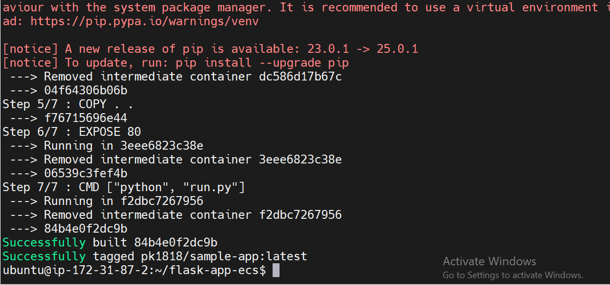
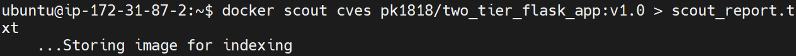

# Solution for Docker Challenge Tasks (WEEK-5)

## Task 1: Introduction and Conceptual Understanding

### Introduction to Docker
Docker is an open-source platform that simplifies the process of developing, shipping, and running applications by using containerization. It provides a lightweight and efficient way to package applications with their dependencies, ensuring consistent execution across various environments. In modern DevOps, Docker plays a crucial role in streamlining software development, enhancing collaboration, and improving CI/CD pipelines. By isolating applications into containers, Docker eliminates the "it works on my machine" problem and facilitates faster deployment cycles.

### Virtualization vs. Containerization

| Feature          | Virtualization | Containerization |
|-----------------|---------------|----------------|
| OS Overhead     | Each VM has a full OS | Containers share the host OS |
| Resource Usage  | High (each VM requires dedicated resources) | Low (lightweight and efficient) |
| Boot Time       | Slow (minutes) | Fast (seconds) |
| Portability     | Limited (dependent on hypervisor) | High (works across any Docker-supported platform) |
| Isolation       | Strong (full OS per VM) | Process-level isolation |

### Why Containerization is Preferred for Microservices and CI/CD Pipelines
- **Lightweight and Fast**: Containers consume fewer resources and start quickly.
- **Scalability**: Ideal for microservices architecture, enabling horizontal scaling.
- **Consistency Across Environments**: Eliminates compatibility issues between development, testing, and production.
- **Better CI/CD Integration**: Supports automated building, testing, and deployment.
- **Portability**: Runs consistently across different platforms and cloud environments.

## Task 2: Create a Dockerfile for a Sample Project

### Dockerfile for a Python Sample Application

```dockerfile
# Use a lightweight Python base image
FROM python:3.9-slim

# Set a working directory
WORKDIR /app

# Copy only requirements here
COPY requirements.txt .

# Install dependencies
RUN pip install --no-cache-dir -r requirements.txt

# Copy the rest of the application code
COPY . .

# Expose port 80
EXPOSE 80

# Run the application
CMD ["python", "run.py"]
```

### Build and Run the Docker Image
```bash
docker build -t pk1818/sample-app:latest .
docker run -d -p 8080:80 pk1818/sample-app:latest
```

### Verify the Running Container
```bash
docker ps
docker logs <container_id>
```
Screenshots:
 

 

 

 

 

 


## Task 3: Explore Docker Terminologies and Components

### Key Docker Terminologies

| Term        | Description |
|------------|-------------|
| **Image** | A lightweight, standalone package that includes the application and dependencies. |
| **Container** | A running instance of a Docker image, providing an isolated environment. |
| **Dockerfile** | A script containing instructions to build a Docker image. |
| **Volume** | A persistent storage mechanism that allows data to persist across container restarts. |
| **Network** | Enables communication between containers or between a container and the host system. |

### Main Docker Components

  ### Docker Daemon
  - Runs on the host OS.
  - Manages containers and services.
  - Can communicate with other daemons.

  ### Docker Client
  - Interface for users to interact with the daemon.
  - Uses commands and REST API.
  - Can connect to multiple daemons.

  ### Docker Host
  - Provides the environment to run applications.
  - Includes daemon, images, containers, networks, and storage.

  ### Docker Hub/Registry
  - Stores and manages Docker images.
  - **Public Registry:** Docker Hub.
  - **Private Registry:** Used within enterprises.

  ### Docker Images
  - Read-only templates for containers.
  - Ways to create images:
    1. Pull from Docker Hub.
    2. Create from a Dockerfile.
    3. Convert an existing container into an image.

  ### Docker Containers
  - Running instances of images.
  - Isolated environments for applications.
  - Function like lightweight virtual machines.


## Task 4: Optimize Your Docker Image with Multi-Stage Builds

### Updated Dockerfile with Multi-Stage Build

```dockerfile
# Build Stage
FROM python:3.9-slim AS builder
WORKDIR /app

# Copy dependency file
COPY requirements.txt .
RUN pip install --no-cache-dir -r requirements.txt --target=/app/deps

# Copy application source code
COPY . .

# Final Distroless Stage
FROM gcr.io/distroless/python3-debian11
WORKDIR /app

# Copy dependencies from the builder stage
COPY --from=builder /app/deps /app/deps
COPY --from=builder /app .

# Set environment variables
ENV PYTHONUNBUFFERED=1
ENV PYTHONPATH="/app/deps"

# Expose the application port
EXPOSE 80

# Run the application
CMD ["python", "run.py"]
```

### Build and Compare Image Sizes
```bash
docker build -t pk1818/sample-app-mini:latest .
docker build -t pk1818/sample-app-multi:latest -f Dockerfile-multi .
docker images
```

### Example Output (Before vs. After Multi-Stage Build)

```bash
REPOSITORY                       TAG          IMAGE ID       SIZE
pk1818/sample-app                latest       abc123        150MB
pk1818/sample-app-multi          latest       def456        30MB
```

### Benefits of Multi-Stage Builds
- **Smaller Image Size**: The final image contains only the necessary runtime files.
- **Improved Security**: Excludes unnecessary dependencies, reducing the attack surface.
- **Better Performance**: Reduces deployment time and resource consumption.

### Run & Verify the Optimized Image
```bash
docker run -d -p 8080:80 pk1818/sample-app-multi:latest
docker ps
docker logs <container_id>
```

Screenshots:

 

 


## NOTE
By implementing multi-stage builds, we successfully optimized our Docker image, improving efficiency, security, and performance. Containerization enhances the development lifecycle by providing a consistent, scalable, and portable environment, making it a crucial technology in modern DevOps practices.

## Task 5: Manage Your Image with Docker Hub

### Tag Your Image
To tag the image appropriately, run:
```bash
docker tag pk1818/sample-app-mini:latest pk1818/sample-app-mini:v1.0
```

### Push Your Image to Docker Hub
Log in to Docker Hub:
```bash
docker login
```
Push the image:
```bash
docker push pk1818/sample-app:v1.0
```

### (Optional) Pull the Image
To verify, pull the image from Docker Hub:
```bash
docker pull pk1818/sample-app:v1.0
```
Screenshots:
 

 

 


---

## Task 6: Persist Data with Docker Volumes

### Create a Docker Volume
```bash
docker volume create my_volume
```

### Run a Container with the Volume
```bash
docker run -d -v my_volume:/app/data pk1818/sample-app:latest
```

### Verify Volume Persistence
To check the stored data:
```bash
sudo cat /var/lib/docker/volumes/my_volume/_data/file1.txt
```

### Importance of Docker Volumes
Docker volumes help with data persistence by:
- Retaining data even after container removal.
- Allowing multiple containers to share data.
- Improving performance compared to bind mounts.
- Enabling easy backup and restoration.

Example:
```bash
docker run -d --name mysql-db -v mysql_data:/var/lib/mysql -e MYSQL_ROOT_PASSWORD=root mysql:5.7
```
Even if the container stops or is removed, MySQL data persists in `mysql_data` volume.

Screenshots:
 

 


---

## Task 7: Configure Docker Networking

### Create a Custom Docker Network
```bash
docker network create my_network
```

### Run Containers on the Same Network
```bash
docker run -d --name mysql --network my_network -p 3306:3306 \
  -e MYSQL_ROOT_PASSWORD=root \
  -e MYSQL_DATABASE=db1 \
  -e MYSQL_USER=user1 \
  -e MYSQL_PASSWORD=pass123 \
  mysql:5.7
```
```bash
docker run -d --name sample-app --network my_network -p 5000:5000 \
  -e MYSQL_HOST=mysql \
  -e MYSQL_DB=db1 \
  -e MYSQL_USER=user1 \
  -e MYSQL_PASSWORD=pass123 \
  pk1818/two_tier_flask_app:v1.0
```

### Significance of Docker Networking
Docker networking enables container communication, crucial for:
- Inter-container communication (e.g., connecting a web app to a database).
- Load balancing and scaling multi-container applications.
- Isolating services for better security.

Screenshots:
 

 


---

## Task 8: Orchestrate with Docker Compose

### Create `docker-compose.yml`
```yaml
version: "1.0"
services:
  mysql:
    image: mysql:5.7
    container_name: mysql
    environment:
      MYSQL_ROOT_PASSWORD: root
      MYSQL_DATABASE: db2
      MYSQL_USER: user2
      MYSQL_PASSWORD: pass123
    volumes:
      - ./mysql-data:/var/lib/mysql
      - ./message.sql:/docker-entrypoint-initdb.d/message.sql
    networks:
      - task8_network
    healthcheck:
      test: ["CMD", "mysqladmin", "ping", "-h", "localhost", "-uroot", "-proot"]
      interval: 10s
      timeout: 5s
      retries: 5
      start_period: 60s

  flask-app:
    image: pk1818/two_tier_flask_app:v1.0
    container_name: flask-app
    ports:
      - "5000:5000"
    environment:
      MYSQL_HOST: mysql
      MYSQL_DB: db2
      MYSQL_USER: user2
      MYSQL_PASSWORD: pass123
    depends_on:
      mysql:
        condition: service_healthy
    networks:
      - task8_network
    restart: always
    healthcheck:
      test: ["CMD-SHELL", "curl -f http://localhost:5000/health || exit 1"]
      interval: 10s
      timeout: 5s
      retries: 5
      start_period: 30s

networks:
  task8_network:
```

### Deploy the Application
```bash
docker network create task8_network
docker-compose up -d
```

### Verify Running Containers
```bash
docker ps
```

### Stop and Remove Containers
```bash
docker-compose down
```

This setup ensures MySQL starts before the Flask app, with persistent storage and inter-container networking.

Screenshots:
 


## Task 9: Analyze Your Image with Docker Scout

## Running Docker Scout Analysis
To analyze the security of our Docker image, we use Docker Scout, which provides insights into vulnerabilities (CVEs) present in our image layers and dependencies.

### Step 1: Run Docker Scout for CVE Analysis
```bash
docker scout cves pk1818/sample-app:v1.0
```
This command scans the image and reports all known vulnerabilities (CVEs) in the base image and application dependencies.

### Step 2: Quick Security Overview
```bash
docker scout quickview pk1818/sample-app:v1.0
```
This command provides a summarized view of the security posture of the image.

### Step 3: Save Report for Analysis
```bash
docker scout cves pk1818/sample-app:v1.0 > scout_report.txt
```
This command stores the CVE scan results in a file for further review.

### Reviewing the Docker Scout Report
The analysis highlights the following:
- **List of CVEs:** Identifies vulnerabilities, classified as Critical, High, Medium, or Low.
- **Affected Layers/Dependencies:** Specifies which part of the image contributes to security issues.
- **Suggested Remediations:** Provides recommendations to mitigate vulnerabilities, such as updating base images or dependencies.

### Alternative Analysis Tool
If Docker Scout is unavailable, we can use Trivy:
```bash
trivy image pk1818/sample-app:v1.0
```
This performs a similar vulnerability scan and reports potential risks.

### Suggested Remediation Actions
- Upgrade the base image to a newer version with fewer vulnerabilities.
- Update application dependencies to patched versions.
- Use multi-stage builds to minimize unnecessary dependencies.
- Remove unused packages and reduce the image attack surface.

Screenshots:

 




---

## Task 10: Documentation and Critical Reflection

### List of Commands and Steps Executed

1. **Create a Dockerfile for a Sample Project**
   ```bash
   docker build -t pk1818/sample-app:latest .
   docker run -d -p 8080:80 pk1818/sample-app:latest
   ```
   - Created a `Dockerfile` for a Python application.
   - Built and ran a Docker container.
   
2. **Optimize Docker Image with Multi-Stage Builds**
   ```bash
   docker build -t pk1818/sample-app-multi:latest -f Dockerfile-multi .
   docker images
   ```
   - Reduced image size using a multi-stage build approach.

3. **Push Image to Docker Hub**
   ```bash
   docker tag pk1818/sample-app-mini:latest pk1818/sample-app-mini:v1.0
   docker push pk1818/sample-app:v1.0
   ```
   - Tagged and pushed the optimized image to Docker Hub.
   
4. **Persist Data with Docker Volumes**
   ```bash
   docker volume create my_volume
   docker run -d -v my_volume:/app/data pk1818/sample-app:latest
   ```
   - Created a Docker volume for persistent data storage.

5. **Configure Docker Networking**
   ```bash
   docker network create my_network
   docker run -d --name mysql --network my_network -p 3306:3306 \
     -e MYSQL_ROOT_PASSWORD=root -e MYSQL_DATABASE=db1 -e MYSQL_USER=user1 -e MYSQL_PASSWORD=pass123 mysql:5.7
   ```
   - Set up container networking for inter-container communication.

6. **Orchestrate with Docker Compose**
   ```bash
   docker network create task8_network
   docker-compose up -d
   ```
   - Deployed a multi-container application using Docker Compose.

7. **Analyze Image Security with Docker Scout**
   ```bash
   docker scout cves pk1818/sample-app:v1.0
   docker scout quickview pk1818/sample-app:v1.0
   ```
   - Scanned the image for vulnerabilities and generated a security report.

### Explanation of Improvements

- **Multi-Stage Builds**: Reduced image size and improved security by removing unnecessary dependencies.
- **Docker Volumes**: Enabled persistent storage, ensuring data is retained across container restarts.
- **Networking**: Allowed seamless communication between services.
- **Docker Compose**: Simplified the deployment of a two-tier application.
- **Security Scanning**: Identified vulnerabilities and suggested remediation actions.

### Reflection on Docker’s Impact

Docker has revolutionized modern software development by providing lightweight, portable, and scalable containerized environments. It significantly improves CI/CD pipelines, enhances application security, and facilitates microservices architecture.

#### Benefits:
- **Portability**: Applications run consistently across different environments.
- **Scalability**: Containers can be easily replicated and scaled.
- **Efficiency**: Optimized resource utilization compared to traditional VMs.
- **Security**: Isolation reduces the risk of application conflicts.

#### Challenges:
- **Security Concerns**: Containers share the host OS, requiring careful security configurations.
- **Complexity**: Managing multiple containers and orchestration tools like Kubernetes can be complex.
- **Persistent Storage**: Handling data persistence across container restarts needs proper volume management.

Overall, Docker is an essential tool in DevOps, enabling efficient, secure, and scalable application development and deployment.


