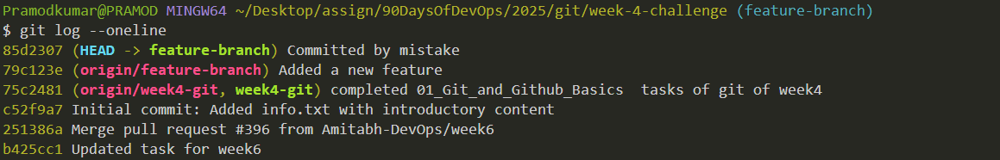
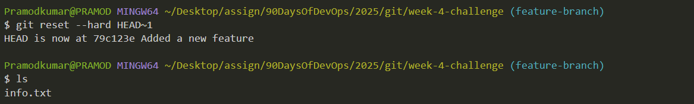
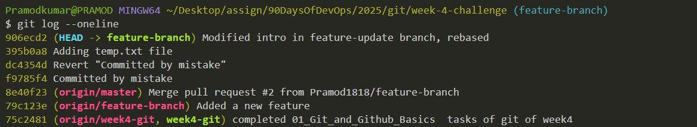

# Git Advanced Challenges - Week 4

## **Task 1: Working with Pull Requests (PRs)**  

### **Steps to Create a Pull Request**  
1. **Fork the repository** from GitHub.  
2. **Clone** your forked repository locally:  
   ```bash
   git clone <your-forked-repo-url>
   cd <repo-name>
   ```
3. **Create a new feature branch**:  
   ```bash
   git checkout -b feature-branch
   ```
4. **Make changes** and commit them:  
   ```bash
   echo "New Feature" >> feature.txt
   git add .
   git commit -m "Added a new feature"
   ```
5. **Push changes to GitHub**:  
   ```bash
   git push origin feature-branch
   ```
6. **Create a Pull Request (PR)** on GitHub:
   - Go to your repository on GitHub.
   - Click **New Pull Request**.
   - Select **feature-branch** to merge into `main`.
   - Add a **descriptive title and details** about the changes.
   - Request a review from a teammate.
7. **Handle feedback**:
   - If changes are requested, modify the files locally and push updates.
   - Once approved, click **Merge PR**.

### **Best Practices for PRs**  
✅ Write **clear commit messages** (e.g., "Refactored login feature to improve security").  
✅ Use **descriptive PR titles** (e.g., "Fix bug in payment gateway").  
✅ Add **detailed descriptions** explaining the change, issue fixed, and impact.  
✅ Always request **code reviews** before merging.  
✅ **Link issues** if applicable (e.g., “Fixes #123”).  

---
Screenshots:
 

 

 

 

 

 

 


## **Task 2: Undoing Changes – Reset & Revert**  

### **Common Scenarios & Commands**  

#### **1. Soft Reset (Undo Last Commit, Keep Changes Staged)**
- Use when you need to **modify the last commit** before pushing.
```bash
git reset --soft HEAD~1
```
💡 Changes remain **staged**, so you can amend the commit.

#### **2. Mixed Reset (Undo Last Commit, Keep Changes Unstaged)**
- Use when you need to **edit a file before re-adding it**.
```bash
git reset --mixed HEAD~1
```
💡 Changes are removed from staging but stay in working directory.

#### **3. Hard Reset (Undo Last Commit, Discard Changes)**
- Use when you want to **completely remove changes**.
```bash
git reset --hard HEAD~1
```
⚠️ **Warning:** This **deletes all changes permanently**.

#### **4. Revert a Commit (Safer Alternative)**
- Use when you want to **undo changes while keeping history**.
```bash
git revert HEAD
```
💡 Creates a **new commit** that undoes the last commit.

### **When to Use Reset vs. Revert?**
| Scenario | Use `reset` | Use `revert` |
|----------|------------|--------------|
| Before pushing changes | ✅ | ✅ |
| After pushing changes (team collaboration) | ❌ | ✅ |
| Keep commit history | ❌ | ✅ |
| Remove changes permanently | ✅ | ❌ |

---
 

 

 

 

 

 

 

 


## **Task 3: Stashing - Save Work Without Committing**  

### **Scenario:** You need to switch branches but don’t want to commit unfinished work.

### **Steps to Use `git stash`**
1. **Make changes without committing**:  
   ```bash
   echo "Temporary Change" >> temp.txt
   git add temp.txt
   ```
2. **Stash the changes** (save work temporarily):  
   ```bash
   git stash
   ```
   💡 This **removes the changes** but keeps them safe.

3. **Switch to another branch** and later apply the stash:  
   ```bash
   git checkout main
   git stash pop
   ```
   💡 `git stash pop` **restores** changes and **removes the stash**.

4. **If you want to keep the stash after applying**:  
   ```bash
   git stash apply
   ```
   💡 This applies the changes but **keeps the stash**.

### **When to Use `git stash`?**  
✅ When you need to **switch branches quickly** without committing.  
✅ When you're working on **experimental changes** and need to save them.  
✅ When you want to **store temporary work** without committing it.  

### **`git stash pop` vs. `git stash apply`**
| Command | What it does |
|---------|-------------|
| `git stash pop` | Applies the stash and **removes it** from stash history. |
| `git stash apply` | Applies the stash but **keeps it** in stash history. |

---
Screenshots:
 

 


---
## **Task 4: Cherry-Picking - Selectively Apply Commits**

### **Scenario**
A bug fix exists in another branch, and you only want to apply that specific commit.

### **Steps to Cherry-Pick a Commit**
1. **Find the commit you want to cherry-pick**
   ```bash
   git log --oneline
   ```
   - This will list commits with their short hashes.
   - Identify the commit you want to apply.

2. **Switch to the target branch**
   ```bash
   git checkout <target-branch>
   ```

3. **Cherry-pick the commit**
   ```bash
   git cherry-pick <commit-hash>
   ```

4. **Resolve conflicts (if any)**
   - Edit conflicting files.
   - Add resolved files:
     ```bash
     git add .
     ```
   - Continue cherry-picking:
     ```bash
     git cherry-pick --continue
     ```
   - If you want to cancel:
     ```bash
     git cherry-pick --abort
     ```

### **Key Takeaways**
- Cherry-picking allows applying a specific bug fix from one branch to another without merging unrelated changes.
- Risks include possible duplicate commits and conflicts.

Screenshots:
 

 


---

## **Task 5: Rebasing - Keeping a Clean Commit History**

### **Scenario**
Your branch is behind the main branch and needs to be updated without extra merge commits.

### **Steps to Rebase**
1. **Fetch the latest changes**
   ```bash
   git fetch origin main
   ```

2. **Switch to the feature branch**
   ```bash
   git checkout feature-branch
   ```

3. **Rebase the feature branch onto `main`**
   ```bash
   git rebase origin/main
   ```

4. **Resolve conflicts (if any)**
   - Edit conflicting files.
   - Stage the resolved files:
     ```bash
     git add .
     ```
   - Continue rebase:
     ```bash
     git rebase --continue
     ```
   - Cancel the rebase if needed:
     ```bash
     git rebase --abort
     ```

### **Key Takeaways**
- `merge` creates extra commits; `rebase` keeps history linear.
- Always rebase **before merging** into `main`.
- Avoid rebasing **shared branches**.

---

Screenshots:
 

 

 



## **Task 6: Branching Strategies in DevOps Workflows**

Branching strategies help teams manage development workflows efficiently.

### **1. Git Flow**
- **Branches:** `main`, `develop`, `feature/*`, `release/*`, `hotfix/*`
- **Usage:** Large teams and structured releases.
- **Pros:** Well-defined workflow, supports parallel development.
- **Cons:** More overhead, slower CI/CD.

### **2. GitHub Flow**
- **Branches:** `main`, `feature/*`
- **Usage:** Fast-paced CI/CD.
- **Pros:** Simple, quick merging.
- **Cons:** No explicit support for releases/hotfixes.

### **3. Trunk-Based Development (TBD)**
- **Concept:** Short-lived branches merged into `main` frequently.
- **Usage:** Continuous Integration (CI), fast-paced development.
- **Pros:** Reduces merge conflicts, speeds up delivery.
- **Cons:** Requires strong CI/CD automation.

### **Best Strategy for DevOps & CI/CD**
| Strategy | Best For | Pros | Cons |
|----------|---------|------|------|
| **Git Flow** | Large teams, structured releases | Well-defined process | Slower, more overhead |
| **GitHub Flow** | Fast-paced CI/CD | Simple, quick merging | No dedicated release management |
| **TBD** | Continuous deployment | Fastest, avoids merge conflicts | Risky without strong CI/CD |

### **Recommendation**
For **CI/CD and DevOps**, **Trunk-Based Development** is ideal because:
- Encourages **frequent integration**.
- Works well with **automated testing and deployment**.
- Reduces **merge conflicts**.

---

## **Simulating Git Workflows**

### **Example of a Git Workflow Simulation**
```bash
# Step 1: Create feature and hotfix branches
git branch feature-1
git branch hotfix-1

# Step 2: Switch to feature branch and start working
git checkout feature-1
```

---

## **Conclusion**
Understanding **branching strategies** is crucial for efficient DevOps workflows. The best approach depends on project needs, but for modern CI/CD, **Trunk-Based Development** is the most effective.

### ✅ **Final Deliverable**
Document all findings in `solution.md`:
- **Task 1**: PR workflow and best practices.
- **Task 2**: Reset vs. Revert explanation.
- **Task 3**: Stashing commands and use cases.
- **Cherry-picking** is useful for selectively applying commits but should be used carefully.
- **Rebasing** keeps the history clean and avoids unnecessary merge commits.
- **Choosing the right Git workflow** depends on your team’s needs and deployment strategy.


## **Topics Covered**  
1. Pull Requests – Collaborating in teams.  
2. Reset & Revert – Undo changes safely.  
3. Stashing – Saving work temporarily.  
4. Cherry-picking – Selecting specific commits.  
5. Rebasing – Maintaining a clean history.  
6. Branching Strategies – Industry best practices.  
---


