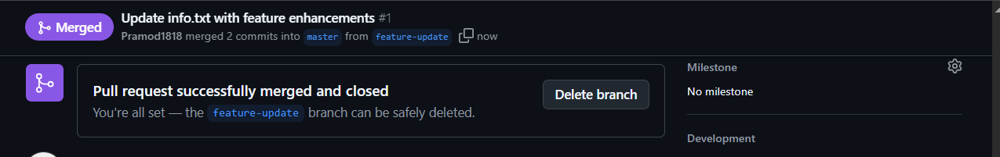
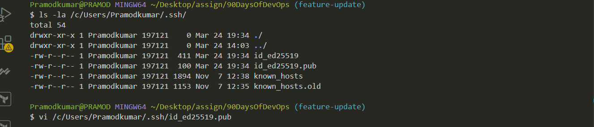
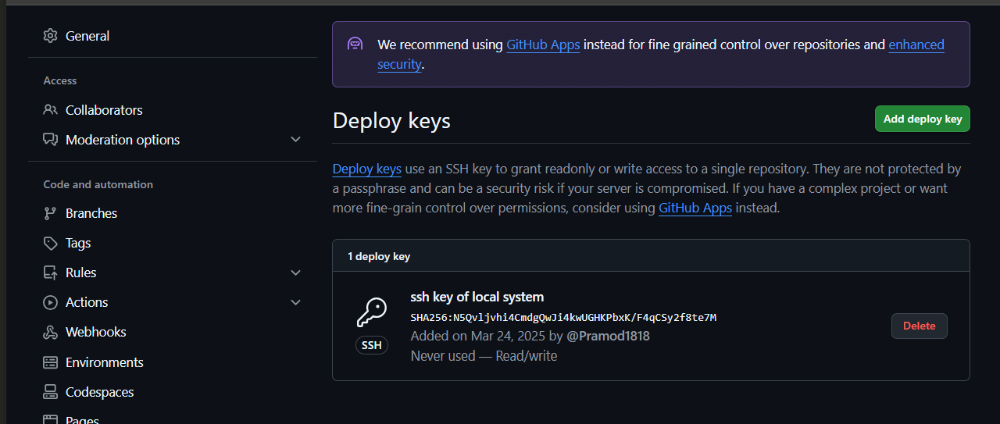

# Week 4: Git and GitHub Challenge

## Challenge Tasks

### Task 1: Fork and Clone the Repository

1. **Fork the Repository**
   - Visit [this repository](https://github.com/LondheShubham153/90DaysOfDevOps) and fork it to your GitHub account.

2. **Clone Your Fork Locally**
   - Clone the forked repository using HTTPS:
     ```bash
     git clone https://github.com/Pramod1818/90DaysOfDevOps.git

     ```
   - Navigate into the cloned repository:
     ```bash
     cd git/01_Git_and_Github_Basics
     ```
---
Screenshots
 


### Task 2: Initialize a Local Repository and Create a File

1. **Set Up a Challenge Directory**
   ```bash
   mkdir week-4-challenge
   cd week-4-challenge
   ```

2. **Initialize a Git Repository**
   ```bash
   git init
   ```

3. **Create and Edit a File**
   ```bash
   echo "My Name: Pramod Kumar" > info.txt
   echo "Introduction: I am participating in the 90 Days of DevOps challenge!" >> info.txt
   ```

4. **Stage and Commit the File**
   ```bash
   git add info.txt
   git commit -m "Initial commit: Added info.txt with introductory content"
   ```
---
Screenshots
 


### Task 3: Configure Remote URL with PAT and Push Changes

1. **Set Up Remote Repository with Personal Access Token (PAT)**
   ```bash
   git remote add origin https://Pramod1818:<key>@github.com/Pramod1818/90DaysOfDevOps.git
   git remote set-url origin https://pramod1818:<key>/pramod1818/90DaysOfDevOps.git
   ```

2. **Push Changes to GitHub**
   ```bash
   git push -u origin week4-git
   ```

3. **Pull Remote Changes (if necessary)**
   ```bash
   git pull origin week4-git
   ```
---
Screenshots
 


### Task 4: View Commit History

1. **Check Commit History**
   ```bash
   git log
   git log --oneline
   git log -n 5
   ```
---
Screenshots:
 


### Task 5: Branching and Merging

1. **Create and Switch to a New Branch**
   ```bash
   git branch feature-update
   git checkout feature-update
   ```

2. **Modify the File and Commit Changes**
   ```bash
   #modify info.txt
   git add info.txt
   git commit -m "Feature update: Enhanced info.txt with additional details"
   git push origin feature-update
   ```

3. **Create a Pull Request (PR) on GitHub**
   - Navigate to your repository on GitHub.
   - Click **"Compare & pull request"**.
   - Provide a **title and description** for your PR.
   - Select **base: main** and **compare: feature-update**.
   - Click **"Create pull request"**.

4. **Merge the PR into `main`**
   - Review the changes and click **"Merge pull request"**.
   - Confirm the merge and optionally **delete the feature branch**.

5. **(Optional) Delete the Merged Branch Locally**
   ```bash
   git branch -d feature-update
   git push origin --delete feature-update
   ```
---
Screenshots:
 

 

 

 

 

 

 


### (Advanced) Optional Extra Challenge
### 📌 Challenge Overview
create another branch (e.g., `experimental`) from your main branch, make a conflicting change to `info.txt`, then switch back to `feature-update` and merge `experimental` to simulate a merge conflict. Resolve the conflict manually, then commit the resolution.

---
1. **Restore and Sync the `feature-update` Branch**
    ```sh
    # Fetch latest changes from remote
    git fetch origin

    # Checkout the feature-update branch
    git checkout -b feature-update origin/feature-update

    # Pull the latest updates from remote
    git pull origin feature-update

    # Verify sync status
    git branch -vv
    ```

2. **Create and Switch to the `experimental` Branch**
    ```sh
    # Create a new branch from feature-update
    git checkout -b experimental
    ```

3. **Modify `info.txt` in `experimental` (Create a Conflict)**
    Edit the `week-4-challenge/info.txt` file with the following changes:
    ```txt
    My Name: Pramod Kumar
    Introduction: I am learning DevOps and working on Git branching strategies.
    ```
    Then, commit and push the changes:
    ```sh
    # Stage and commit the changes
    git add week-4-challenge/info.txt
    git commit -m "Modified intro in experimental branch -2"

    # Push to remote repository
    git push origin experimental
    ```

4. **Merge `experimental` into `feature-update` to Create a Conflict**
    ```sh
    # Switch back to feature-update branch
    git checkout feature-update

    # Attempt to merge experimental
    git merge experimental
    ```
    At this point, Git will detect a merge conflict and ask you to resolve it manually.

5. **Resolve the Merge Conflict**
    Open `week-4-challenge/info.txt`, where Git will mark the conflict like this:
    ```txt
    <<<<<<< feature-update
    My Name: Pramod Kumar
    Introduction: I am focusing on advanced Git workflows.
    =======
    My Name: Pramod Kumar
    Introduction: I am learning DevOps and working on Git branching strategies.
    >>>>>>> experimental
    ```
    Manually edit the file to keep the correct content and remove the conflict markers (`<<<<<<<`, `=======`, `>>>>>>>`).

    For example:
    ```txt
    My Name: Pramod Kumar
    Introduction: I am learning DevOps and focusing on advanced Git workflows.
    ```
    Save the file and proceed with the following commands:
    ```sh
    # Stage and commit the resolved file
    git add week-4-challenge/info.txt
    git commit -m "Resolved merge conflict between feature-update and experimental"

    # Push the resolved merge
    git push origin feature-update
    ```

6. **Delete Unneeded Branches After Merging**
    Once the pull request (PR) is merged, delete the branches to keep the repository clean:
    ```sh
    # Delete local branches
    git branch -d experimental
    git branch -d feature-update

    # Delete remote branches
    git push origin --delete experimental feature-update
    ```
---
Screenshots:

 

 

 

 

 

 

 

 


### Task 6: Understanding Branching Strategies

#### Why Branching Strategies Matter:
   - **Isolating Features and Bug Fixes**: Develop new features without affecting `main`.
   - **Parallel Development**: Multiple developers can work independently.
   - **Reducing Merge Conflicts**: Smaller, frequent merges minimize conflicts.
   - **Enabling Code Reviews**: PRs allow peer review before merging.

   Common strategies:
   - **Git Flow**: `feature`, `develop`, `release`, and `hotfix` branches.
   - **GitHub Flow**: Always deployable `main`, with feature branches.
   - **Trunk-Based Development**: Short-lived branches merged frequently.

---

### Bonus Task: SSH Authentication

1. **Generate an SSH Key**
   ```bash
   ssh-keygen
   ```
   - Copy the public key from `~/.ssh/id_ed25519.pub`.
   - Add it to GitHub under **SSH and GPG keys**.

2. **Switch Remote URL to SSH**
   ```bash
   git remote set-url origin git@github.com:<your-username>/90DaysOfDevOps.git
   ```

3. **Push Using SSH**
   ```bash
   git push origin feature-update
   ```
---

Screenhots:

 

 

 

 

 


## Summary
- **Completed Git and GitHub tasks**: cloning, branching, committing, pushing, and merging.
- **Documented the process** in `git_basic_solution.md`.


