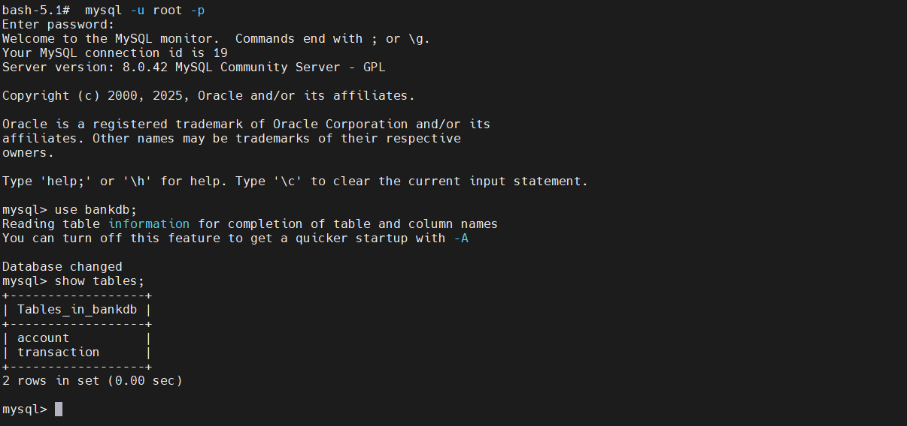
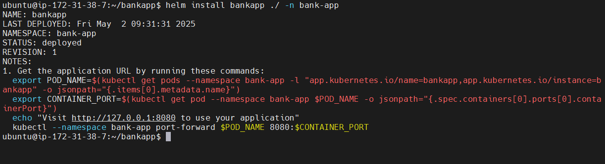
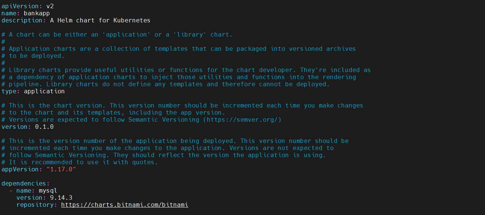

#  Week 7: Kubernetes Basics & Advanced Challenges, Solution

**Task repository(Springboot-app) url:** https://github.com/Pramod1818/Springboot-BankApp/tree/DevOps/kubernetes

##  Task 1: Understand Kubernetes Architecture & Deploy a Sample Pod
###  Kubernetes Architecture Overview
Kubernetes follows a **master-worker** architecture and has two major components:

####  Control Plane Components (Master Node)
1. **kube-apiserver**:
   The entry point for all Kubernetes REST commands. It validates and processes requests, then updates objects in etcd or forwards them to other control plane components.

2. **kube-scheduler**:
   Monitors unassigned pods and assigns them to nodes based on resource availability, affinity rules, taints/tolerations, etc.

3. **kube-controller-manager**:
   Manages controllers that regulate the cluster state, including the Replication Controller, Node Controller, Job Controller, etc.

4. **etcd**:
   A consistent and distributed key-value store used as the Kubernetes backing store. All cluster configuration data (state of pods, services, etc.) is stored here.

5. **cloud-controller-manager** (in cloud environments):
   Handles cloud-specific control logic, like managing load balancers or persistent volumes in AWS, GCP, Azure, etc.


####  Worker Node Components

1. **kubelet**:
   An agent running on each node. It registers the node with the cluster and ensures that containers described in the pod specs are running and healthy.

2. **kube-proxy**:
   Maintains network rules on nodes. It enables communication between services across different pods and nodes by managing IP forwarding, NAT, etc.

3. **Container Runtime**:
   Responsible for running containers. Popular choices include `containerd`, `CRI-O`, and `Docker` (deprecated in newer Kubernetes versions).


###  Deploying a Sample Pod

We will now deploy a simple NGINX Pod using a yml manifest.

####  `pod.yml`

```yml
apiVersion: v1
kind: Pod
metadata:
  name: nginx-pod
  labels:
    app: nginx
spec:
  containers:
    - name: nginx-container
      image: nginx:latest
      ports:
        - containerPort: 80
```

####  Explanation of `pod.yml`

* **apiVersion**: API version used to create the Pod (`v1`).
* **kind**: The Kubernetes object type, here it's a `Pod`.
* **metadata**: Metadata for the pod like `name` and `labels`.
* **spec**: Defines the desired behavior.

  * **containers**: List of container specs in the pod.

    * **name**: Logical name of the container.
    * **image**: Docker image to run (`nginx:latest`).
    * **ports**: Ports to be exposed by the container.


####  Deploying the Pod

```bash
# Apply the manifest
kubectl apply -f pod.yml

# Confirm pod creation
kubectl get pods

# View detailed pod info
kubectl describe pod nginx-pod

# Check pod logs 
kubectl logs nginx-pod
```

### Screenshots:
 


### Interview Q\&A

####  Q1: How do Kubernetes control plane components work together? What is the role of etcd?

* `kube-apiserver` receives API requests.
* `kube-scheduler` places unscheduled pods on appropriate nodes.
* `kube-controller-manager` ensures the current state matches the desired state.
* All state data is stored and persisted in `etcd`, ensuring high availability and consistency.


####  Q2: What steps would you take if a Pod fails to start?


1. **Check pod status**:
   ```bash
   kubectl get pods
   ```

2. **Get more info**:
   ```bash
   kubectl describe pod <pod-name>
   ```

3. **View container logs**:
   ```bash
   kubectl logs <pod-name>
   ```

4. **Common issues**:
   * ImagePullBackOff (image not found or private repo without secret)
   * CrashLoopBackOff (incorrect command, config issue)
   * Node pressure (CPU/Memory exhaustion)
   * Wrong port or container spec


##  Task 2: Deploy and Manage Core Kubernetes Objects

### Scenario
Deploy core Kubernetes objects for the **SpringBoot BankApp**, including Deployments, ReplicaSets, StatefulSets, DaemonSets, and use Namespaces to isolate resources.


###  Create a Namespace
**File: `namespace.yml`**
```yml
apiVersion: v1
kind: Namespace
metadata:
  name: bank-app
```

**Command:**
```bash
kubectl apply -f namespace.yml
```

###  Deploy a Deployment
**File: `deployment.yml`**
```yml
apiVersion: apps/v1
kind: Deployment
metadata:
  name: bankapp-web
  namespace: bank-app
spec:
  replicas: 3
  selector:
    matchLabels:
      app: bankapp-web
  template:
    metadata:
      labels:
        app: bankapp-web
    spec:
      containers:
      - name: bankapp-container
        image: pk1818/bankapp:latest
        ports:
        - containerPort: 8080
```

**Command:**
```bash
kubectl apply -f deployment.yml
kubectl get replicaset -n bank-app

kubectl get pods -n bank-app -l app=bankapp-web		
kubectl delete deployment bankapp-web -n bank-app	
# kubectl exec bankapp-web-6578fbbb76-rwzxw -c  bankapp-container -- /bin/sh
```

This will also create a **ReplicaSet** to maintain 3 Pods.

### Make Service for StatefulSet and Deploy a StatefulSet (Mysql)
**stateful_svc.yml**
```yml
apiVersion: v1
kind: Service
metadata:
  name: mysql
  namespace: bank-app
  labels:
    app: mysql
spec:
  ports:
    - port: 3306
      name: mysql
  clusterIP: None  # Headless service for StatefulSet
  selector:
    app: mysql
```

**File: `statefulset.yml`**
```yml
apiVersion: apps/v1
kind: StatefulSet
metadata:
  name: mysql
  namespace: bank-app
  labels:
    app: mysql
spec:
  serviceName: mysql
  replicas: 1
  selector:
    matchLabels:
      app: mysql
  template:
    metadata:
      labels:
        app: mysql
    spec:
      containers:
        - name: mysql
          image: mysql:8.0
          ports:
            - containerPort: 3306
          env:
            - name: MYSQL_ROOT_PASSWORD
              value: rootpass
            - name: MYSQL_DATABASE
              value: bankdb
          volumeMounts:
            - name: mysql-persistent-storage
              mountPath: /var/lib/mysql
  volumeClaimTemplates:
    - metadata:
        name: mysql-persistent-storage
      spec:
        accessModes: ["ReadWriteOnce"]
        resources:
          requests:
            storage: 5Gi
```

**Command:**
```bash
kubectl apply -f stateful_svc.yml
kubectl apply -f statefulset.yml

kubectl get statefulset -n bank-app
kubectl rollout restart statefulset mysql -n bank-app
```

### Deploy a DaemonSet (Monitoring Agent)

**File: `daemonset.yml`**
```yml
apiVersion: apps/v1
kind: DaemonSet
metadata:
  name: simple-daemon
  namespace: bank-app
  labels:
    app: simple-daemon
spec:
  selector:
    matchLabels:
      app: simple-daemon
  template:
    metadata:
      labels:
        app: simple-daemon
    spec:
      containers:
        - name: daemon-container
          image: busybox
          command: ["/bin/sh", "-c", "while true; do echo Hello from the daemon pod; sleep 60; done"]
```

**Command:**
```bash
kubectl apply -f daemonset.yml
kubectl logs -n bank-app simple-daemon-abcd1 -c daemon-container

kubectl get pods -n bank-app -l app=simple-daemon
kubectl delete daemonset simple-daemon -n bank-app
```

###  Screenshots:
 
 
 


###  Summary: Differences Between Core Kubernetes Objects

| Object          | Purpose / Key Feature                                              | Use Case Example                  |
|-----------------|--------------------------------------------------------------------|----------------------------------|
| **Namespace**   | Isolates resources in a cluster for better management.             | Separate environments (dev, prod) |
| **Deployment**  | Manages stateless apps with rolling updates and rollback features. | Frontend of BankApp               |
| **ReplicaSet**  | Ensures a specific number of Pod replicas are always running.      | Controlled via Deployment         |
| **StatefulSet** | Manages stateful apps with persistent storage and stable identity. | MySQL,PostgreSQL, Redis                 |
| **DaemonSet**   | Runs a Pod on all (or selected) nodes.                             | Monitoring/logging agents         |


### Interview Questions & Answers

#### Q1: How does a Deployment ensure that the desired state of Pods is maintained?
A Deployment manages a ReplicaSet, which ensures the specified number of pod replicas are running. If a Pod is deleted or crashes, the ReplicaSet automatically creates a new one. It also supports rolling updates and rollback mechanisms to keep the application available and consistent during changes.


#### Q2: What are the differences between Deployment, StatefulSet, and DaemonSet? Provide examples.

| Controller        | Key Difference                                        | Example Scenario                        |
| ----------------- | ----------------------------------------------------- | --------------------------------------- |
| **Deployment** | For stateless apps, easy scaling & updates           | BankApp web frontend                    |
| **StatefulSet** | For stateful apps needing persistent data            | PostgreSQL, Redis backend               |
| **DaemonSet** | One pod per node, for infrastructure tasks           | node-exporter for monitoring each node |


## Task 3: Networking & Exposure – Services, Ingress, and Network Policies
### Scenario:
Expose your SpringBoot BankApp application to internal and external traffic by creating Services and configuring an Ingress, while using Network Policies to secure communication.


###  1. ClusterIP Service (Internal Access)
> Use this when only internal communication within the cluster is needed (e.g., between frontend and backend)
**clusterip-service.yml**:
```yml
apiVersion: v1
kind: Service
metadata:
  name: bankapp-service
  namespace: bank-app
spec:
  selector:
    app: bankapp-web
  ports:
    - port: 8080
      targetPort: 8080
  type: ClusterIP
```

**Command**:
```bash
kubectl apply -f clusterip-service.yml
kubectl get svc -n bank-app
sudo -E kubectl port-forward svc/bankapp-service 8080:8080 -n bank-app --address=0.0.0.0
```

### 2. NodePort Service (External Access - Dev/Testing)

**nodeport-service.yml**:
```yml
apiVersion: v1
kind: Service
metadata:
  name: bankapp-nodeport
  namespace: bank-app
spec:
  selector:
    app: bankapp
  ports:
    - port: 8080
      targetPort: 8080
      nodePort: 30080
  type: NodePort
```
> Access: `http://<NodeIP>:30080`

###  3. Ingress (External Access with Routing)

**Install nginx**
```bash
kubectl apply -f https://raw.githubusercontent.com/kubernetes/ingress-nginx/main/deploy/static/provider/kind/deploy.yml
kubectl apply -f https://kind.sigs.k8s.io/examples/ingress/deploy-ingress-nginx.yml

kubectl wait --namespace ingress-nginx \
  --for=condition=ready pod \
  --selector=app.kubernetes.io/component=controller \
  --timeout=90s
 
 
 #get,desc pod
 kubectl logs ingress-nginx-controller-78d4468598-g4kxj  -n ingress-nginx
 ```

**ingress.yml**:
```yml
apiVersion: networking.k8s.io/v1
kind: Ingress
metadata:
  name: bankapp-ingress
  namespace: bank-app
  annotations:
    nginx.ingress.kubernetes.io/rewrite-target: /
spec:
  rules:
    - host: "34.255.0.223.nip.io"
      http:
        paths:
          - path: /
            pathType: Prefix
            backend:
              service:
                name: bankapp-service
                port:
                  number: 8080
```
kubectl port-forward svc/ingress-nginx-controller 8080:80 -n ingress-nginx --address=0.0.0.0


### 4. NetworkPolicy (Restrict Access to BankApp Pods)
```yml
# network-policy.yml
apiVersion: networking.k8s.io/v1
kind: NetworkPolicy
metadata:
  name: allow-frontend-to-bankapp
  namespace: bank-app
spec:
  podSelector:
    matchLabels:
      app: bankapp-web
  ingress:
    - from:
        - podSelector:
            matchLabels:
              role: frontend
  policyTypes:
    - Ingress
```

> Only allows Pods with `role=frontend` label in the same namespace to talk to `app=bankapp` Pods.


####  Differences Between Service Types:

* **ClusterIP**: Default; accessible **only within** the Kubernetes cluster. Used for internal communication.
* **NodePort**: Exposes the service on each Node’s IP at a **static port**. Suitable for development and testing environments.
* **LoadBalancer**: Allocates an **external IP** (via cloud provider) to expose the service. Best for production use in cloud environments.

####  Ingress:
* Manages HTTP/HTTPS routing to different services inside the cluster.
* Enables **domain-based access** and **SSL termination**.
* Requires an Ingress Controller (NGINX, Traefik, etc.).

####  Network Policy:
* Controls traffic **into and out of** Pods.
* Important for **security isolation** and compliance.
* Default behavior: all traffic is allowed until a policy is created. Once enforced, only allowed traffic is permitted.

###  Screenshots:
 
 
 
 


### Interview Questions
Q1: How do NodePort and LoadBalancer Services differ in terms of exposure and use cases?
* **NodePort** exposes the application on a port across all nodes. Useful for quick access in dev/test environments, but not scalable or secure for production.
* **LoadBalancer** provisions a cloud-based external load balancer that routes to the application. Best for production and scalable access.

Q2: What is the role of a Network Policy in Kubernetes, and can you describe a scenario where it is essential?
* Network Policies define rules for traffic flow between pods.
* Example: In a multi-tenant environment, you want frontend pods to access backend pods but restrict all other communication to/from database pods. A network policy ensures that only specified pods can communicate with the backend, enhancing **security and data isolation**.


##  Task 4: Storage Management – Persistent Volumes, Claims & StorageClass
### Scenario
Deploy a component of the SpringBoot **BankApp** application (in this case, a MySQL database) that requires **persistent storage** by using:

* Static **Persistent Volume (PV)**
* **Persistent Volume Claim (PVC)**
* Modify the **Deployment** to mount the PVC
* Learn about **StorageClass** for dynamic provisioning


#### Persistent Volume 
**mysql-pv.yml**
```yml
apiVersion: v1
kind: PersistentVolume
metadata:
  name: mysql-pv
  namespace: bank-app
spec:
  capacity:
    storage: 5Gi
  volumeMode: Filesystem
  accessModes:
    - ReadWriteOnce
  persistentVolumeReclaimPolicy: Retain  # Keeps the PV after the PVC is deleted
  storageClassName: standard  # Make sure this matches your cluster's default storage class
  hostPath:
    path: /mnt/data/mysql
    type: DirectoryOrCreate
```

> **Purpose:** Pre-allocates 5Gi of storage on host node under `/mnt/data/mysql`. Used for persistent MySQL data.


#### Persistent Volume Claim 
**mysql-pvc.yml**
```yml
apiVersion: v1
kind: PersistentVolumeClaim
metadata:
  name: mysql-pvc
  namespace: bank-app
spec:
  accessModes:
    - ReadWriteOnce
  resources:
    requests:
      storage: 5Gi
  storageClassName: standard
```
> **Purpose:** Requests 5Gi storage from available PVs. It will bind to `mysql-pv` if the requirements match.


#### MySQL Deployment using PVC 
**mysql-deployment.yml**
```yml
apiVersion: apps/v1
kind: Deployment
metadata:
  name: mysql
  namespace: bank-app
  labels:
    app: mysql
spec:
  replicas: 1
  selector:
    matchLabels:
      app: mysql
  template:
    metadata:
      labels:
        app: mysql
    spec:
      containers:
        - name: mysql
          image: mysql:8.0
          ports:
            - containerPort: 3306
          env:
            - name: MYSQL_ROOT_PASSWORD
              value: rootpass
            - name: MYSQL_DATABASE
              value: bankdb
          volumeMounts:
            - name: mysql-pv-storage
              mountPath: /var/lib/mysql
      volumes:
      - name: mysql-pv-storage
        persistentVolumeClaim:
          claimName: mysql-pvc
```
> **Purpose:** Mounts the PVC to `/var/lib/mysql` inside the container to persist DB files even if the pod restarts.


###  Comands
```bash
kubectl apply -f mysql-pv.yml
kubectl apply -f mysql-pvc.yml
kubectl apply -f mysql-deployment.yml

kubectl get pods -n bank-app
kubectl exec -n bank-app -it mysql-7ddcfcd4c5-wqr5h -- bash
mysql -u root -p
```

### Explanation – StorageClass (Dynamic Provisioning)
#### What is a StorageClass?
A **StorageClass** is used to provision volumes **dynamically** when PVCs are created, rather than relying on static PVs.

#### Benefits:
* Automatically creates and attaches persistent storage when a PVC is applied.
* Useful in cloud environments where storage backends like AWS EBS, GCP PD, or Azure Disk are integrated.
* Reduces the need to pre-create PVs.
* Allows multiple storage types (fast SSD, slow HDD) via multiple classes.

### Example:
```yml
apiVersion: storage.k8s.io/v1
kind: StorageClass
metadata:
  name: fast-ssd
provisioner: kubernetes.io/aws-ebs
parameters:
  type: gp2
```

Then in PVC:
```yml
spec:
  storageClassName: fast-ssd
```

###  Screenshots:
 
 



### Interview Questions

#### Q1: What are the main differences between a Persistent Volume (PV) and a Persistent Volume Claim (PVC)?

| Feature    | Persistent Volume (PV)                         | Persistent Volume Claim (PVC)               |
|-----------------|----------------------------------|--------------------------------------------------- |
| Definition | The actual piece of storage provisioned        | A request for storage by a user/application |
| Created by | Admin (static) or dynamically via StorageClass | User or application                         |
| Purpose    | Exposes storage to the cluster                 | Binds to PV to use the storage              |


#### Q2: How does a StorageClass simplify storage management in Kubernetes?

* Automates provisioning of storage (no manual PV creation).
* Provides flexibility to define different storage types (SSD, HDD).
* Reduces complexity in managing dynamic workloads and scaling.
* Helps in multi-tenant environments with varying storage requirements.

By using PV, PVC, and optionally a StorageClass, we ensure that our **SpringBoot BankApp** can reliably persist its data (like in a MySQL database) across pod restarts and deployments – a critical aspect of production-ready microservices.


## Task 5: Configuration & Secrets Management with ConfigMaps and Secrets
### Scenario
Deploy a component of the SpringBoot **BankApp** application that consumes **external configuration** and **sensitive data** using:

* **ConfigMaps** for general configurations
* **Secrets** for sensitive credentials
* A **Deployment** that consumes both via environment variables


**bankapp-configmap.yml**
```yml
apiVersion: v1
kind: ConfigMap
metadata:
  name: bankapp-config
  namespace: bank-app
data:
  SPRING_DATASOURCE_URL: jdbc:mysql://mysql.bank-app.svc.cluster.local:3306/bankdb?useSSL=false&allowPublicKeyRetrieval=true&serverTimezone=UTC
  SPRING_DATASOURCE_USERNAME: root
  MYSQL_DATABASE: bankdb
```

> **Purpose:** Provides external configuration such as the database connection URL and active profile to the Spring Boot application.

---

**bankapp-secret.yml**
```yml
apiVersion: v1
kind: Secret
metadata:
  name: mysql-secret
  namespace: bank-app
type: Opaque
data:
  MYSQL_ROOT_PASSWORD: cm9vdHBhc3MK=  
  SPRING_DATASOURCE_PASSWORD: cm9vdHBhc3MK= #base 64 
#use to convert echo -n "rootpass" | base64  
#cm9vdHBhc3M=
```

> **Purpose:** Stores sensitive data (username and password) securely.

**bankapp-deployment.yml**
```yml
    spec:
      containers:
      - name: bankapp-container
        image: pk1818/bankapp:latest
        ports:
        - containerPort: 8080
  #     env:
  #     - name: SPRING_DATASOURCE_URL
  #       valueFrom:
  #         configMapKeyRef:
  #           name: bankapp-config
  #           key: SPRING_DATASOURCE_URL
        envFrom:
         - configMapRef:
            name: bankapp-config
         - secretRef:
            name: bankapp-secret
```

> **Purpose:** Mounts configuration and secrets into the container as environment variables.


### Apply the ymls

```bash
kubectl apply -f bankapp-configmap.yml
kubectl apply -f bankapp-secret.yml
kubectl apply -f bankapp-deployment.yml
kubectl get pods -n bank-app
kubectl exec -n bank-app bankapp-web-597574c4f-2wgg2  -- printenv | grep SPRING

```


### Explanation
* **ConfigMap** is used to store non-sensitive configuration data.
* **Secret** is used to store sensitive credentials such as DB username/password.
* **envFrom** simplifies injection of all keys from a ConfigMap or Secret as environment variables in one block.

---

###  Screenshots:
 
 


#### Interview Questions & Answers

Q1: How would you update a running application if a ConfigMap or Secret is modified?
Environment variables loaded from a ConfigMap or Secret do **not update automatically** in a running pod. You need to **restart the pod** or trigger a **rolling restart**:

```
kubectl rollout restart deployment bankapp-web -n bank-app
```
This reloads the updated values.

#### Q2: What measures do you take to secure Secrets in Kubernetes?
* **Use RBAC**: Apply least-privilege access controls to limit who/what can access secrets.
* **Encrypt at rest**: Enable encryption of secrets using Kubernetes' built-in encryption providers.
* **Avoid secrets in plaintext yml**: Use `kubectl create secret` to avoid storing secrets in source control.
* **Use external tools**: Consider integrating with secure solutions like:

  * **HashiCorp Vault**
  * **AWS Secrets Manager**
  * **Azure Key Vault**


This task demonstrates how to decouple configuration and credentials from the application code using Kubernetes-native constructs. It makes your deployments more secure, portable, and environment-aware.


## Task 6: Autoscaling & Resource Management

### Scenario
We implement **Horizontal Pod Autoscaler (HPA)** to automatically scale the number of replicas for the `bankapp-web` component based on CPU usage.we explore **Vertical Pod Autoscaler (VPA)** and ensure the **Metrics Server** is running to support autoscaling features.

```bash
#first install metric server
kubectl apply -f https://github.com/kubernetes-sigs/metrics-server/releases/latest/download/components.yaml
kubectl get deployment metrics-server -n kube-system
kubectl edit deployment metrics-server -n kube-system
#Add the following under containers.args:
# - --kubelet-insecure-tls

#then check
kubectl top nodes
kubectl get --raw "/apis/metrics.k8s.io/v1beta1/nodes" | jq
```

**bankapp-deployment.yml**
Defines the initial deployment with CPU and memory **requests** and **limits**.
```yml
      containers:
      - name: bankapp-container
        image: pk1818/bankapp:latest
        ports:
        - containerPort: 8080
        resources:
          requests:
            cpu: "100m"
            memory: "128Mi"
          limits:
            cpu: "500m"
            memory: "256Mi"
```

**bankapp-hpa.yml**
Defines the **Horizontal Pod Autoscaler** based on CPU utilization.
```yml
apiVersion: autoscaling/v2
kind: HorizontalPodAutoscaler
metadata:
  name: bankapp-hpa
  namespace: bank-app
spec:
  scaleTargetRef:
    apiVersion: apps/v1
    kind: Deployment
    name: bankapp-web
  minReplicas: 1
  maxReplicas: 4
  metrics:
  - type: Resource
    resource:
      name: cpu
      target:
        type: Utilization
        averageUtilization: 40
```

**bankapp-vpa.yml**
Defines a **Vertical Pod Autoscaler** to automatically adjust resource requests.
```bash
# Install vpa
kubectl apply -f https://github.com/kubernetes/autoscaler/releases/latest/download/vertical-pod-autoscaler.yaml
```

```yml
apiVersion: autoscaling.k8s.io/v1
kind: VerticalPodAutoscaler
metadata:
  name: bankapp-vpa
  namespace: bank-app
spec:
  targetRef:
    apiVersion: "apps/v1"
    kind:       Deployment
    name:       bankapp-web
  updatePolicy:
    updateMode: "Auto"
```


**Commands to Apply**
```bash
kubectl apply -f bankapp-deployment.yml
kubectl apply -f bankapp-hpa.yml
kubectl apply -f bankapp-vpa.yml 

kubectl get hpa -n bank-app
```

###  Screenshots:


### Explanation

**Horizontal Pod Autoscaler (HPA)**
* Automatically adjusts the number of replicas based on CPU usage.
* In our config, it targets 50% CPU utilization and scales between 1 to 5 pods.
* Requires Metrics Server to fetch live usage stats.

**Vertical Pod Autoscaler (VPA)**
* Dynamically recommends or enforces CPU/memory requests and limits.
* Useful for workloads where memory/CPU use changes but can’t scale horizontally.

**Benefits of Autoscaling**
* Ensures efficient resource utilization.
* Reduces cost by scaling down under low load.
* Maintains performance and availability during high traffic.
* Minimizes manual scaling efforts and operational overhead.


### Interview Questions & Answers
**Q1: How does HPA work in Kubernetes?**
HPA monitors CPU/memory metrics from the **Metrics Server**. If resource usage exceeds a defined threshold (e.g. 50%), it increases pod replicas. If usage drops below, it reduces them. It performs this check periodically using Kubernetes control loops.

**Q2: When would VPA be more beneficial than HPA?**
VPA is better when:
* The application cannot scale horizontally (e.g. stateful apps, singleton processes).
* The app has fluctuating resource needs but is always served by one replica.
* You want Kubernetes to auto-tune resource requests to avoid over/under-provisioning.


## Task 7: Security & Access Control
### Part A: RBAC Implementation

In this section, we implement Role-Based Access Control (RBAC) in a Kubernetes cluster to secure access to resources. The objective is to create roles, role bindings, and simulate real-world user access control scenarios.

### Create Roles and RoleBindings
**Admin Role and RoleBinding**
```yaml
# admin-role.yaml
apiVersion: rbac.authorization.k8s.io/v1
kind: Role
metadata:
  namespace: bank-app
  name: admin-role
rules:
- apiGroups: [""]
  resources: ["pods", "services"]
  verbs: ["get", "list", "create", "delete", "update"]


# admin-rolebinding.yaml
apiVersion: rbac.authorization.k8s.io/v1
kind: RoleBinding
metadata:
  name: admin-rolebinding
  namespace: bank-app
subjects:
- kind: User
  name: admin-user
  apiGroup: rbac.authorization.k8s.io
roleRef:
  kind: Role
  name: admin-role
  apiGroup: rbac.authorization.k8s.io
```

**Developer Role and RoleBinding**
```yaml
# developer-role.yaml
apiVersion: rbac.authorization.k8s.io/v1
kind: Role
metadata:
  namespace: bank-app
  name: developer-role
rules:
- apiGroups: [""]
  resources: ["pods", "services"]
  verbs: ["get", "create", "update"]

---

# developer-rolebinding.yaml
apiVersion: rbac.authorization.k8s.io/v1
kind: RoleBinding
metadata:
  name: developer-rolebinding
  namespace: bank-app
subjects:
- kind: User
  name: developer-user
  apiGroup: rbac.authorization.k8s.io
roleRef:
  kind: Role
  name: developer-role
  apiGroup: rbac.authorization.k8s.io
```

**Tester Role and RoleBinding**
```yaml
# tester-role.yaml
apiVersion: rbac.authorization.k8s.io/v1
kind: Role
metadata:
  namespace: bank-app
  name: tester-role
rules:
- apiGroups: [""]
  resources: ["pods", "services"]
  verbs: ["get", "list", "watch"]

---

# tester-rolebinding.yaml
apiVersion: rbac.authorization.k8s.io/v1
kind: RoleBinding
metadata:
  name: tester-rolebinding
  namespace: bank-app
subjects:
- kind: User
  name: tester-user
  apiGroup: rbac.authorization.k8s.io
roleRef:
  kind: Role
  name: tester-role
  apiGroup: rbac.authorization.k8s.io
```

**Simulate Test Users**

You can simulate user actions using the `kubectl auth can-i` command to check their permissions:

```bash
kubectl auth can-i delete pods --as admin-user -n bank-app  # Should return "yes"
kubectl auth can-i delete pods --as developer-user -n bank-app  # Should return "no"
kubectl auth can-i delete pods --as tester-user -n bank-app  # Should return "no"
```

** RBAC Logs**
You can use the following command to check RBAC logs and verify that unauthorized access attempts are recorded:

```bash
kubectl logs <pod-name> -n bank-app
```

### Part B: Additional Security Controls
This section focuses on enhancing security and stability in the Kubernetes cluster by applying Taints, Tolerations, and Pod Disruption Budgets (PDBs).

**Set Up Taints and Tolerations**
#### Apply Taint to Node
To isolate critical workloads, apply a taint to a node:

```bash
kubectl get nodes
kubectl taint nodes kind-cluster-worker role=banking:NoSchedule
```

#### Add Toleration to Pods
In the pod specification, add a toleration to allow the pod to be scheduled on the tainted node:

```yaml
spec:
  tolerations:
  - key: "role"
    operator: "Equal"
    value: "banking"
    effect: "NoSchedule"
```


**Define Pod Disruption Budget (PDB)**
A Pod Disruption Budget (PDB) ensures that a minimum number of pods remain available during voluntary disruptions (e.g., node drain or upgrades).

#### PDB YAML
```yaml
apiVersion: policy/v1
kind: PodDisruptionBudget
metadata:
  name: bankapp-pdb
  namespace: bank-app
spec:
  minAvailable: 1
  selector:
    matchLabels:
      app: bankapp-web
```


#### Apply PDB

```bash
kubectl apply -f pdb.yaml
kubectl describe node kind-cluster-worker | grep Taints
kubectl get pdb -n bank-app
```
###  Screenshots:
 
 


#### Summary of Benefits
* **RBAC**: Helps control user access to Kubernetes resources, ensuring that each user has the appropriate level of access.
* **Taints and Tolerations**: Isolate critical workloads by ensuring they are only scheduled on specific nodes.
* **Pod Disruption Budget (PDB)**: Ensures high availability during voluntary disruptions by maintaining the required number of pods.

---

### Interview Questions and Answers

#### Q1: How do RBAC policies help secure a multi-team Kubernetes environment?
RBAC ensures that each user or group of users only has access to the Kubernetes resources they need, minimizing the risk of accidental or malicious changes to the environment.

#### Q2: Can you provide an example of how improper RBAC could compromise a cluster?

If an RBAC policy is misconfigured, for example, granting the `developer` role `delete` permissions for critical resources like pods, it could lead to unintended downtime or deletion of essential services.

#### Q3: How do taints and tolerations ensure that critical workloads are isolated from interference?

Taints allow nodes to repel certain pods unless they have the matching tolerations, ensuring that critical workloads are only scheduled on appropriate nodes, and other less critical workloads do not interfere.

Taint (on a Node):
Think of a taint as a mark or a restriction placed on a Node.
It says to the Kubernetes scheduler: "This Node should not accept certain Pods."

Toleration (on a Pod):
A toleration is like a permission slip that you can give to a Pod.
It tells the Kubernetes scheduler: "This Pod is allowed to run on Nodes that have a specific taint."

- How They Work Together (Simple):
A Node gets a taint (the "Wet Paint" sign).
By default, the Kubernetes scheduler will avoid placing Pods on that Node.
If a Pod has a toleration that matches the taint on the Node (like the "Permission Slip"), the scheduler can place that Pod on the Node.
		
role=banking:NoSchedule is like saying, "This node is specifically for 'banking' stuff. Only Pods that have been explicitly told they are allowed on 'banking' nodes should be scheduled here


#### Q4: Why are Pod Disruption Budgets important for maintaining application availability?

PDBs prevent disruptions, such as node upgrades or maintenance, from affecting the availability of a minimum number of pods, ensuring high availability during scheduled or voluntary disruptions.


## Task 8: Job Scheduling & Custom Resources - Solution

### Objective:
Manage scheduled tasks and extend Kubernetes functionality by creating Jobs, CronJobs, and a Custom Resource Definition (CRD).


### **Part 1: Jobs & CronJobs**

#### **1. Job (One-time Task)**

**Use case**: A job is used for tasks that need to be run once and completed, such as a database backup, a migration job, or batch processing.

**yml for Job: `job.yml`**

```yml
apiVersion: batch/v1
kind: Job
metadata:
  name: db-backup-job
  namespace: bank-app
spec:
  template:
    spec:
      containers:
      - name: backup
        image: busybox
        command: ["sh", "-c", "echo 'Backing up DB...' && sleep 5"]
      restartPolicy: Never
  backoffLimit: 3
```

**Explanation**:
* This `Job` creates a one-time task (`db-backup-job`) that runs a `busybox` container and performs the task of backing up a database. It will not restart on failure (`restartPolicy: Never`), and if the task fails three times, it will not retry (`backoffLimit: 3`).

```bash
kubectl apply -f job.yml
```

#### **2. CronJob (Scheduled Task)**
**Use case**: A CronJob is used for tasks that need to be scheduled periodically, such as nightly backups or generating regular reports.

**yml for CronJob: `cronjob.yml`**
```yml
apiVersion: batch/v1
kind: CronJob
metadata:
  name: db-backup-cron
  namespace: bank-app
spec:
  schedule: "*/5 * * * *"  # Every 5 minutes
  jobTemplate:
    spec:
      template:
        spec:
          containers:
          - name: cron-backup
            image: busybox
            command: ["sh", "-c", "echo 'Scheduled DB backup...' && sleep 5"]
          restartPolicy: OnFailure
```

**Explanation**:
* This `CronJob` runs every 5 minutes as specified by the cron expression (`*/5 * * * *`).
* It runs a `busybox` container that simulates a backup operation. If it fails, it will restart (`restartPolicy: OnFailure`).

```bash
kubectl apply -f job.yml,cronjob.yml
kubectl get jobs -n bank-app
kubectl get pods -n bank-app | grep db-backup-job
kubectl logs <job-pod-name> -n bank-app
```

### **Part 2: Custom Resource Definition (CRD)**
#### **3. Create a CRD**

**Use case**: A Custom Resource Definition (CRD) is used to extend Kubernetes with new types of resources that are not built-in, such as resources specific to an application, like a custom "BankApp".

**yml for CRD: `crd.yml`**
```yml
apiVersion: apiextensions.k8s.io/v1
kind: CustomResourceDefinition
metadata:
  name: bankapps.bankapp.io
spec:
  group: bankapp.io
  versions:
    - name: v1
      served: true
      storage: true
      schema:
        openAPIV3Schema:
          type: object
          properties:
            spec:
              type: object
              properties:
                name:
                  type: string
                version:
                  type: string
  scope: Namespaced
  names:
    plural: bankapps
    singular: bankapp
    kind: BankApp
    shortNames:
    - bap
```

**Explanation**:
* This `CustomResourceDefinition` defines a new Kubernetes resource type called `BankApp`. It has properties such as `name` and `version` under the `spec` field.
* The CRD is defined under the `group` `bankapp.io` and version `v1`.


#### **4. Create a Custom Resource (Instance of CRD)**
**Use case**: After defining a CRD, you can create custom resources that are instances of that CRD. For example, you can create an instance of a `BankApp`.

**yml for Custom Resource: `bankapp-instance.yml`**
```yml
apiVersion: bankapp.io/v1
kind: BankApp
metadata:
  name: my-bankapp
  namespace: bank-app
spec:
  name: payment-service
  version: v1.0.0
```

**Explanation**:
* This custom resource defines an instance of the `BankApp` CRD, with the name `payment-service` and version `v1.0.0`.
```bash
kubectl apply -f crd.yml
kubectl apply -f bankapp-instance.yml
```

###  Screenshots:
 
 


1. **Job yml**: A description of how Jobs are used for one-time tasks.
2. **CronJob yml**: A description of how CronJobs are used for scheduled, periodic tasks.
3. **CRD yml**: Explanation of how Custom Resource Definitions (CRDs) are used to extend Kubernetes capabilities.
4. **Custom Resource Instance**: Explanation of how instances of a CRD are created and utilized.


### **Interview Questions**
#### **1. What factors would influence your decision to use a CronJob versus a Job?**

* **Job**: Use a `Job` for tasks that need to be executed **once** and do not need to be scheduled (e.g., backup tasks, migrations).
* **CronJob**: Use a `CronJob` for **periodic** tasks that need to run on a specific schedule (e.g., regular backups, cleanup tasks).

#### **2. How do CRDs enable custom extensions in Kubernetes?**

* CRDs allow developers to define **custom resource types**, which extend the Kubernetes API. This enables users to create resources tailored to their application's needs, such as a `BankApp` for managing banking applications, or any other domain-specific resource. CRDs are useful for building **operators** and **domain-specific APIs** inside Kubernetes.


# Task 9: Bonus Task - Advanced Deployment with Helm, Service Mesh, or EKS - Solution

## Objective:
For an added challenge, deploy a component of the SpringBoot BankApp application using Helm, implement a basic Service Mesh (e.g., Istio), or deploy your cluster on AWS EKS.


### **Deploy SpringBoot BankApp Using Helm**
Helm simplifies Kubernetes application deployment by managing complex manifests with reusable, versioned charts.


#### **Install Helm**
If Helm is not installed, use the following command to install it:

```bash
curl https://raw.githubusercontent.com/helm/helm/main/scripts/get-helm-3 | bash
helm version
```

#### **Create a Helm Chart**
Generate the default Helm chart structure for your SpringBoot BankApp:
```bash
helm create bankapp
cd bankapp
```

This will create the following directory structure:
```
bankapp/
├── Chart.yml
├── values.yml
└── templates/
    ├── deployment.yml
    ├── service.yml
    ├── ingress.yml
    └── ...
```


#### **Modify**
In the `values.yml` file, customize the app's image, replica count, and resources as follows:

```yml
# values.yml
replicaCount: 1

image:
  repository: your-dockerhub-username/bankapp
  tag: latest
  pullPolicy: IfNotPresent

service:
  type: ClusterIP
  port: 8080

resources:
  requests:
    cpu: "100m"
    memory: "128Mi"
  limits:
    cpu: "200m"
    memory: "256Mi"
```

* **Explanation**: The `values.yml` file is where you define custom values for the Helm chart (e.g., image repository, resource limits).


#### ** Update Deployment Template**
Edit the `templates/deployment.yml` to use values from `values.yml` and optionally mount persistent volumes, ConfigMaps, or Secrets.

```yml
apiVersion: apps/v1
kind: Deployment
metadata:
  name: {{ .Release.Name }}
spec:
  replicas: {{ .Values.replicaCount }}
  selector:
    matchLabels:
      app: {{ .Release.Name }}
  template:
    metadata:
      labels:
        app: {{ .Release.Name }}
    spec:
      containers:
        - name: {{ .Release.Name }}
          image: "{{ .Values.image.repository }}:{{ .Values.image.tag }}"
          ports:
            - containerPort: 8080
          resources:
            {{- toyml .Values.resources | nindent 12 }}
```


#### **Install the Chart in a Namespace**
```bash
#Create a namespace for the app and install the Helm chart:
kubectl create namespace bank-app
helm install bankapp ./ -n bank-app

#Check the deployment:
kubectl get all -n bank-app
```

#### **Upgrade or Rollback**
```bash
#If you make any changes to the Helm chart and want to upgrade the deployment:
helm upgrade bankapp ./ -n bank-app

#To rollback to a previous version:
helm rollback bankapp 1 -n bank-app
```

#### **Uninstall (Cleanup)**
```bash
#To uninstall the Helm chart and delete resources:
helm uninstall bankapp -n bank-app
```


### **Option 2: Service Mesh Implementation with Istio (Basic)**

A **Service Mesh** like Istio is used for advanced traffic management, observability, and security between microservices.
#### **Step-by-Step: Deploy Istio and BankApp**

#### **Step 1: Install Istio**

Install Istio using `istioctl`:

```bash
curl -L https://istio.io/downloadIstio | sh -
export PATH=$PWD/istio-*/bin:$PATH
istioctl install --set profile=demo
```


#### **Step 2: Enable Istio Injection**
Label the namespace to enable automatic sidecar injection:

```bash
kubectl label namespace bank-app istio-injection=enabled
```


#### **Step 3: Deploy the BankApp with Istio**

Apply the Kubernetes resources for your BankApp. Istio will automatically inject sidecar proxies into the BankApp pods for enhanced traffic management.

```bash
kubectl apply -f bankapp-deployment.yml -n bank-app
```


#### **Step 4: Verify Traffic Management**
You can now use Istio's powerful traffic management features, such as routing, retries, and fault injection, between the BankApp services.


### **Option 3: Deploy on AWS EKS**
AWS EKS provides a fully managed Kubernetes service, removing the need to manage Kubernetes infrastructure manually.

#### **Step-by-Step: Deploy BankApp on EKS**
#### **Step 1: Create an EKS Cluster**

Use the AWS CLI to create an EKS cluster:
```bash
aws eks create-cluster \
  --name bankapp-cluster \
  --role-arn arn:aws:iam::ACCOUNT_ID:role/EKS-Cluster-Role \
  --resources-vpc-config subnetIds=subnet-xxxxxxxx,subnet-yyyyyyyy,securityGroupIds=sg-xxxxxxxx
```


#### **Step 2: Configure kubectl**
Configure your `kubectl` to use the newly created EKS cluster:

```bash
aws eks --region us-west-2 update-kubeconfig --name bankapp-cluster
```


#### **Step 3: Deploy BankApp on EKS**
Once your `kubectl` is connected to the EKS cluster, apply your BankApp's deployment:
```bash
kubectl apply -f bankapp-deployment.yml -n bank-app
```
###  Screenshots:

 
 
 
 
 
 



### Note

* **Helm Chart Structure**: Include files such as `Chart.yml`, `values.yml`, and templates like `deployment.yml` and `service.yml`.
* **Service Mesh**: Include Istio configuration for traffic management and service interaction.
* **EKS Deployment**: Include steps for setting up the cluster and deploying your app on AWS.

### **Benefits**

* **Helm**:

  * **Easy Upgrades**: Helm allows for easy upgrades and version management of applications.
  * **Rollback Support**: You can rollback to a previous release with a single command.
  * **Template-driven Consistency**: Helm charts make deployments repeatable and maintainable.

* **Service Mesh (Istio)**:

  * **Traffic Management**: Enables advanced routing, retries, and fault tolerance between services.
  * **Security**: Istio provides mutual TLS, securing communication between services.
  * **Observability**: Istio provides detailed telemetry, logs, and metrics for your microservices.

* **AWS EKS**:

  * **Managed Kubernetes**: AWS EKS removes the complexity of managing Kubernetes infrastructure.
  * **Scalability**: Easily scale your workloads in EKS with minimal effort.
  * **Integration with AWS Services**: EKS integrates seamlessly with other AWS services like IAM, VPC, and CloudWatch.


### **Interview Questions**
#### **1. How does Helm simplify Kubernetes deployments?**

* Helm simplifies Kubernetes deployments by packaging all necessary Kubernetes resources into reusable and versioned charts. It allows for easy parameterization and configuration of deployments, supports rollback, and integrates with CI/CD pipelines.

#### **2. What are the benefits of using a Service Mesh in a microservices architecture?**

* A Service Mesh provides traffic management, observability, and security between microservices. It enables advanced routing, retries, and fault injection. It also allows mutual TLS for service-to-service communication and provides detailed telemetry for monitoring and logging.

#### **3. How does deploying on AWS EKS compare with managing your own Kubernetes cluster?**

* Deploying on AWS EKS offloads the management of Kubernetes infrastructure to AWS. EKS provides a fully managed control plane, automatic scaling, and integration with AWS services, reducing operational overhead compared to managing your own Kubernetes cluster.


