# 📌 Linux Tasks

## 🔹 1️⃣ User & Group Management
Learn about Linux **users, groups, and permissions** (`/etc/passwd`, `/etc/group`).

### **Task:**
- Create a user `devops_user` and add them to a group `devops_team`.
- Set a password and grant **sudo** access.
- Restrict SSH login for certain users in `/etc/ssh/sshd_config`.

### **Commands:**
```bash
# Create the group (if not exists)
sudo groupadd devops_team  

# Create the user and assign them to the group
sudo useradd -m -g devops_team -s /bin/bash devops_user

# Set a password for the user
sudo passwd devops_user  

# Grant sudo privileges to the user
sudo usermod -aG sudo devops_user

# Alternatively, add a sudo rule
echo "devops_user ALL=(ALL) NOPASSWD:ALL" | sudo tee /etc/sudoers.d/devops_user
sudo chmod 0440 /etc/sudoers.d/devops_user  # Set proper permissions

# Restrict SSH access
sudo nano /etc/ssh/sshd_config
# Add the following lines:
DenyUsers user1 user2
AllowUsers devops_user

# Restart SSH service
sudo systemctl restart sshd
```

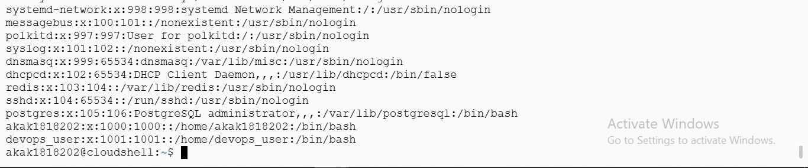
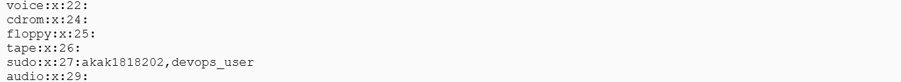 
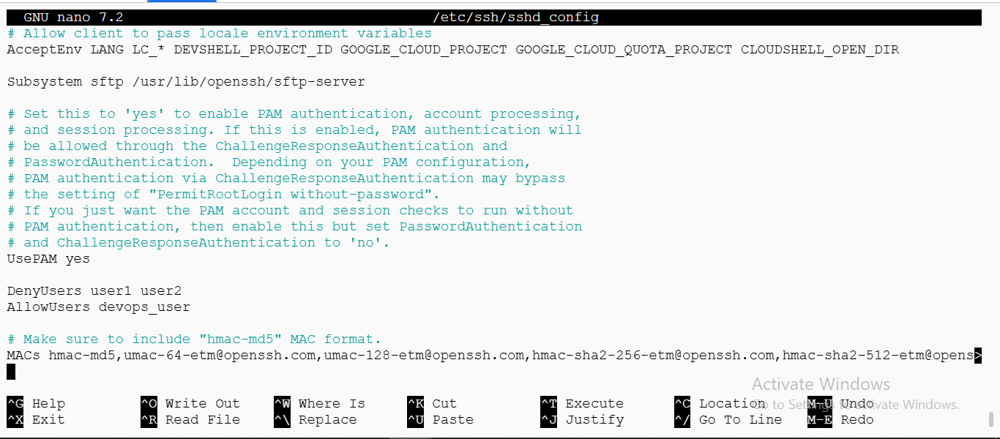 

---

## 🔹 2️⃣ File & Directory Permissions
### **Task:**
- Create `/devops_workspace` and a file `project_notes.txt`.
- Set permissions:
  - **Owner can edit**, **group can read**, **others have no access**.
- Use `ls -l` to verify permissions.

### **Commands:**
```bash
# Create the directory and file
sudo mkdir /devops_workspace  
sudo touch /devops_workspace/project_notes.txt  

# Set permissions (Owner: Read+Write, Group: Read, Others: No Access)
sudo chmod 640 /devops_workspace/project_notes.txt

# Verify permissions
ls -l /devops_workspace/
```

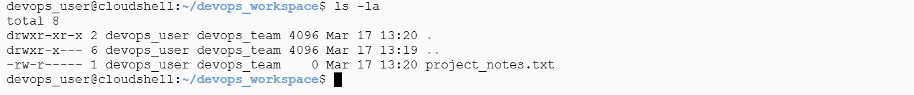
---

## 🔹 3️⃣ Log File Analysis with AWK, Grep & Sed
Logs are crucial in DevOps! We will analyze logs using the **Linux_2k.log** file from **LogHub** ([GitHub Repo](https://github.com/logpai/loghub/blob/master/Linux/Linux_2k.log)).

### **Task:**
- **Download the log file** from the repository.
- **Extract insights using commands:**
  - Use `grep` to find all occurrences of the word **"error"**.
  - Use `awk` to extract **timestamps and log levels**.
  - Use `sed` to replace all IP addresses with **[REDACTED]** for security.
- **Bonus:** Find the most frequent log entry using `awk` or `sort | uniq -c | sort -nr | head -10`.

### **Commands:**
```bash
# Count occurrences of "error" in logs
grep -i "error" app.log | wc -l

# Extract timestamps and log levels
awk '{print $1, $2, $3, $6}' app.log | head -5

# Replace IP addresses with [REDACTED]
sed 's \([[:digit:]]\+\(\.\|-\)\)\{3\}[[:digit:]]\+ [REDACTED] g' app.log | head -5 
# Find the most frequent log entry
awk '{print $6}' app.log | sort | uniq -c | sort -nr | head -10
```

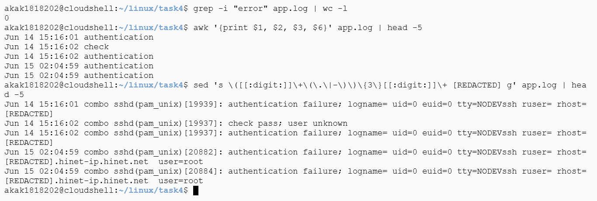 
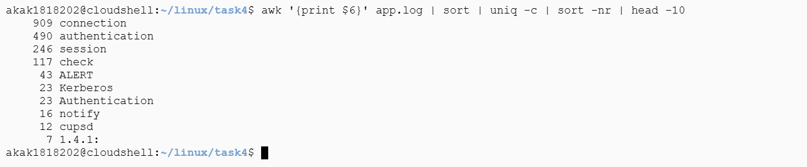
---


## 4️⃣ Volume Management & Disk Usage
### **Task:**
1. Create a directory `/mnt/devops_data`.
2. Mount a new volume (or loop device for local practice).
3. Verify using `df -h` and `mount | grep devops_data`.

### **AWS EC2 Steps:**
1. Go to **AWS EC2 Console** → Click **Elastic Block Store (EBS)** → **Volumes**
2. Click **Create Volume** and configure:
   - **Size**: Example, 5 GiB
   - **Availability Zone**: Must match your EC2 instance’s zone
3. Click **Create Volume**.
4. Select the newly created volume → Click **Attach Volume**.
5. Choose your EC2 instance → Click **Attach**.
6. Note the device name (e.g., `/dev/xvdf` or `/dev/nvme1n1`).

### **Mounting the Volume:**
```sh
ssh -i key.pem ubuntu@<ip>
lsblk  # Check available volumes
sudo mkdir -p /mnt/devops_data
sudo mkfs.ext4 /dev/xvdf  # Format the volume
sudo mount /dev/xvdf /mnt/devops_data
```

### **Verify the Mount:**
```sh
df -h | grep devops_data
lsblk | grep devops_data
mount | grep devops_data
```

### **Bonus: Persist Mount after Reboot**
```sh
sudo blkid /dev/xvdf
echo "UUID=$(sudo blkid -s UUID -o value /dev/xvdf) /mnt/devops_data ext4 defaults,nofail 0 2" | sudo tee -a /etc/fstab
sudo reboot
```
Verify again:
```sh
df -h | grep devops_data
```

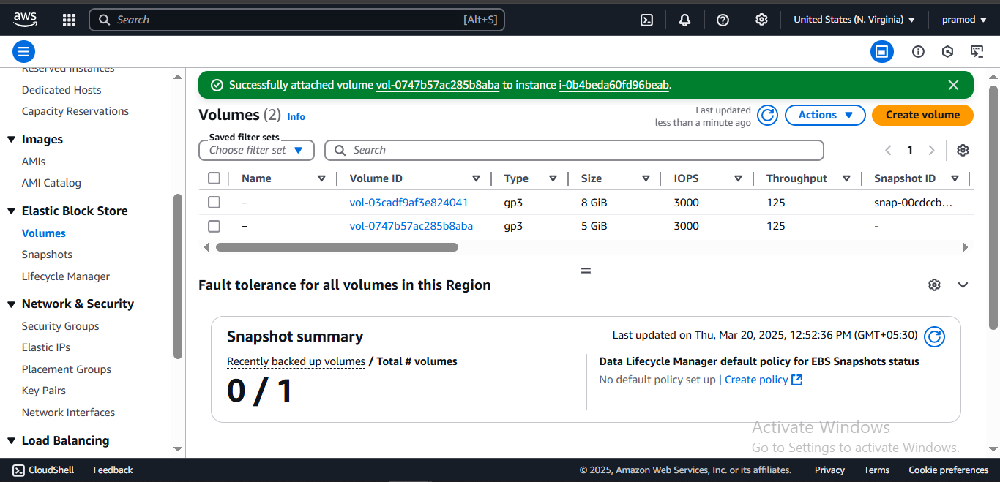 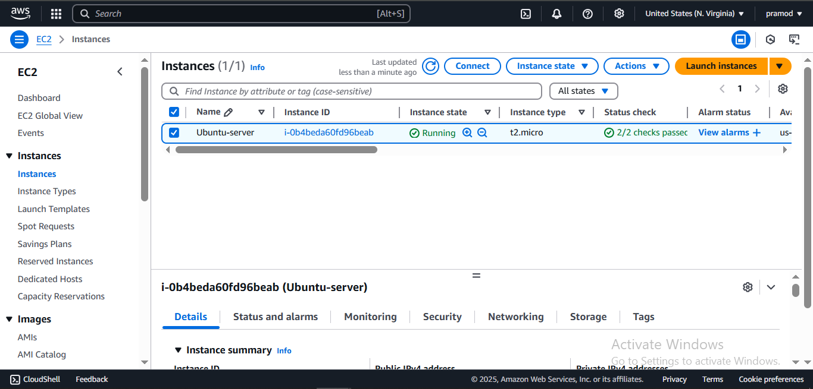 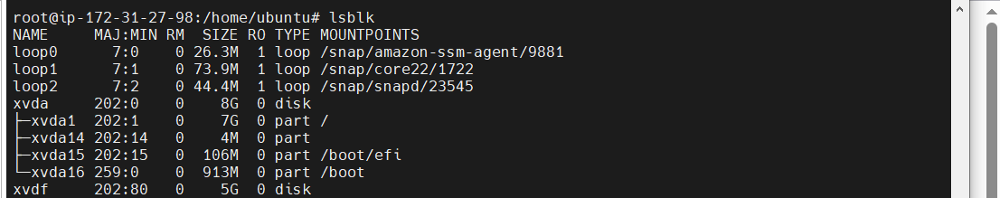 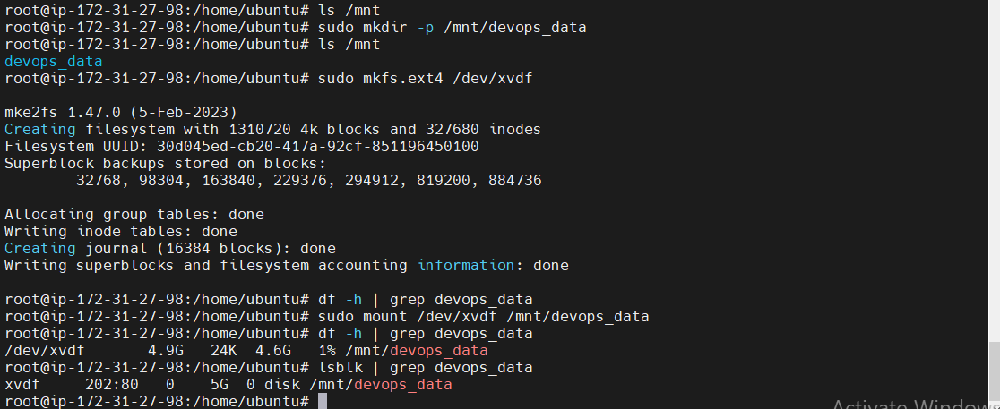 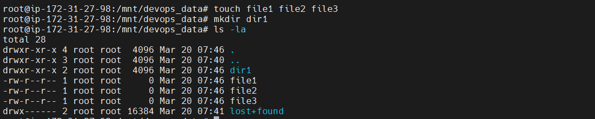
---

## 5️⃣ Process Management & Monitoring
### **Task:**
1. Start a background process:
```sh
ping google.com > ping_test.log &
```
2. Monitor the process:
```sh
ps aux | grep ping
top
htop
```
3. Kill the process and verify:
```sh
pkill -f "ping google.com"
ps aux | grep ping  # Ensure the process is gone
```

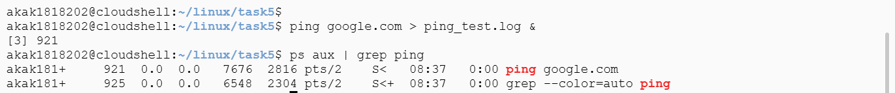 
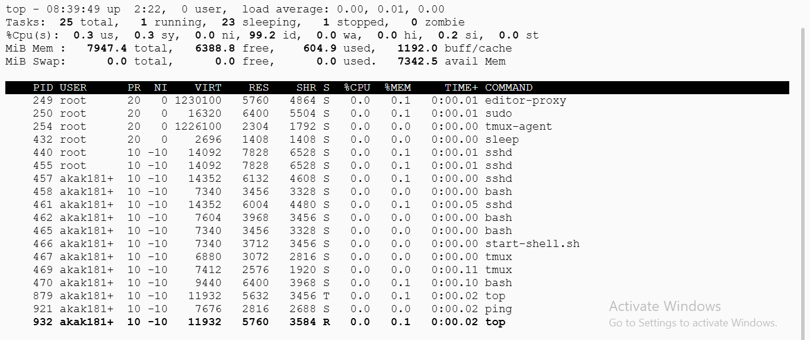 
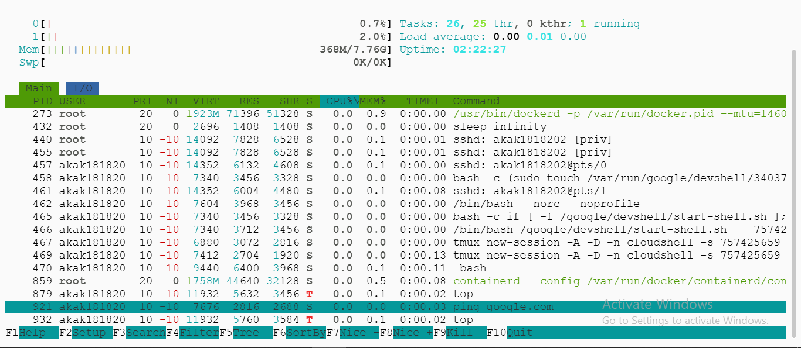 
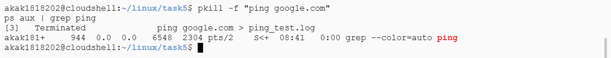

---

## 6️⃣ Automate Backups with Shell Scripting
### **Task:**
1. Write a shell script to back up `/devops_workspace` as `backup_$(date +%F).tar.gz`.
2. Save it in `/backups` and schedule it using `cron`.
3. Make the script display a success message in **green text** using `echo -e`.

### **Backup Script (`backup.sh`)**
```sh
#!/bin/bash

# Enable strict error handling
set -e

# Assign arguments to variables for readability
SOURCE_DIR=$1
TARGET_DIR=$2

# Check if the correct number of arguments is provided
if [ $# -ne 2 ]; then
    echo -e "\e[31mUsage: backup.sh <source_dir> <target_dir>\e[0m"
    exit 1
fi

# Validate directories
if [ ! -d "$SOURCE_DIR" ] || [ ! -d "$TARGET_DIR" ]; then
    echo -e "\e[31mInvalid location: Source or Target directory does not exist\e[0m"
    exit 2
fi

# Create a timestamp for the backup file
current_time=$(date +%F_%H:%M:%S)

# Backup file path
backup_file="${TARGET_DIR%/}/backup_$current_time.tar.gz"

# Create the backup
tar -czf "$backup_file" "$SOURCE_DIR"

# Verify if the backup was successful
if [ -f "$backup_file" ]; then
    echo -e "\e[32mBackup completed successfully: $backup_file\e[0m"
else
    echo -e "\e[31mBackup failed!\e[0m"
    exit 3
fi
```

### **Setup & Execution:**
```sh
mkdir src
sudo mkdir /backups
sudo chmod 777 /backups
nano backup.sh

bash backup.sh
bash backup.sh wrong_src wrong_dest  # Test with wrong paths
bash backup.sh src /backups/
ls /backups/
```

### **Scheduling with Cron:**
```sh
sudo mkdir /devops_workspace
sudo chmod 777 /devops_workspace

crontab -e
```
Add the following line to schedule backups every minute:
```sh
* * * * * /home/user/linux/task6/backup.sh /devops_workspace /backups >> /home/user/linux/task6/backup.log 2>&1
```
Test with a simple cron job:
```sh
* * * * * echo "hii" >> /home/user/linux/task6/2.log 2>&1
```
Start the cron service:
```sh
export EDITOR=vim
service cron status
service cron start
```

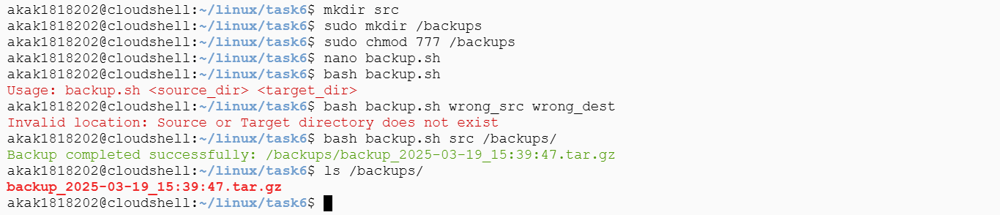 
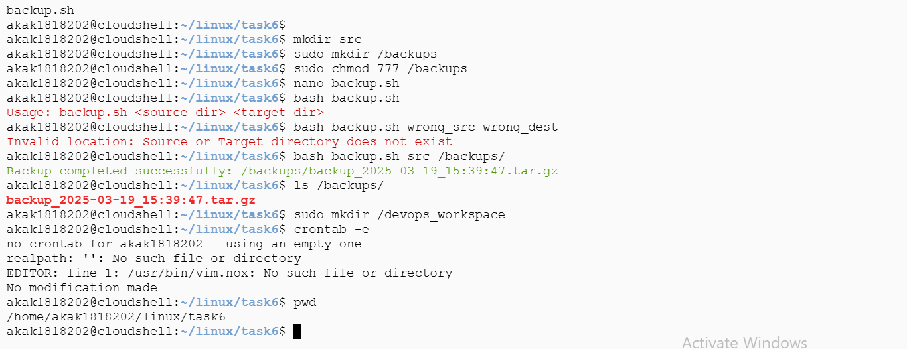 
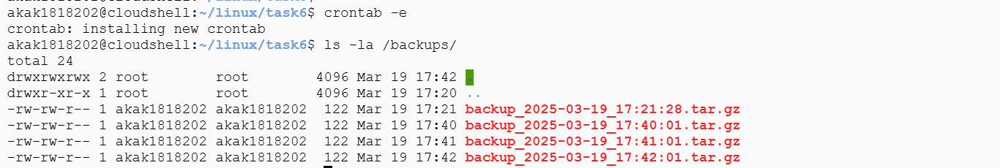


