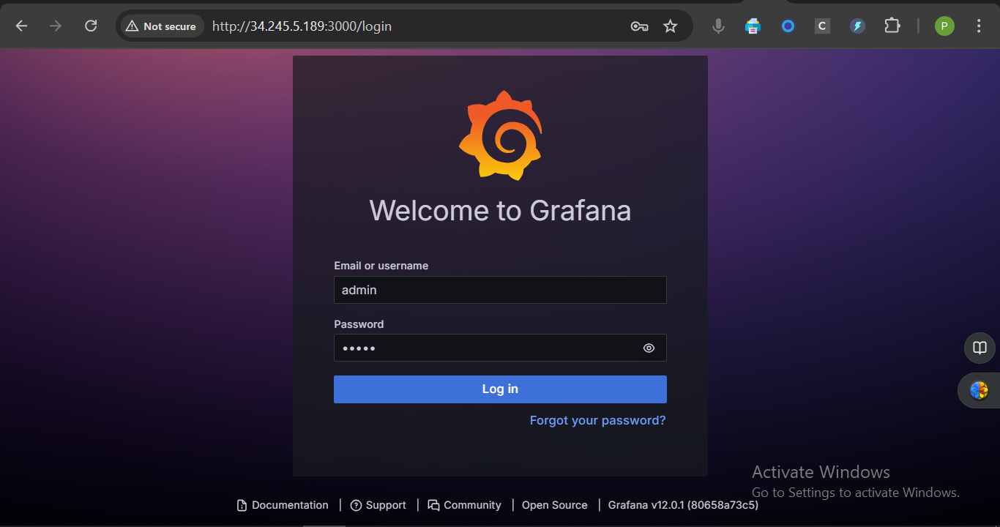

# Week 10: Observability Challenge with Prometheus and Grafana on KIND/EKS 

**Task Repository URL :** https://github.com/Pramod1818/online_shopping/tree/week10-Observality/k8s/Observability

## ✅ Task 1: Setup a KIND Cluster for Observability

### Objective

Simulate a production-like Kubernetes environment locally by creating a KIND (Kubernetes in Docker) cluster to serve as the foundation for observability using Prometheus and Grafana.

### KIND and kubectl Installation:

* Docker (must be installed and running)
```bash
#Installing KIND and kubectl by script
bash ./install_kind_kubectl.sh

# Verify installation
kind --version
```

### Create KIND Cluster
```bash
cat <<EOF > kind-cluster-config.yaml
kind: Cluster
apiVersion: kind.x-k8s.io/v1alpha4

nodes:
- role: control-plane
  image: kindest/node:v1.31.2
  extraPortMappings:
  - containerPort: 80
    hostPort: 80
  - containerPort: 443
    hostPort: 443
- role: worker
  image: kindest/node:v1.31.2
- role: worker
  image: kindest/node:v1.31.2
EOF

kind create cluster --name observability-cluster --config kind-cluster-config.yaml

#Verify the Cluster
kubectl get nodes

kubectl label node observability-cluster-worker  role=app
```
> **Steps to run the  app on kubernetes**

### Online Shopping App Deployment

**1. Docker:**
```bash
docker build -t pk1818/online_shopping_app:latest -f Dockerfile.dev .
kind load docker-image pk1818/online_shopping_app:v0.2 --name observability-cluster
```

**2. Helm:**
```bash
sudo snap install helm --classic
```

**3. Kubernetes Setup:**
```bash
kubectl apply -f namespace.yml
kubectl config set-context --current --namespace=online-shop-prod
```

**4. Deployment Affinity (deployment.yml):**
```yaml
    spec:
      affinity:
        nodeAffinity:
          requiredDuringSchedulingIgnoredDuringExecution:
            nodeSelectorTerms:
              - matchExpressions:
                  - key: role
                    operator: In
                    values:
                      - app
```

**5. Apply Core Resources:**
```bash
kubectl apply -f configmap.yml
kubectl apply -f deployment.yml
kubectl apply -f service.yml
kubectl apply -f hpa.yml
```

**6. Ingress:**
```bash
kubectl apply -f ingress-nginx-values.yml
kubectl apply -f ingress.yml
```

**7. Port-Forward Ingress (Local):**
```bash
kubectl port-forward svc/ingress-nginx-controller 8080:80 -n ingress-nginx --address=0.0.0.0
```


Screenshots:

 

 

 

 

###  Interview Questions & Answers

#### **Q1: What are the benefits and limitations of using KIND for production-like testing?**

**Benefits:**

* Lightweight and fast to set up.
* Ideal for CI/CD pipelines and local development.
* Full Kubernetes environment for realistic testing.
* Runs entirely in Docker — no need for VMs or cloud resources.

**Limitations:**

* Not suitable for actual production use (e.g., lacks HA, networking features).
* Limited resources (runs inside Docker on a single node).
* Doesn't simulate real-world multi-host networking scenarios well.

---

#### **Q2: How can you simulate production scenarios using a local KIND cluster?**

**Approaches:**

* Use multi-node configurations in KIND (via `kind-config.yaml`) to simulate multiple nodes.
* Deploy real observability tools like Prometheus, Grafana, Node Exporter.
* Use stress/load generators (e.g., `k6`, `kubemark`) to mimic production traffic.
* Emulate failures and resource bottlenecks for testing alerts and auto-scaling.

---

## ✅ Task 2: Deploy Prometheus on KIND with Advanced Configurations

### Objective

Deploy Prometheus on your KIND cluster with a custom configuration, targeting key cluster components with **advanced relabeling rules** and **optimized scrape settings**.

###  What we need to do:
1. **Create a custom `prometheus.yml` config**
2. **Deploy Prometheus** ( via Helm)
3. **Scrape key components (kube-state-metrics, node-exporter, app, etc.)**
4. **Use relabeling rules to clean up metrics**
5. **Verify scraping works from Prometheus UI**


---
### **Step 1: Install kube-state-metrics + node-exporter**

Installing both via the Prometheus Helm chart or can manually.

**By Helm:**

```bash
helm repo add prometheus-community https://prometheus-community.github.io/helm-charts
helm repo update
```

---

### **Step 2: Create a custom `values.yaml` file for Prometheus**

```yaml
#prometheus-values.yaml
alertmanager:
  enabled: false

prometheus:
  prometheusSpec:
    maximumStartupDurationSeconds: 120
    serviceMonitorSelectorNilUsesHelmValues: false
    podMonitorSelectorNilUsesHelmValues: false
    scrapeInterval: 15s
    evaluationInterval: 15s
    additionalScrapeConfigs:
      - job_name: 'node-exporter'
        static_configs:
          - targets: ['node-exporter.online-shop.svc.cluster.local:9100']
        relabel_configs:
          - source_labels: [__address__]
            regex: '(.*):.*'
            target_label: instance
            replacement: '$1'

      - job_name: 'online-shop-app'
        static_configs:
          - targets: ['online-shop.online-shop.svc.cluster.local:3000']
        relabel_configs:
          - source_labels: [__address__]
            regex: '(.*):.*'
            target_label: app_instance
            replacement: '$1'

kubeStateMetrics:
  enabled: true

nodeExporter:
  enabled: true

grafana:
  enabled: false
```

This config:

* Scrapes the app directly
* Scrapes Node Exporter
* Includes relabeling

---

### **Step 3: Install Prometheus with Helm using custom values**

Install Prometheus in `monitoring` namespace:

```bash
kubectl create ns monitoring

helm install prometheus prometheus-community/kube-prometheus-stack \
  --namespace monitoring \
  -f prometheus-values.yaml
```

---

### **Step 4: Port-forward Prometheus UI**

```bash
kubectl port-forward svc/prometheus-kube-prometheus-prometheus 9090:9090 -n monitoring  --address=0.0.0.0

```

---

### **Step 5: Verify Targets**

* Go to the Prometheus UI > **Status > Targets**
* Make sure:

  * `online-shop-app` target is up
  * `node-exporter` target is up
  * `kube-state-metrics` target is up


```bash
#check
kubectl get pods -n monitoring -o wide

NAME                                                     READY   STATUS    RESTARTS   AGE     IP           NODE                       ...
prometheus-kube-prometheus-prometheus-0                  2/2     Running   0          5m      10.244.1.10  kind-worker                ...
prometheus-grafana-6b7b8f9469-q72v9                      1/1     Running   0          5m      10.244.2.5   kind-worker2               ...
```
---

Screenshots:

 

 

 


> note
### Each Pod type has specific job

| Pod Name Prefix                                      | Component           | Purpose                                                 |
| ---------------------------------------------------- | ------------------- | ------------------------------------------------------- |
| `prometheus-kube-prometheus-operator-*`              | Prometheus Operator | Manages CRDs like Prometheus, Alertmanager              |
| `prometheus-kube-state-metrics-*`                    | kube-state-metrics  | Exposes K8s API metrics (pod health, deployments, etc.) |
| `prometheus-prometheus-kube-prometheus-prometheus-*` | Prometheus Server   | Scrapes data, stores TSDB, exposes UI and API           |
| `prometheus-prometheus-node-exporter-*`              | Node Exporter       | System-level metrics, 1 per node (via DaemonSet)        |

---


### Interview Questions & Answers
#### **Q1: How do advanced relabeling rules refine metric collection in Prometheus?**

**Answer:**

* **Relabeling** transforms metadata into usable labels before metrics are stored.
* It allows:

  * Removing noisy/unnecessary labels (`labeldrop`)
  * Keeping only relevant targets (`action: keep`)
  * Renaming labels for consistency
  * Enriching metrics with Kubernetes node/pod info
* **Result**: Cleaner, smaller, and more query-efficient metric sets.

#### **Q2: What performance issues might you encounter when scraping targets on a KIND cluster, and how would you address them?**

**Answer:**

| Issue                                     | Mitigation                                                       |
| ----------------------------------------- | ---------------------------------------------------------------- |
| Limited resources (memory/CPU)            | Increase scrape interval (e.g., 30s–60s), reduce retention time  |
| High number of targets                    | Use static\_configs or relabeling to filter out unnecessary ones |
| Duplicate or noisy metrics                | Apply `labeldrop` or `metric_relabel_configs`                    |
| KIND cluster runs all nodes as containers | Reduce parallel scrape concurrency to avoid overload             |
---


## ✅ Task 3: Deploy Grafana and Build Production-Grade Dashboards
### **1. Deploy Grafana in KIND**

### Deployment
- Deployed Grafana using `grafana/grafana:latest`
- Exposed via NodePort `32000`
- Namespace: `monitoring`

### Cmds Used:

```bash
kubectl create namespace monitoring
kubectl apply -f grafana-deployment.yaml
kubectl apply -f grafana-service.yaml
```


### **2. Access Grafana**
* Port forward or can use NodePort:

  ```bash
  kubectl port-forward svc/grafana -n monitoring 3000:3000 -n monitoring --address=0.0.0.0

  ```

 > Access via browser or nodeport:
  ```
  http://<EC2_PUBLIC_IP>:3000
  ```

* Login credentials (default):

  ```
  Username: admin
  Password: admin
  ```

---

### **3. Add Prometheus as a Data Source**

* Navigate to: **Settings → Data Sources → Add data source**
* Choose **Prometheus**
* Set URL to:

  ```
  http://prometheus-operated.monitoring.svc:9090
  ```
* Click **Save & Test**

---

### **4. Create Production-Grade Dashboards**
> Create dashboards to visualize:

#### CPU & Memory (Node Exporter)

**PromQL** example queries:
- CPU Usage:
  `100 - (avg by(instance)(irate(node_cpu_seconds_total{mode="idle"}[5m])) * 100)`
- Memory Usage:
  `(1 - (node_memory_MemAvailable_bytes / node_memory_MemTotal_bytes)) * 100)`
- Disk I/O:
  `rate(node_disk_reads_completed_total[5m])`
- Network latency:
  `rate(node_network_receive_bytes_total[5m])`
- Kubernetes Metrics
  `kube_pod_status_phase{phase="Running"}`


#### Grafana Dashboard: CPU Usage

> **Steps:**

1.  **Open Grafana UI:** `http://localhost:3000`, login (default: admin/admin).
2.  **Create Dashboard:** `+` (Create) -> `Dashboard` -> `Add new panel`.
3.  **Add CPU Panel:**
    * **Query:** `100 - (avg by(instance)(irate(node_cpu_seconds_total{mode="idle"}[5m])) * 100)`
    * **Legend:** `{{instance}}` (optional)
4.  **Set Visualization:** Panel title -> Edit -> Choose `Gauge`, `Graph`, or `Bar Gauge`.
5.  **Panel Settings (Optional):**
    * **Title:** e.g., `CPU Usage (%)`
    * **Thresholds:** e.g., `70%` (warn), `90%` (critical).
6.  **Save:** `Apply` (panel) -> `Save dashboard` (top right) -> Name (e.g., `Production Monitoring`).


### ➤ Grafana Dashboard Templates:

#### 1. **Node Exporter Full** (for CPU, Memory, Disk, Network)

* **Dashboard ID**: `1860`

* **Includes**:
  * CPU usage
  * Memory usage
  * Disk I/O
  * Network stats
  * Uptime

#### 2. **Kubernetes Cluster Monitoring (via kube-prometheus-stack)**

* **Dashboard ID**: `315`

* **Includes**:
  * Pod status
  * Node status
  * Cluster usage
  * Resource saturation

#### 3. **Kube State Metrics - Workloads Overview**

* **Dashboard ID**: `13332`

* **Includes**:
  * Deployments
  * StatefulSets
  * DaemonSets
  * CronJobs and Jobs

Screenshots

 

 

 

 

 

 

 

 

 

 


### Interview Questions

#### **Q: What factors are critical when designing dashboards for production monitoring?**

1.  **Clarity & Simplicity:** Concise labels, clear layout, actionable metrics (errors, latency, resource).
2.  **Performance & Responsiveness:** Avoid overload, group related metrics.
3.  **Role-Based Views:** Tailor dashboards to specific teams.
4.  **Real-Time Awareness:** Track SLAs, SLOs, incidents, use annotations.
5.  **Historical Context:** Time range selectors, comparative panels.
6.  **Alert Integration:** Link panels to active alerts.

####  **Q: How do you optimize PromQL queries for performance and clarity in Grafana?**

1.  **Wise Label Use:** Filter precisely (e.g., `job="app"`), avoid high cardinality.
2.  **Reduce Range:** Use shorter lookbacks (`[5m]`) when possible.
3.  **Recording Rules:** Precompute expensive queries.
4.  **Avoid Nesting:** Simplify complex expressions.
5.  **Downsample:** Use aggregation (`avg_over_time`, `rate`).
6.  **Benchmark:** Check query latency in Grafana.
---

## ✅ Task 4: Configure Alerting and Notification Rules
---
### 1. **Enable Alertmanager in `Prometheus_values.yaml`**

Since we disabled it (`alertmanager.enabled: false`), now enable it:

```yaml
alertmanager:
  enabled: true
  config:
    global:
      resolve_timeout: 5m
    route:
      group_by: ['alertname']
      group_wait: 30s
      group_interval: 5m
      repeat_interval: 3h
      receiver: 'default-receiver'
    receivers:
    - name: 'default-receiver'
      email_configs:
      - to: 'your-email@example.com'
        from: 'alertmanager@example.com'
        smarthost: 'smtp.example.com:587'
        auth_username: 'alertmanager@example.com'
        auth_identity: 'alertmanager@example.com'
        auth_password: 'your-password'
```

>  *For now testing, using dummy configs without SMTP as not sending real notification.*

---

###  2. **Add Alerting Rules**

Create a file named `custom-rules.yaml`:

```yaml
apiVersion: monitoring.coreos.com/v1
kind: PrometheusRule
metadata:
  name: example-alerts
  namespace: monitoring
spec:
  groups:
  - name: node.rules
    rules:
    - alert: HighCPUUsage
      expr: 100 - (avg by(instance)(irate(node_cpu_seconds_total{mode="idle"}[5m])) * 100) > 80
      for: 2m
      labels:
        severity: warning
      annotations:
        summary: "High CPU usage detected on {{ $labels.instance }}"
        description: "CPU usage is over 80% for 2 minutes"

    - alert: PodNotRunning
      expr: kube_pod_status_phase{phase!="Running"} > 0
      for: 1m
      labels:
        severity: critical
      annotations:
        summary: "Pod is not running"
        description: "One or more pods are not in a Running state."
```

```bash
#Apply the rule:
kubectl apply -f custom-rules.yaml
```

---

###  3. **Link Alert Rules to Prometheus**

Ensure Prometheus is configured to look for `PrometheusRule` CRDs, which it is by default with the Helm chart if you're using:

```yaml
prometheus:
  prometheusSpec:
    ruleSelectorNilUsesHelmValues: false
```

> fixing the error 
>`Get "http://node-exporter.online-shop.svc.cluster.local:9100/metrics": dial tcp: lookup node-exporter.online-shop.svc.cluster.local on 10.96.0.10:53: no such host`


###  Fix Prometheus Node-Exporter Scraping

**1. Check Service Name/Namespace:** `kubectl get svc -A | grep node-exporter` (note service name and namespace).

**2. Update `additionalScrapeConfigs`:** In `values.yaml`, set `targets: ['<service-name>.<namespace>.svc.cluster.local:9100']` 
>value used : prometheus-prometheus-node-exporter.monitoring.svc.cluster.local:9100

**3. Reapply Helm:** `helm upgrade --install prometheus prometheus-community/kube-prometheus-stack \
  --namespace monitoring \
  -f prometheus-values.yaml`.

**4. Validate in Prometheus UI:** 
`check **"Active Targets"** for `node-exporter` being `UP`.

---

### 4. **Verify Alerts in Prometheus UI**

Go to `http://<your-prometheus-url>/alerts`

* You should see `HighCPUUsage`, `PodNotRunning`, etc.
* You can trigger them manually by simulating high load or stopping a pod.

---

**Now Create a Grafana dashboard that shows metrics from the app (e.g., served via `prom-client` on `/metrics`).**

### Grafana Dashboard Setup for App Metrics

**1. Verify Prometheus Scraping:**

   - App target `UP` (e.g., `online-shop.online-shop-prod.svc.cluster.local:9100`).

**2. Grafana Login:**

   - `http://<grafana-host>:3000`.

**3. Add Prometheus Data Source:**

   - **Settings (Gear)** → **Data Sources** → **Add Prometheus**.
   - **URL:** `http://prometheus-server.monitoring.svc.cluster.local` (adjust).
   - **Save & Test**.

**4. Create Dashboard:**

   - `+` → `Dashboard` → `Add a new panel`.

**5. Add Panels & Queries:**

   - **CPU (User):** `process_cpu_user_seconds_total`
   - **CPU (System):** `process_cpu_system_seconds_total`
   - **Memory:** `process_resident_memory_bytes`
   - **Total Requests (Custom):** `http_requests_total` (define in `server.js`).

**6. Customize Panels:**

   - Add titles, units (e.g., `seconds`, `bytes`).
   - Set refresh interval (e.g., `5s`, `30s`).
   - Apply filters (e.g., `instance`, `job="online-shop-app"`).

**7. Save the Dashboard:**

   - Name it (e.g., `Online Shop App Metrics`).
 

### Grafana Dashboards templates for Node.js
#### Node.js Grafana Dashboards

**1. Node.js Exporter Quickstart:**

   - **Overview:** Comprehensive dashboard (version, restarts, CPU, memory, etc.).
   - **Source:** Grafana Labs ID [14058].
   - **Usage:** `prom-client` ([Grafana Labs][2]).

**2. Node.js Metrics Dashboard:**

   - **Overview:** Visualizes default `prom-client` runtime metrics.
   - **Source:** Grafana Labs ID [11956].
   - **Usage:** Default `prom-client` metrics ([Grafana Labs][3]).


### Customize:

* **Add Panels:** For custom `prom-client` metrics.
* **Modify Panels:** Adjust queries/visualizations.
* **Set Alerts:** For proactive monitoring.

Screenshots
 

 

 

 

 

 

 

 
### Interview Questions

#### **Q: How do you design effective alerting rules to minimize false positives in production?**

1.  **Tune Thresholds:** Use realistic values based on history.
2.  **Time Windows:** Alert on sustained issues (`for: 5m`).
3.  **Rate/Ratio Metrics:** Use `rate()` for meaningful alerts.
4.  **Multi-Signal Validation:** Combine related metrics.
5.  **Alert Grouping:** Suppress duplicates in Alertmanager.
6.  **Deployment Suppression:** Silence alerts during known changes.

#### **Q: What challenges do you face in configuring notifications for a dynamic environment?**

1.  **Dynamic Targets/Scaling:** Use label-based routing in Alertmanager.
2.  **Autoscaling Noise:** Implement hysteresis in alerts.
3.  **Multi-Environment:** Route by environment labels.
4.  **Team Routing:** Use Alertmanager `receiver` chains.
5.  **Notification Fatigue:** Implement severity levels and escalation. 
 

## ✅ Task 5: Deploy Node Exporter for Enhanced System Metrics

### Deploy Node Exporter 
> Already installed by helm chart

###  Configure Prometheus to Scrape Node Exporter
Add the following job to your prometheus.yml scrape config:

```yml
      - job_name: 'node-exporter'
        static_configs:
          - targets: ['prometheus-prometheus-node-exporter.monitoring.svc.cluster.local:9100']
```

```bash
#Upgrade prometheus
helm upgrade --install prometheus prometheus-community/kube-prometheus-stack \
  --namespace monitoring \
  -f prometheus-values.yaml

kubectl port-forward svc/prometheus-kube-prometheus-prometheus 9090:9090 -n monitoring  --address=0.0.0.0

```

### Verify by Prometheus UI
Visit http://<prometheus-host>:9090
Go to Status → Targets

You should see node-exporter with state: UP


###  Screenshots
 


 


###  Why System-Level Metrics Matter

System metrics such as CPU usage, memory pressure, disk IO, and network traffic are vital for:

- Diagnosing slowdowns and bottlenecks
- Detecting host-level issues like OOMKills
- Correlating application metrics with infrastructure health
- Capacity planning and scaling decisions

In production, these metrics provide a foundation for alerting and incident response.


### Interview Question

#### **What are the key challenges of monitoring an EKS cluster versus a local KIND cluster?**

1.  **CPU:** Usage per core, load average.
2.  **Memory:** Available/used, swap usage.
3.  **Disk:** Usage, free space, I/O stats.
4.  **Network:** Traffic in/out, errors/drops.
5.  **System:** Open file descriptors, running processes.
6.  **Hardware:** Temperature, power (if available).

These aid in diagnosing resource, I/O, memory, and network bottlenecks.

#### **How would you integrate logging with monitoring tools to ensure comprehensive observability?**

1.  **Deploy:** As DaemonSet (K8s) or direct install. Enable in Helm (`kube-prometheus-stack`).
2.  **Scrape Config:** Auto-configured by Helm. Manual job in `prometheus.yml` if needed.
3.  **Verify:** Check `/targets` in Prometheus for `UP` endpoints.
4.  **Visualize:** Import Grafana dashboards (e.g., ID 1860).

---


## ✅ Task-6 (Bonus Task): Monitor and Log an AWS EKS Cluster

**Objective**
Provision or use an existing AWS EKS cluster and set up Prometheus and Grafana to monitor and log its performance. This task simulates the observability of a production cloud environment.

###  **1. Provision an EKS Cluster (with Terraform)**

**AWS EKS module:**

#### `main.tf`

```hcl
provider "aws" {
  region = "us-west-2"
}

module "eks" {
  source          = "terraform-aws-modules/eks/aws"
  cluster_name    = "my-eks-cluster"
  cluster_version = "1.27"
  subnets         = [<your-subnet-ids>]
  vpc_id          = "<your-vpc-id>"

  node_groups = {
    default = {
      desired_capacity = 2
      max_capacity     = 3
      min_capacity     = 1

      instance_type = "t3.medium"
    }
  }
}
```

### Commands:

```sh
terraform init
terraform apply -auto-approve
```

---

### **2. Deploy Prometheus and Grafana**

Use Helm to install them easily:

```sh
helm repo add prometheus-community https://prometheus-community.github.io/helm-charts
helm repo update

# Create namespace
kubectl create ns monitoring

# Install Prometheus
helm install prometheus prometheus-community/kube-prometheus-stack \
  --namespace monitoring

# Verify:
kubectl get pods -n monitoring
```

---

### **3. Configure Prometheus Scrape Targets**

The Helm chart comes preconfigured to scrape:

* Kubelet
* cAdvisor
* Node Exporter
* Kube API server
* etcd (if accessible)

Can be customize it in `values.yaml`, but the default targets for EKS should already be present.

---

###  **4. Deploy Grafana**

Grafana is deployed as part of `kube-prometheus-stack`.

To access it:

```sh
kubectl port-forward svc/prometheus-grafana -n monitoring 3000:80
```

Default credentials:

* **User:** `admin`
* **Password:** `prom-operator` (unless overridden)

---

### **5. Integrate Logging (Optional)**

#### Option 1: CloudWatch with FluentBit

Use AWS CloudWatch Container Insights:

```sh
curl https://raw.githubusercontent.com/aws-samples/amazon-cloudwatch-container-insights/master/k8s-deployment-manifest-eks.yaml \
  -o cwagent-fluentbit.yaml

kubectl apply -f cwagent-fluentbit.yaml
```

#### Option 2: Fluentd with Elasticsearch or Loki

Use Helm to deploy:

```sh
helm repo add grafana https://grafana.github.io/helm-charts
helm upgrade --install loki grafana/loki-stack -n monitoring
```

---

### Interview Questions
#### **What are the key challenges of monitoring an EKS cluster versus a local KIND cluster?**

1.  **Networking & Discovery:** EKS uses complex AWS networking, requiring IAM and ServiceMonitors.
2.  **Authentication & RBAC:** EKS needs IAM roles, RBAC, and IRSA.
3.  **Scalability:** EKS has dynamic targets;ds monitoring must adapt.
4.  **Cost & Performance:** EKS observability incurs AWS costs.
5.  **Multi-Zone/Region:** Requires reliable metric aggregation.

#### **How would you integrate logging with monitoring tools to ensure comprehensive observability?**

1.  **Log Collection:** Fluentd, Fluent Bit, or Vector as DaemonSets.
2.  **Log Aggregation:** CloudWatch Logs, Elasticsearch/Kibana, or Loki.
3.  **Grafana Integration:** Use Loki for correlation with metrics via labels.
4.  **Structured Logging:** Output JSON for easier parsing.
5.  **Metric-Log Correlation:** Link Grafana panels to relevant logs for root cause analysis.

