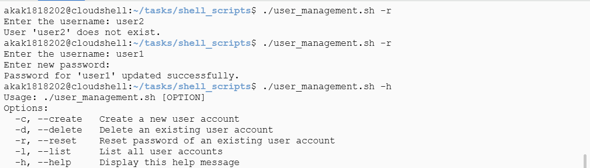

# Solution for Week 3 Challenges

## Challenge 1: User Account Management

### Overview
This challenge involves creating a Bash script that provides user account management features, including account creation, deletion, password resetting, and listing users. The script ensures appropriate checks before performing each operation and provides meaningful feedback to the user.

### Solution Explanation

#### 1. Displaying Help Information
- The script includes a `usage` function to display available options when no arguments are provided or when the `-h` or `--help` flag is used.
- This function exits after printing the usage information.

#### 2. Creating a User Account
- The `create_user` function prompts the user to enter a username.
- It checks whether the username already exists using the `id` command.
- If the username is available, the user is prompted to enter a password securely.
- The script then creates the user account using `useradd -m` and sets the password with `chpasswd`.
- A success message is displayed upon successful account creation.

#### 3. Deleting a User Account
- The `delete_user` function prompts the user to enter the username of the account to be deleted.
- It checks for the existence of the user using `id`.
- If the user exists, the `userdel -r` command is used to delete the account and remove its home directory.
- A confirmation message is displayed.

#### 4. Resetting a User’s Password
- The `reset_password` function prompts the user for a username and checks for its existence.
- If the user exists, the script asks for a new password securely and updates it using `chpasswd`.
- A success message is displayed upon successful password reset.

#### 5. Listing User Accounts
- The `list_users` function extracts usernames and UIDs from the `/etc/passwd` file and displays them in a formatted manner.

#### 6. Handling Command-Line Arguments
- The script processes command-line arguments using a case statement.
- If no valid argument is provided, the `usage` function is called.

### script user_management.sh 
```bash
#!/bin/bash

# Function to display help
usage() {
    echo "Usage: $0 [OPTION]"
    echo "Options:"
    echo "  -c, --create   Create a new user account"
    echo "  -d, --delete   Delete an existing user account"
    echo "  -r, --reset    Reset password of an existing user account"
    echo "  -l, --list     List all user accounts"
    echo "  -h, --help     Display this help message"
    exit 1
}

# Function to create a user
create_user() {
    read -p "Enter the new username: " username
    if id "$username" &>/dev/null; then
        echo "User '$username' already exists. Choose another username."
        exit 1
    fi
    read -s -p "Enter the password: " password
    echo
    sudo useradd -m "$username"
    echo "$username:$password" | sudo chpasswd
    echo "User '$username' created successfully."
}

# Function to delete a user
delete_user() {
    read -p "Enter the username to delete: " username
    if ! id "$username" &>/dev/null; then
        echo "User '$username' does not exist."
        exit 1
    fi
    sudo userdel -r "$username"
    echo "User '$username' deleted successfully."
}

# Function to reset a user's password
reset_password() {
    read -p "Enter the username: " username
    if ! id "$username" &>/dev/null; then
        echo "User '$username' does not exist."
        exit 1
    fi
    read -s -p "Enter new password: " password
    echo
    echo "$username:$password" | sudo chpasswd
    echo "Password for '$username' updated successfully."
}

# Function to list all users
list_users() {
    echo "Listing all user accounts:"
    awk -F: '{ print $1, "(UID: "$3")" }' /etc/passwd
}

# Main script logic
if [[ $# -eq 0 ]]; then
    usage
fi

case "$1" in
    -c|--create)
        create_user
        ;;
    -d|--delete)
        delete_user
        ;;
    -r|--reset)
        reset_password
        ;;
    -l|--list)
        list_users
        ;;
    -h|--help)
        usage
        ;;
    *)
        echo "Invalid option: $1"
        usage
        ;;
esac
```
### Screenshots
 
 
 

---

## Challenge 2: Automated Backup & Recovery using Cron

### Overview
This challenge involves creating a Bash script that automates directory backups and implements a rotation mechanism to retain only the last three backups.

### Solution Explanation

#### 1. Checking Command-Line Arguments
- The script verifies if a directory path is provided as an argument. If not, it displays usage instructions and exits.

#### 2. Verifying Directory Existence
- The script ensures that the provided directory exists before proceeding. If the directory does not exist, an error message is displayed, and the script exits.

#### 3. Creating Timestamped Backups
- A timestamp is generated using `date` to ensure unique backup folder names.
- A new backup directory is created inside the specified directory.
- All files from the original directory are copied into the new backup folder using `cp -r`.

#### 4. Implementing Backup Rotation
- The script lists all backup directories inside the specified path and sorts them by modification time.
- If there are more than three backups, the oldest ones are deleted to retain only the last three.
- A message is displayed whenever an old backup is removed.

### script backup_with_rotation.sh
```bash
#!/bin/bash

# Script to perform automated backup with rotation (keeping last 3 backups)

# Check if the directory argument is provided
if [ -z "$1" ]; then
    echo "Usage: $0 <directory_path>"
    exit 1
fi

# Assign the provided directory path to a variable
dir_path="$1"

# Check if the directory exists
if [ ! -d "$dir_path" ]; then
    echo "Error: Directory '$dir_path' does not exist."
    exit 1
fi

# Create a timestamped backup folder name
timestamp=$(date +"%Y-%m-%d_%H-%M-%S")
backup_folder="$dir_path/backup_$timestamp"

# Create the backup folder
mkdir "$backup_folder"

# Copy all files from the specified directory to the backup folder
cp -r "$dir_path"/* "$backup_folder" 2>/dev/null

# Confirm backup creation
echo "Backup created: $backup_folder"

# Implement backup rotation (keep only the last 3 backups)
backups=($(ls -dt "$dir_path"/backup_* 2>/dev/null))
num_backups=${#backups[@]}

if [ "$num_backups" -gt 3 ]; then
    for ((i=3; i<$num_backups; i++)); do
        rm -rf "${backups[$i]}"
        echo "Deleted old backup: ${backups[$i]}"
    done
fi

exit 0
```
### Screenshot


### Cron Job Automation 
- To automate the backup script using cron, the following entry can be added to the crontab:
```bash
* * * * * sudo /home/akak1818202/tasks/shell_scripts/backup_with_rotation.sh /home/akak1818202/tasks/shell_scripts/backup >> /home/akak1818202/tasks/shell_scripts/backup.log 2>&1
```
- This schedules the script to run every day at 2 AM.


### Conclusion
These scripts demonstrate efficient user management and backup automation techniques using Bash scripting. The user management script provides essential account operations, while the backup script ensures automated data protection with a rotation mechanism. Happy scripting! 🚀

