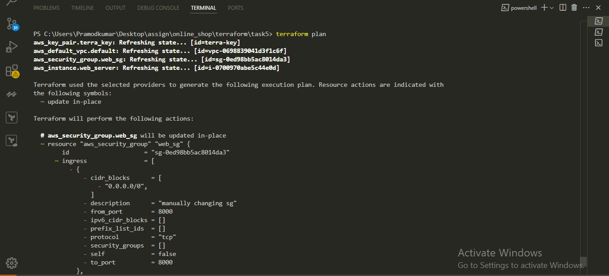
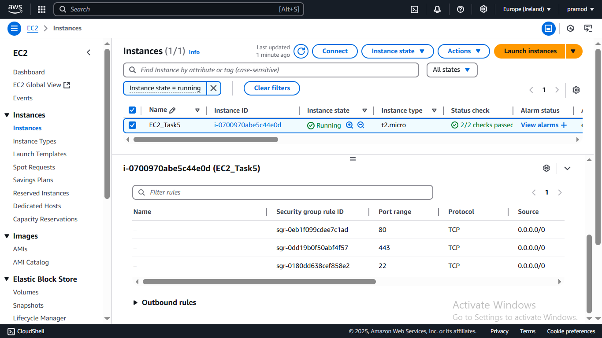
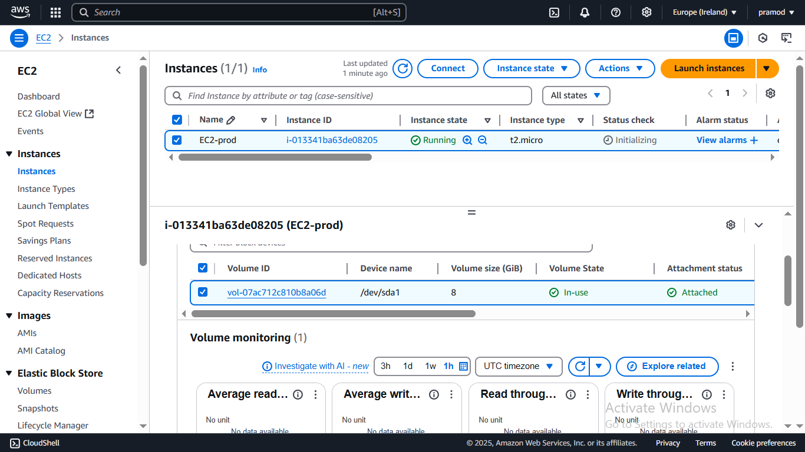
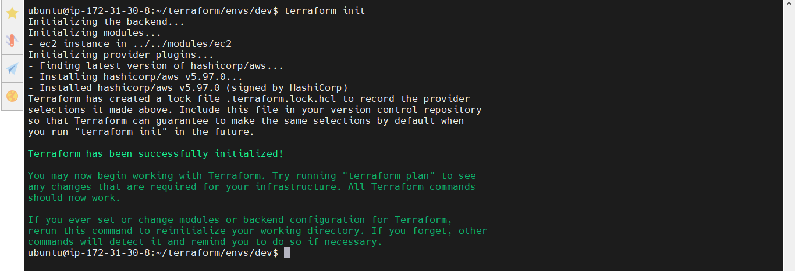

# Week 8: Terraform (Infrastructure as Code) Challenge {Solution}

> Task Repository: https://github.com/Pramod1818/online_shop/tree/github-action/terraform

## Task 1: Install Terraform, Initialize, and Provision a Basic Resource

### Objective

Install Terraform, set up a basic Terraform project, and provision an AWS EC2 instance to verify the setup.

###  Install Terraform

On Ubuntu-based system:

```bash
sudo apt update && sudo apt install -y gnupg software-properties-common curl
curl -fsSL https://apt.releases.hashicorp.com/gpg | sudo gpg --dearmor -o /usr/share/keyrings/hashicorp-archive-keyring.gpg
echo "deb [signed-by=/usr/share/keyrings/hashicorp-archive-keyring.gpg] https://apt.releases.hashicorp.com $(lsb_release -cs) main" | sudo tee /etc/apt/sources.list.d/hashicorp.list
sudo apt update
sudo apt install terraform

terraform -v #verfify
```

### Create Terraform Project
Create a new directory and initialize the project:

```bash
mkdir terraform_online_shop
cd terraform_online_shop
```

### Create terraform.tf

```hcl
terraform {
  required_providers {
    aws = {
      source  = "hashicorp/aws"
      version = "5.65.0"
    }
  }
}
```

### Create main.tf

```hcl
provider "aws" {
  region = "eu-west-1"
}

resource "aws_key_pair" "key" {
  key_name   = "terra-key"
  public_key = file("terra-key.pub")
}

resource "aws_default_vpc" "default" {}

resource "aws_security_group" "security_group" {
  name   = "terra-sg"
  vpc_id = aws_default_vpc.default.id

  ingress {
    description = "port 22 allow"
    from_port   = 22
    to_port     = 22
    protocol    = "tcp"
    cidr_blocks = ["0.0.0.0/0"]
  }

  ingress {
    description = "port 80 allow"
    from_port   = 80
    to_port     = 80
    protocol    = "tcp"
    cidr_blocks = ["0.0.0.0/0"]
  }

  ingress {
    description = "port 443 allow"
    from_port   = 443
    to_port     = 443
    protocol    = "tcp"
    cidr_blocks = ["0.0.0.0/0"]
  }

  egress {
    description = "allow all outgoing traffic"
    from_port   = 0
    to_port     = 0
    protocol    = "-1"
    cidr_blocks = ["0.0.0.0/0"]
  }

  tags = {
    Name = "my_sg"
  }
}

resource "aws_instance" "instance" {
  ami           = "ami-0df368112825f8d8f"
  instance_type = "t2.micro"
  key_name      = aws_key_pair.key.key_name
  security_groups = [aws_security_group.security_group.name]

  root_block_device {
    volume_size = 10
    volume_type = "gp3"
  }

  tags = {
    Name = "EC2_by_Terraform"
  }
}
```

### Run Terraform Commands
```bash
terraform init #Initialize the Terraform project:
terraform plan #Preview the execution plan:
terraform apply #Apply the configuration to create the resources:
```

 

 

 

 

 


---

## Interview Questions

1. How does Terraform manage resource creation and state?

Terraform uses a file called `terraform.tfstate` to keep track of the infrastructure it creates. This file contains a snapshot of the resources and their configurations. Terraform compares the current state with the desired configuration to decide what changes to make.

2. What is the significance of the `terraform init` command in a new project?

The `terraform init` command initializes a new or existing Terraform project by downloading the necessary provider plugins and setting up the backend. This step is required before running any other Terraform commands.

---

## Task 2: Manage Terraform State with a Remote Backend

### **Manually Create Backend Resources (once)**

Use AWS CLI to create an S3 bucket and DynamoDB table:

```bash
# Create S3 bucket for state file
aws s3api create-bucket \
  --bucket terraform-state-bucket-may-2025 \
  --region eu-west-1 \
  --create-bucket-configuration LocationConstraint=eu-west-1

# Create DynamoDB table for state locking
aws dynamodb create-table \
  --table-name terraform-locks-table \
  --attribute-definitions AttributeName=LockID,AttributeType=S \
  --key-schema AttributeName=LockID,KeyType=HASH \
  --billing-mode PAY_PER_REQUEST \
  --region eu-west-1
```
#### Dynamodb_table.tf 
>Make it first before using it in backend
```hcl 
provider "aws" {
  region = "eu-west-1"
}

resource "aws_dynamodb_table" "dynamo_table" {
  name         = "terraform-locks-table"
  billing_mode = "PAY_PER_REQUEST"
  hash_key     = "LockID"

  attribute {
    name = "LockID"
    type = "S"
  }

  tags = {
    Name = "TerraformStateLockTable"
  }
}
```

---

#### **Configure Backend in Terraform**

In  `main.tf` or a separate `backend.tf` file:

```hcl
terraform {
  backend "s3" {
    bucket         = "terraform-state-bucket-may-2025"
    key            = "terraform.tfstate"
    region         = "eu-west-1"
    dynamodb_table = "terraform-locks-table"
    encrypt        = true
  }
}
```

> ✅ This block must be defined before `terraform init` , and do not put variables in this block.

---

#### **Initialize Terraform Backend**

```bash
terraform init
```

This command will:

* Connect to the remote backend (S3)
* Validate the DynamoDB table for locking
* Migrate local state (if any)

---
Screenshots:
 

 

 

 

 


### ✅ Why This Matters

* **Remote State** keeps your infrastructure state centralized and consistent.
* **DynamoDB Locking** ensures only one user can modify infrastructure at a time, avoiding state corruption.
* **Collaboration** is easier—multiple people or CI/CD pipelines can work safely.

---

###  Interview Question Answers

**Q1. Why is remote state management important in Terraform?**

> It ensures everyone works off the same source of truth, avoids drift, and allows team collaboration by keeping state outside local machines.

**Q2. How does state locking prevent conflicts during collaborative updates?**

> It prevents simultaneous `terraform apply` or `plan` by locking the state. Any second operation is blocked until the lock is released.

---

## Task 3: Use Variables, Outputs, and Workspaces
---
### variables.tf

This file defines configurable parameters:

```hcl
variable "region" {
  description = "AWS region"
  type        = string
  default     = "eu-west-1"
}

variable "instance_type" {
  description = "EC2 instance type"
  type        = string
  default     = "t2.micro"
}

variable "ami" {
  description = "AMI ID for EC2"
  type        = string
  default     = "ami-0df368112825f8d8f" # Ubuntu in eu-west-1
}

variable "key_name" {
  description = "Key pair name"
  type        = string
  default     = "terra-key"
}
```

---
### `outputs.tf`

This file outputs important information:

```hcl
output "instance_id" {
  value = aws_instance.instance.id
}

output "public_ip" {
  value = aws_instance.instance.public_ip
}

output "instance_type" {
  value = aws_instance.instance.instance_type
}
```

---
### Modify variable values in `main.tf`
Use the variables you defined:

```hcl
provider "aws" {
  region = var.region
}

resource "aws_instance" "instance" {
  ami           = var.ami
  instance_type = var.instance_type
  key_name      = var.key_name

  security_groups = [aws_security_group.security_group.name]

  root_block_device {
    volume_size = 10
    volume_type = "gp3"
  }

  tags = {
    Name = "EC2-${terraform.workspace}"
  }
}
```

---

### Create and Use Workspaces
Run these commands to manage environments:

```bash
terraform workspace list                 # List existing workspaces
terraform workspace new dev             # Create a workspace named dev
terraform workspace new staging         # Create staging workspace
terraform workspace new prod            # Create prod workspace

terraform workspace select dev          # Use dev workspace
terraform apply                         # Deploy resources for dev
```

> note: Each workspace will keep **its own state** in the same backend — great for isolated environments.

---
Screenshots:
 

 

 

 


### Interview Answers

#### Q: How do variables and outputs enhance reusability?

**A:** Variables allow you to parameterize your configuration (e.g., region, instance type), so you can reuse the same code across different environments or settings. Outputs help extract important information like IPs or IDs after deployment, making it easier to integrate with other systems or tools.

#### Q: What is the purpose of workspaces in Terraform?

**A:** Workspaces allow you to manage **multiple instances of your infrastructure** from a single codebase. For example, you can use `dev`, `staging`, and `prod` workspaces to isolate environments — each having a separate state file. This avoids resource name conflicts and helps manage lifecycle separately.

---


## Task 4: Create and Use Terraform Modules

###  Goal: Move reusable EC2 setup into a **module** and use it in your root configuration.

---

### Directory Structure

```
terraform-project/
├── main.tf
├── variables.tf
├── outputs.tf
├── modules/
│   └── ec2_instance/
│       ├── main.tf
│       ├── variables.tf
│       └── outputs.tf
```

---

### Module: `modules/ec2_instance/`

### ➤ `modules/ec2_instance/main.tf`

```hcl
resource "aws_instance" "this" {
  ami           = var.ami
  instance_type = var.instance_type
  key_name      = var.key_name

  security_groups = [var.security_group]

  root_block_device {
    volume_size = 10
    volume_type = "gp3"
  }

  tags = {
    Name = var.name
  }
}
```

---

### ➤ `modules/ec2_instance/variables.tf`

```hcl
variable "ami" {
  type = string
}

variable "instance_type" {
  type = string
}

variable "key_name" {
  type = string
}

variable "security_group" {
  type = string
}

variable "name" {
  type = string
}
```

---

### ➤ `modules/ec2_instance/outputs.tf`

```hcl
output "public_ip" {
  value = aws_instance.this.public_ip
}

output "instance_id" {
  value = aws_instance.this.id
}
```

---

### Root Configuration: `main.tf`

```hcl
provider "aws" {
  region = var.region
}

resource "aws_key_pair" "key" {
  key_name   = var.key_name
  public_key = file("terra-key.pub")
}

resource "aws_default_vpc" "default" {}

resource "aws_security_group" "security_group" {
  name   = "terra-sg"
  vpc_id = aws_default_vpc.default.id

  ingress {
    description = "SSH"
    from_port   = 22
    to_port     = 22
    protocol    = "tcp"
    cidr_blocks = ["0.0.0.0/0"]
  }

  egress {
    from_port   = 0
    to_port     = 0
    protocol    = "-1"
    cidr_blocks = ["0.0.0.0/0"]
  }
}

module "ec2" {
  source         = "./modules/ec2_instance"
  ami            = var.ami
  instance_type  = var.instance_type
  key_name       = var.key_name
  security_group = aws_security_group.security_group.name
  name           = "EC2-${terraform.workspace}"
}
```

---

### Root `variables.tf`

```hcl
variable "region" {
  default = "eu-west-1"
}

variable "ami" {
  default = "ami-0df368112825f8d8f"
}

variable "instance_type" {
  default = "t2.micro"
}

variable "key_name" {
  default = "terra-key"
}
```

---

### Root `outputs.tf`

```hcl
output "ec2_public_ip" {
  value = module.ec2.public_ip
}

output "ec2_instance_id" {
  value = module.ec2.instance_id
}
```
Screenshots:
 

 


---

### Interview Questions & Answers
#### Q: What are the advantages of using modules in Terraform?

**A:**

* **Reusability**: You can reuse infrastructure components like EC2 instances, VPCs, etc., across multiple projects.
* **Consistency**: Ensures consistent configurations.
* **Abstraction**: Hides implementation details behind input/output interfaces.
* **Team Collaboration**: Different teams can work on modules independently.

---

#### Q: How would you structure a module for reusable infrastructure components?

**A:**

* Use `main.tf`, `variables.tf`, and `outputs.tf`.
* Accept parameters via variables to make the module flexible.
* Export key outputs.
* Keep modules small and focused on a single responsibility (e.g., `vpc`, `ec2`, `rds`).

---

## Task 5: Resource Dependencies and Lifecycle Management

**Goal:**
* Ensure Terraform creates resources in the correct order.
* Avoid downtime during resource updates using lifecycle settings like `create_before_destroy`.

---

### Key Concepts

* `depends_on`: Explicitly define resource dependencies.
* `lifecycle` block:

  * `create_before_destroy`: Create a new resource before destroying the old one.
  * `prevent_destroy`: Prevent deletion of critical resources.

---

### Example Code Snippets

### ✅ EC2 instance with explicit dependency on a security group and key pair

```hcl
provider "aws" {
  region = "eu-west-1"
}

# Create Key Pair
resource "aws_key_pair" "terra_key" {
  key_name   = "terra-key"
  public_key = file("..\\terra-key.pub")
}

# Use default VPC
resource "aws_default_vpc" "default" {}

# Create Security Group
resource "aws_security_group" "web_sg" {
  name        = "web_sg"
  description = "Allow inbound traffic"
  vpc_id      = aws_default_vpc.default.id

  ingress {
    description = "Allow SSH"
    from_port   = 22
    to_port     = 22
    protocol    = "tcp"
    cidr_blocks = ["0.0.0.0/0"]
  }

  ingress {
    description = "Allow HTTP"
    from_port   = 80
    to_port     = 80
    protocol    = "tcp"
    cidr_blocks = ["0.0.0.0/0"]
  }

  ingress {
    description = "Allow HTTPS"
    from_port   = 443
    to_port     = 443
    protocol    = "tcp"
    cidr_blocks = ["0.0.0.0/0"]
  }

  egress {
    description = "Allow all outbound traffic"
    from_port   = 0
    to_port     = 0
    protocol    = "-1"
    cidr_blocks = ["0.0.0.0/0"]
  }

  tags = {
    Name = "web_sg"
  }
}

# EC2 Instance with lifecycle and dependency
resource "aws_instance" "web_server" {
  ami           = "ami-0df368112825f8d8f" # Ubuntu AMI for eu-west-1 (Ireland)
  instance_type = "t2.micro"
  key_name      = aws_key_pair.terra_key.key_name

  security_groups = [aws_security_group.web_sg.name]

  # Lifecycle to safely manage updates
  lifecycle {
    create_before_destroy = true
    prevent_destroy       = false
    ignore_changes        = [ami] # Optional - ignore changes to AMI
  }

  # Explicit dependency to ensure SG is created before instance
  depends_on = [
    aws_security_group.web_sg
  ]

  root_block_device {
    volume_size = 10
    volume_type = "gp3"
  }

  tags = {
    Name = "EC2_Task5"
  }
}
```

### 🔹 **Resource Dependencies**

We used the `depends_on` argument in the `aws_instance` resource to make sure it waits for the `aws_key_pair` and `aws_security_group` to be created. This ensures the instance is launched only when its prerequisites are ready.

### 🔹 **Lifecycle Management**

The `create_before_destroy = true` lifecycle argument ensures that when an update occurs (like AMI change), a new EC2 instance is launched **before** the old one is destroyed, minimizing downtime.

---

### Interview Questions & Answers

#### Q: **How does Terraform handle resource dependencies?**

**A:**
Terraform automatically detects implicit dependencies based on resource references (e.g., using `aws_security_group.sg.name`). You can also define explicit dependencies using `depends_on` when needed to enforce resource creation order.


#### Q: **What is the purpose of the `create_before_destroy` lifecycle argument?**

**A:**
It ensures Terraform creates a new resource before destroying the existing one. This is especially useful for avoiding downtime when replacing resources like EC2 instances, load balancers, or databases.

---
Screenshots:
 


## Task 6: Infrastructure Drift Detection and Change Management

Detect and fix infrastructure drift — changes made manually or outside of Terraform — to maintain infrastructure consistency.

---

### Steps & Examples

#### **Detect Drift**

Run the following command:

```bash
terraform plan
```

> ✅ This command compares your current Terraform configuration with the actual resources in AWS and shows any differences (drift).

---

### 2. **Example of Drift**

Suppose we dont defined the rule for, ingress port 8000 in `main.tf` and mannualy added by aws console :


Output of `terraform plan` might show:

```
~ change in security group
```

---

### 3. **Reconcile Drift**

We have **two options**:

* **Option 1: Reapply Configuration (recommended for enforcing IaC)**

```bash
terraform apply
```

> This will revert the manually made change and bring AWS back in sync with your `.tf` files.

* **Option 2: Accept Current State (if the manual change was correct)**

```bash
terraform refresh
```

> This updates the `.tfstate` file to match the real-world infrastructure without changing anything.

You can also update `.tf` to match the drift, if needed.

---

### 🔹 **Drift Detection**

We used `terraform plan` to identify that the EC2 instance type was manually modified from `t2.micro` to `t2.small`.

### 🔹 **Change Reconciliation**

To resolve drift:

* If the change was unintended, we ran `terraform apply` to restore the instance type to `t2.micro`.
* If the change was intentional, we either updated the `.tf` file or used `terraform refresh` to update state.

### 🔹 **Importance of Change Management**

Infrastructure drift leads to:

* Configuration mismatches
* Potential security risks
* Debugging difficulty

Using `terraform plan` regularly and enforcing changes only through Terraform ensures consistency and auditability in production.

---
Screenshots:
 

 


 

 

 



### Interview Questions & Answers
#### Q: What is infrastructure drift, and why is it a concern?

**A:**
Infrastructure drift occurs when the actual infrastructure differs from the Terraform configuration, often due to manual changes. It can cause:

* Unexpected behavior
* Deployment failures
* Security vulnerabilities
* Audit and compliance issues

---

#### Q: How do you resolve discrepancies between Terraform and actual infrastructure?

**A:**

* Run `terraform plan` to detect drift.
* Use `terraform apply` to fix drift by reapplying configuration.
* Use `terraform refresh` or update `.tf` files if the manual changes were intentional.


## Task 7: Dynamic Pipeline Parameterization for Terraform

### Project Structure

```
terraform-project/
├── main.tf
├── variables.tf
├── outputs.tf
├── terraform.tfvars      # Optional: for default env config
```

---

### `variables.tf`

```hcl
variable "environment" {
  description = "The environment to deploy (dev, staging, prod)"
  type        = string
  default     = "dev"
}

variable "region" {
  description = "AWS region to deploy in"
  type        = string
  default     = "eu-west-1"
}

variable "instance_type" {
  description = "Instance type based on environment"
  type        = string
  default     = ""
}

variable "volume_size" {
  description = "Root volume size"
  type        = number
  default     = 0
}
```

---

### Define Defaults in `terraform.tfvars`
Can set these values per environment:

For **prod**:

```hcl
environment   = "prod"
instance_type = "t3.medium"
volume_size   = 20
```

For **dev**:

```hcl
environment   = "dev"
instance_type = "t2.micro"
volume_size   = 10
```

---

### Define `main.tf` with Dynamic Logic

```hcl
provider "aws" {
  region = var.region
}

resource "aws_key_pair" "terra_key" {
  key_name   = "terra-key"
  public_key = file("terra-key.pub")
}

resource "aws_default_vpc" "default" {}

resource "aws_security_group" "web_sg" {
  name        = "web_sg"
  description = "Allow inbound traffic"
  vpc_id      = aws_default_vpc.default.id

  ingress {
    description = "SSH"
    from_port   = 22
    to_port     = 22
    protocol    = "tcp"
    cidr_blocks = ["0.0.0.0/0"]
  }

  egress {
    from_port   = 0
    to_port     = 0
    protocol    = "-1"
    cidr_blocks = ["0.0.0.0/0"]
  }

  tags = {
    Name = "SG-${var.environment}"
  }
}

resource "aws_instance" "web_server" {
  ami             = "ami-0df368112825f8d8f"
  instance_type   = var.instance_type
  key_name        = aws_key_pair.terra_key.key_name
  security_groups = [aws_security_group.web_sg.name]

  root_block_device {
    volume_size = var.volume_size
    volume_type = "gp3"
  }

  tags = {
    Name        = "EC2-${var.environment}"
    Environment = var.environment
  }

  lifecycle {
    create_before_destroy = true
  }

  depends_on = [aws_security_group.web_sg]
}
```

---

### Define Outputs in `outputs.tf`

```hcl
output "instance_id" {
  value = aws_instance.web_server.id
}

output "instance_public_ip" {
  value = aws_instance.web_server.public_ip
}
```

---

###  Initialize and Apply Terraform

```bash
terraform init
terraform apply #To apply with default `terraform.tfvars`:

terraform apply -var="environment=prod" -var="instance_type=t2.micro" -var="volume_size=8"  #Or override manually:

terraform apply -var-file="prod.tfvars" #can use different `*.tfvars` files like `prod.tfvars` or `dev.tfvars` and apply:
```

---
 




### 📌 Benefits

* **Reusable**: One codebase for multiple environments
* **Scalable**: Just change variable values to scale infra
* **Safe**: `create_before_destroy` and `depends_on` ensure safe updates

Here is the content you can write in your `solution.md` file for **Task 7: Dynamic Pipeline Parameterization for Terraform**:

###  Explanation: How Dynamic Parameterization Improves Flexibility

Dynamic parameterization in Terraform allows infrastructure to be provisioned differently based on environment-specific variables (e.g., `dev`, `staging`, `prod`). This improves flexibility by:

* Reusing the same codebase across environments.
* Applying conditional logic based on variable values.
* Reducing duplication and enabling environment-specific customization (like different instance types, counts, tags, or monitoring settings).
* Supporting CI/CD pipelines where infrastructure needs to behave differently per deployment stage.

---

### Example: Conditional Resource Configuration

**`variables.tf`**

```hcl
variable "environment" {
  description = "Environment name"
  type        = string
  default     = "dev"
}

variable "instance_type" {
  description = "EC2 instance type"
  type        = string
  default     = "t2.micro"
}

variable "enable_monitoring" {
  description = "Enable detailed monitoring"
  type        = bool
  default     = false
}
```

**`main.tf`**

```hcl
resource "aws_instance" "app_server" {
  ami           = "ami-0c55b159cbfafe1f0"
  instance_type = var.instance_type

  monitoring = var.enable_monitoring

  tags = {
    Name = "${var.environment}-app"
    Env  = var.environment
  }
}
```

**`dev.tfvars`**

```hcl
environment        = "dev"
instance_type      = "t2.micro"
enable_monitoring  = false
```

**`prod.tfvars`**

```hcl
environment        = "prod"
instance_type      = "t3.medium"
enable_monitoring  = true
```

---

### Sample Outputs Demonstrating Different Configurations

#### Dev Environment (`terraform apply -var-file=dev.tfvars`)
* Instance Type: `t2.micro`
* Monitoring: `false`
* Tags:

  * Name: `dev-app`
  * Env: `dev`

#### Prod Environment (`terraform apply -var-file=prod.tfvars`)

* Instance Type: `t3.medium`
* Monitoring: `true`
* Tags:
  * Name: `prod-app`
  * Env: `prod`

### Interview Questions & Answers
**Q1: How do conditional expressions in Terraform improve configuration flexibility?**

> Conditional expressions allow you to change resource attributes dynamically based on variable values. This means you can manage multiple environments (e.g., dev, staging, prod) from the same codebase, avoiding duplication and making the configuration easier to maintain.

**Q2: Provide an example scenario where dynamic parameters are critical in a deployment pipeline.**

> In a CI/CD pipeline, different stages require different infrastructure. For example:

* **Dev:** Small, cost-effective instances (e.g., `t2.micro`) with no monitoring.
* **Prod:** Larger, production-ready instances (e.g., `t3.medium`) with detailed monitoring enabled.
  Dynamic parameters let you deploy the correct setup automatically based on the pipeline stage (using environment variables or `.tfvars`).


## Bonus Task-8: Multi-Environment Setup with Terraform & Ansible

### **1. Install Terraform & Ansible**

**Terraform:**

```bash
sudo apt update
sudo apt install -y gnupg software-properties-common curl
curl -fsSL https://apt.releases.hashicorp.com/gpg | gpg --dearmor | sudo tee /usr/share/keyrings/hashicorp-archive-keyring.gpg > /dev/null
echo "deb [signed-by=/usr/share/keyrings/hashicorp-archive-keyring.gpg] https://apt.releases.hashicorp.com $(lsb_release -cs) main" | sudo tee /etc/apt/sources.list.d/hashicorp.list
sudo apt update
sudo apt install terraform -y
terraform -version
```

**Ansible:**

```bash
sudo apt update
sudo apt install ansible -y
ansible --version
```

---

### **2. Create Terraform Configuration (Multi-Environment)**

**Directory structure:**

```bash
mkdir -p terraform/envs/dev terraform/envs/staging terraform/envs/prod terraform/modules/ec2
cd terraform
```

#### ➤ Common Module: `modules/ec2/main.tf`

```hcl
resource "aws_instance" "this" {
  ami           = "ami-0df368112825f8d8f"
  instance_type = var.instance_type
  key_name      = "your-key-name"

  tags = {
    Name        = "${var.env}-nginx"
    Environment = var.env
  }
}

output "public_ip" {
  value = aws_instance.this.public_ip
}
```

`modules/ec2/variables.tf`:

```hcl
variable "instance_type" {}
variable "env" {}
```

---

#### ➤ Dev Environment: `envs/dev/main.tf`

```hcl
provider "aws" {
  region = var.region
}

module "ec2_instance" {
  source        = "../../modules/ec2"
  instance_type = var.instance_type
  env           = var.env
}

output "public_ip" {
  value = module.ec2_instance.public_ip
}
```

`envs/dev/variables.tf`:

```hcl
variable "region" {}
variable "instance_type" {}
variable "env" {}
```

`envs/dev/dev.tfvars`:

```hcl
region        = "eu-west-1"
instance_type = "t2.micro"
env           = "dev"
```

---

### **3. Apply Terraform & Save IPs for Ansible**

```bash
cd envs/dev
terraform init
terraform apply -var-file="dev.tfvars" -auto-approve
terraform output -raw public_ip > inventory_dev
```

Create inventory_dev like this (replace IP with output):

csharp
Copy
Edit
[web]
<public_ip_from_output>

### **4. Create Ansible Playbook to Configure Nginx**

`nginx_setup.yml`:

```yaml
- name: Configure NGINX
  hosts: web
  become: true
  tasks:
    - name: Install NGINX
      apt:
        name: nginx
        state: present
        update_cache: true

    - name: Ensure NGINX is running
      service:
        name: nginx
        state: started
        enabled: true
```

**Create `inventory_dev`**


### **Run Ansible Playbook**

```bash
ansible-playbook -i inventory_dev nginx_setup.yml --user ubuntu --private-key ~/.ssh/terra-key-2.pem
```

### Commands Used:
- `terraform apply -var-file=dev.tfvars`
- `terraform output -raw public_ip > inventory_dev`
- `ansible-playbook -i inventory_dev nginx_setup.yml`

---
Screenshots:
 

 

 

 

 

 

 

 

 

 

 

### Interview Answers

**Q1: How do you share Terraform outputs with Ansible?**
>Use `terraform output -raw <output>` to generate dynamic IPs and write them into an Ansible inventory file.

**Q2: How do you ensure consistency in dev, staging, prod?**
>Use workspaces or separate `.tfvars` files and avoid hardcoding values. Use modules and common configurations.

**Q3: How do you handle Nginx differences?**
>Use `when` conditions or separate roles in Ansible to apply config changes per environment.

---
